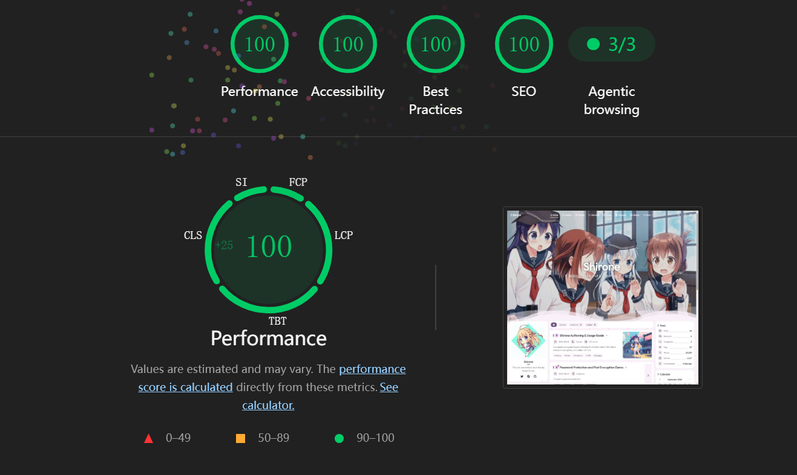
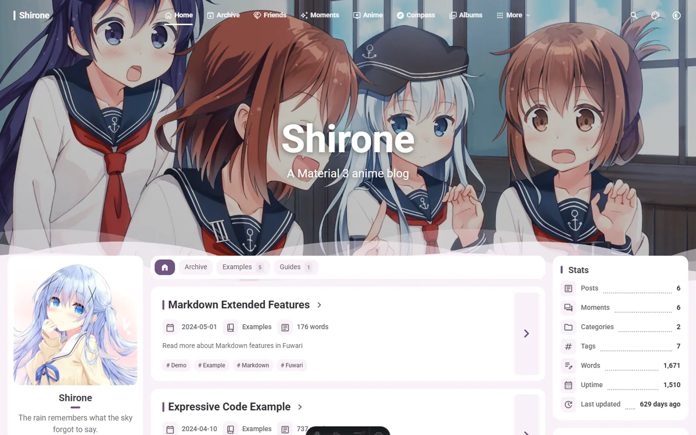

<div align="center">


# Shirone

**Material 3 Expressive を基盤とした、表現豊かなアニメ風ブログテーマ。**

長文の執筆や個人コレクション、サイトを自分らしくする細部のための、落ち着いた読書空間です。

[デモ](https://shirone.mysqil.com/) · [ドキュメント](https://docs.shirone.mysqil.com/) · [問題を報告](https://github.com/LyraVoid/Shirone/issues)

[English](./README.md) · [简体中文](./README.zh-CN.md) · [繁體中文](./README.zh-TW.md) · [日本語](./README.ja.md)


[](./LICENSE)

</div>

> [!IMPORTANT]
> **まず[オンラインドキュメント](https://docs.shirone.mysqil.com/)を参照してください。** テーマ設定、コンテンツ運用、デプロイの主要な入口です。

## ここから始める

[オンラインドキュメント](https://docs.shirone.mysqil.com/)が、テーマ設定、コンテンツ管理、デプロイの入口です。このリポジトリにはテーマ本体が含まれています。個人コンテンツを分離して管理する場合は [Shirone-Content](https://github.com/LyraVoid/Shirone-Content) を利用してください。

## 実測パフォーマンス

現在のリファレンス計測では、Performance、Accessibility、Best Practices、SEO がすべて 100、Agentic browsing も 3/3 でした。詳細なパフォーマンス指標も今回の計測では 100 です。実際の結果はホスティング環境、コンテンツ、ネットワーク条件によって変わります。





<table>
  <tr>
    <td align="center"><strong>色彩の魔法</strong><br><sub>光や気分、選択に応じて変化する HCT ダイナミックカラー。</sub></td>
    <td align="center"><strong>軽やかな旅</strong><br><sub>Swup がページを滑らかにつなぎ、周囲の世界をそっと保ちます。</sub></td>
  </tr>
  <tr>
    <td align="center"><strong>物語の魔導書</strong><br><sub>Markdown、MDX、数式、図表、コード、画像を一つの執筆フローへ。</sub></td>
    <td align="center"><strong>静かな守り</strong><br><sub>SSR とアクセシビリティを優先し、無効な機能は負担を残しません。</sub></td>
  </tr>
</table>

## ✦ すべての物語に、小さな魔法を

Shirone は Astro 7、Svelte 5、Tailwind CSS 4、Stylus で構築された静的な個人ブログテーマです。ここでいう魔法は、華やかな演出を重ねることではありません。光や気分に寄り添って変わる色、空気を途切れさせないページ遷移、そして自分だけの小さな居場所を少しずつ息づかせる細部に宿ります。

その柔らかな表情を支えるのは、デザイントークンで駆動する Material 3 Expressive コンポーネントシステムです。コンテンツは SSR を優先して出力し、Swup による滑らかなサイト内遷移ではページの外側にあるアプリケーションシェルが維持されます。

長文記事だけでなく、モーメント、アルバム、アニメの視聴記録、リンク、プロジェクト、スキル、タイムラインなどの個人コンテンツも掲載できます。

## ✦ 魔導書に込めたもの

- HCT による動的カラーパレットと、Material 3 / Material 3 Expressive 仕様
- ライト・ダークテーマ、バナー・単色背景、任意のテクスチャ、閲覧者ごとの表示設定
- シングルまたはデュアルサイドバーを選べるレスポンシブレイアウト
- Swup によるページ遷移、永続シェル、ルート進捗表示、モーション低減への対応
- Markdown / MDX、数式、Mermaid、注釈ブロック、拡張コードブロック、画像ギャラリー
- Pagefind による全文検索、RSS、Sitemap
- 目次、関連記事、共有、記事暗号化、任意のコメント機能
- アーカイブ、カテゴリー、タグ、リンク、モーメント、アニメ、アルバム、プロジェクト、スキル、タイムラインの各ページ
- 10 種類の UI 言語を内蔵
- SSR 優先、キーボード操作への配慮、アクセシビリティテスト
- 任意機能はゼロ負担を原則とし、無効時には外部リクエスト、DOM、レイアウトシフト、メインバンドルへのコード追加が発生しません

## クイックスタート

### 必要な環境

- [Node.js](https://nodejs.org/) 22.12 以上
- [pnpm](https://pnpm.io/) 9.x（リポジトリでは `pnpm@9.14.4` を固定）

### ローカルで起動する

```bash
git clone https://github.com/LyraVoid/Shirone.git
cd Shirone
corepack enable
pnpm install
pnpm dev
```

ブラウザーで `http://localhost:4321` を開きます。

Windows PowerShell の実行ポリシーでスクリプトがブロックされる場合は、`pnpm.cmd` と `npx.cmd` を使用してください。

### npm パッケージを使う

テーマのリポジトリをクローンしたくない場合は、`shirones` npm パッケージとしてインストールし、空のフォルダーからブログを初期化できます。Astro スターターも手動の依存関係インストールも不要です。

```bash
mkdir my-blog
cd my-blog
npx shirones init   # package.json を書き、astro・テーマ・peer 依存をインストール
pnpm dev
```

`init` は `astro.config.mjs`、`shirones/` 配下の型付き設定、サンプルコンテンツと静的アセットを生成します。`src/components/` と `src/layouts/` でテーマのコンポーネントを上書きすることもできます。いつでも `npx shirones init` を再実行して差分を確認できます（報告のみで何も変更しません）。`npx shirones init --update` で不足ファイルを復元し、`--force` でテンプレートから再初期化します。詳しくは [npm パッケージモード](./docs/npm-package-mode.md) と [shirones リポジトリ](https://github.com/yCENzh/shirones) を参照してください。

### サイトをカスタマイズする

1. `src/config/siteConfig.ts` で公開 URL、タイトル、言語、テーマ、バナー、表示設定を変更します。
2. `src/config/profileConfig.ts` と `src/config/navBarConfig.ts` でプロフィールとナビゲーションを更新します。
3. `src/config/` にある機能別の設定ファイルを確認します。初期値と選択肢は各ファイルのコメントに記載されています。
4. `src/content/`、`src/data/`、`public/` にあるサンプル記事、個人データ、メディアを置き換えます。
5. `pnpm new-post <filename>` で記事を作成し、`src/content/posts/` で編集します。

設定全体の仕様は [`src/config/README.md`](./src/config/README.md) を参照してください。

## 公式連携リポジトリ

Shirone ではテーマのソースコード、個人サイトのコンテンツ、npm 公開の責務を分離しています。公式リポジトリはそれぞれ異なるワークフローに対応します。

| リポジトリ | 用途 | 内容 |
| --- | --- | --- |
| [Shirone-Content](https://github.com/LyraVoid/Shirone-Content) | 外部コンテンツを使う二つのリポジトリ構成のブログ | 記事、モーメント、データ、メディア、`config/*.yaml` オーバーレイのためのコンテンツテンプレートです。Fork または clone して自分のリポジトリ（通常は非公開）に置き、このテーマリポジトリから参照します。[コンテンツ分離ガイド](./docs/content-separation/README.md)を参照してください。 |
| [shirones](https://github.com/yCENzh/shirones) | `shirones` npm パッケージの保守と公開 | 手動のビルド・公開パイプラインです。ビルド時にこのリポジトリを取得し、テーマのソースコードは意図的に保存しません。通常のブログ利用者は `shirones` をインストールすればよく、このリポジトリを直接使う必要はありません。[npm パッケージモード](./docs/npm-package-mode.md)を参照してください。 |

## 主な設定ファイル

| ファイル | 用途 |
| --- | --- |
| `src/config/siteConfig.ts` | サイト URL、識別情報、言語、動的配色、バナー、テクスチャ、目次、表示設定 |
| `src/config/profileConfig.ts` | 作者プロフィールとソーシャルリンク |
| `src/config/navBarConfig.ts` | メインナビゲーション |
| `src/config/sidebarConfig.ts` | サイドバー構成、ウィジェット、ページフィルター |
| `src/config/postListConfig.ts` | ページ分割とリスト/グリッド表示 |
| `src/config/articleConfig.ts` | 更新通知、関連記事、記事共有 |
| `src/config/commentConfig.ts` | 任意のコメントプロバイダー |
| `src/config/musicConfig.ts` | ローカル、カスタム、Meting、混合方式の任意音楽ソース |
| `src/config/animeConfig.ts` | アニメページとローカル/Bangumi/Bilibili スナップショット |

## 記事を書く

記事は `src/content/posts/` に配置し、Markdown と MDX を利用できます。最小限の Frontmatter は次のとおりです。

```yaml
---
title: 最初の記事
published: 2026-08-26
description: 記事一覧やメタデータに表示する短い概要です。
image: ./cover.webp
tags: [Astro, ノート]
category: 執筆
draft: false
---
```

よく使う任意フィールドには `updated`、`pinned`、`comment`、`lang`、`encrypted`、`password`、`passwordHint`、`hideHomeContent` があります。画像にはリモート URL、`public/` を基準とした絶対パス、記事ファイルからの相対パスを指定できます。

## コマンド

| コマンド | 内容 |
| --- | --- |
| `pnpm dev` | 開発サーバーを起動 |
| `pnpm new-post <filename>` | 新しい記事を作成 |
| `pnpm format` | Biome でコードをフォーマット（コミット前に必須） |
| `pnpm check` | Astro の診断を実行 |
| `pnpm type-check` | TypeScript の検査を実行 |
| `pnpm check:manifest` | コンポーネントマニフェストを検証 |
| `pnpm test` | Playwright テストを実行 |
| `pnpm build` | サイトと Pagefind インデックスを `dist/` に生成 |
| `pnpm preview` | 本番ビルドをプレビュー |
| `pnpm lighthouse` | デスクトップ向け本番監査を実行 |

## デプロイ

Shirone は静的な `dist/` ディレクトリを生成するため、Vercel、Netlify、GitHub Pages、その他の静的ホスティングサービスへデプロイできます。

デプロイ前に `src/config/siteConfig.ts` の `site` と `base` を更新し、次のコマンドを実行します。

```bash
pnpm install --frozen-lockfile
pnpm check
pnpm type-check
pnpm check:manifest
pnpm build
```

ホスティング側ではビルドコマンドを `pnpm build`、出力ディレクトリを `dist` に設定します。詳しくは [`INDEX.md`](./INDEX.md) を参照してください。

## ドキュメント

- [`src/config/README.md`](./src/config/README.md) - 設定リファレンス
- [`docs/m3e-standard.md`](./docs/m3e-standard.md) - デザイントークンとコンポーネント標準
- [`docs/atomic-structure.md`](./docs/atomic-structure.md) - コンポーネント階層と依存ルール
- [`docs/markdown-extensions.md`](./docs/markdown-extensions.md) - Markdown プラグイン、スタイル、キャッシュ、テスト規約
- [`docs/sidebar-system.md`](./docs/sidebar-system.md) - サイドバー構成と Swup 同期
- [`docs/on-demand-loading.md`](./docs/on-demand-loading.md) - 任意機能のゼロ負担実装
- [`docs/font-system.md`](./docs/font-system.md) - フォント設定と本番用サブセット化

## コントリビューション

Issue と Pull Request を歓迎します。大きな機能追加やビジュアル変更に着手する前に、Issue または Discussion を作成してください。コードを提出する際は [`CONTRIBUTING.md`](./CONTRIBUTING.md) とリポジトリのルールを読み、コミット前に必ず `pnpm format` でフォーマットを実行し、Pull Request の目的を一つに絞り、Conventional Commits を使用してください。

## 謝辞

Shirone は [saicaca](https://github.com/saicaca) による [Fuwari](https://github.com/saicaca/fuwari) のリファクタリングから始まりました。現在の M3E デザインシステム、コンポーネント構成、各ページ機能、オーケストレーションは Shirone として開発されています。基盤を築いた Fuwari プロジェクトとコントリビューターの皆様に感謝します。

## ともに歩む人たち

一つひとつの貢献が、Shirone の魔導書に新しい一行を書き加えてくれます。この小さな世界を育ててくださる皆様に感謝します。

<div align="center">
  <a href="https://github.com/LyraVoid/Shirone/graphs/contributors">
    
  </a>
</div>

## 星明かりの軌跡

<div align="center">
  <a href="https://star-history.com/#LyraVoid/Shirone&amp;Date">
    <picture>
      <source media="(prefers-color-scheme: dark)" srcset="https://api.star-history.com/svg?repos=LyraVoid/Shirone&amp;type=Date&amp;theme=dark" />
      <source media="(prefers-color-scheme: light)" srcset="https://api.star-history.com/svg?repos=LyraVoid/Shirone&amp;type=Date" />
      
    </picture>
  </a>
  <p><sub>一つの Star が、Shirone をもう少し遠くまで照らす小さな星屑になります。</sub></p>
</div>

## ライセンス

Shirone は [MIT License](./LICENSE) のもとで公開されています。このリポジトリには、同ライセンスで必要とされる元の著作権表示が保持されています。
