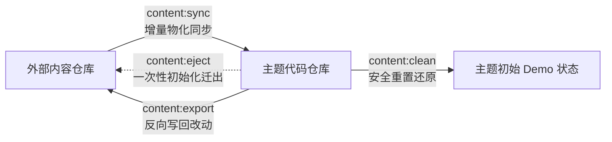

# 内容分离：CLI 工具链与核心工作流

> 本文介绍内容分离工具链的所有命令、核心工作流、安全机制与具体使用方法。  
> 顶层总纲见 [内容分离总览](README.md)；YAML 配置覆盖语法见 [配置覆盖](config-overlay.md)。

---

## 统一 CLI 入口与命令总览

系统提供 `pnpm content <command>` 统一分发器与冒号格式 `pnpm content:<command>`：

| 命令 | 说明 |
| --- | --- |
| `pnpm content` / `pnpm content --help` | **全景帮助**：打印工具链指令总览与核心工作流关系 |
| `pnpm content:status` / `pnpm content status` | **状态体检**：只读检测内容源连接、文件资源、YAML 配置语法与同步状态，快速排查未生效或不同步问题 |
| `pnpm content:sync` / `pnpm content sync` | **内容同步**：将内容仓的文章、图片资源与配置物化（增量拷贝）到代码仓。已自动接入 dev 与 build 流程 |
| `pnpm content:export` / `pnpm content export` | **反向导出**：将代码仓中新建或修改的文章与配置反向写回内容仓，防止同步时丢失。默认仅预览变更清单，加 `--yes` 执行 |
| `pnpm content:clean` / `pnpm content clean` | **重置还原**：清除代码仓中已同步的外部文章与配置，安全恢复为主题初始 Demo 状态。默认仅预览，加 `--yes` 执行 |
| `pnpm content:watch` / `pnpm content watch` | **实时同步**：在后台监听本地内容仓变动，保存文章时自动同步并触发浏览器热重载（适用于边写边看） |
| `pnpm content:validate` / `pnpm content validate` | **安全预检**：零写盘预检内容目录结构、命名冲突与 YAML 配置语法，常用于本地排错与 CI 门禁 |
| `pnpm content:eject` / `pnpm content eject` | **一键解耦**：单仓转双仓，一键初始化独立的外部内容仓库。默认仅预览，加 `--yes` 执行 |

### 核心工作流与“物化”概念

> **什么是“物化”？**  
> 在双仓架构下，Astro 博客引擎在构建与优化图片时，要求所有文件必须物理存放在代码仓库的 `src/` 与 `public/` 目录下。  
> 因此，“物化”是指**将外部内容仓库中的文章、图片和数据文件增量拷贝落地到代码仓库对应目录，同时将 YAML 配置文件编译为可用模块的过程**。

四条核心指令围绕物化构成一个完整的闭环流程：



`content.lock.json`（已加入 git 忽略列表）记录本次构建使用的内容源、Git 提交版本、配置文件清单与各挂载点统计，用于版本溯源与回滚。

---

## 状态体检 (`content:status`)

`content:status` 是站点的只读诊断工具。当你在双仓模式下写文章或改配置时，如果遇到文章未更新、配置未生效或构建报错，可以随时运行此命令进行全面排查。

### 运行特征

- **只读与离线安全**：默认不访问网络，不在磁盘生成任何临时文件或缓存，也不改动 Git 索引锁。随时运行都不会产生副作用。
- **联网探测**：仅当显式传入 `--remote` 时，才会执行 `git ls-remote` 向远端仓库确认目标分支或提交是否可访问。

### 检查维度

命令在执行时会依次完成以下五个维度的体检：

1. **运行模式与内容源**：识别当前处于本地单仓还是外部双仓模式；检查内容目录是否存在、是否为合法 Git 工作区、当前处于哪个分支与提交节点、工作区是否有未提交改动。
2. **挂载文件与资源**：扫描内容仓各挂载目录（如 `content/` 文章、`data/` 数据、`assets/` 原始图片），统计 Markdown 文章数、说说数与数据文件列表，验证文件读取权限。
3. **配置覆盖与类型校验**：扫描内容仓 `config/` 下所有 YAML 配置文件，直接在内存中调用 TypeScript 编译器进行类型检查。若存在拼写错误（如把 `bio` 误写为 `bioo`）或字段类型不符，将精确指出错误文件与行号并提供修正建议。
4. **锁文件与物化同步状态**：比对当前内容源与上次同步记录（`content.lock.json`）、生成文件 `src/user/user-config.ts` 以及挂载文件的修改时间与大小。明确区分“已完全同步”、“代码仓生成物被手动修改”以及“内容仓已有新改动但尚未同步”。
5. **诊断结论与退出码**：
   - 退出码 `0`：无阻断问题（允许存在环境缺少 Git 等非阻断告警）；
   - 退出码 `1`：存在配置错误、路径丢失、内容过期或需要重新同步的阻断性问题，并在末尾输出修复指引。

---

## 反向导出 (`content:export`)

`content:sync` 是单向的，而且带有文件裁剪机制：如果你直接在代码仓的 `src/content/posts/` 里新建或修改了文章，下一次运行 `pnpm dev`（启动首步会自动执行同步）时，系统会判定这些属于“未在内容仓记录的文件”而直接删除。

`content:export` 提供了反向保存通道，把你在代码仓侧新建或调试好的文章、图片与配置差异安全地写回外部内容仓。写回后，内容仓便正式拥有了这些改动，后续正常同步时就不会丢失。

```powershell
pnpm content:export                 # 预演：只打印导出计划
pnpm content:export --yes           # 实际执行
pnpm content:export --yes --config  # 只回写配置
```

与 `content:eject`、`content:clean` 一致，**默认只预演**。

| 参数 | 作用 |
| --- | --- |
| `--yes` | 实际执行（不加就只是预演；`--dry-run` 优先级更高，可用于脚本兜底） |
| `--config` / `--posts` | 只导出配置 / 只导出内容文件；都不给等于两者都导出 |
| `--prune` | 允许删除内容仓中代码仓已不存在的文件（**默认关闭**） |
| `--prune-config` | 允许删除内容仓 YAML 中「已等于主题默认值」的冗余键（**默认关闭**） |
| `--force` | 跳过「内容仓工作区干净」与「物化状态一致」两项检查 |
| `--out <dir>` | 覆盖导出目标（默认取当前生效的内容源目录）；必须是与代码仓不重叠的独立目录 |

### 文章与数据文件的比对与写回机制

在反向导出文章与数据文件时，系统会执行以下规则与安全过滤：

1. **自动反向映射路径**：将代码仓中的路径准确对应回内容仓（例如 `src/content/` → `content/`、`src/data/` → `data/`、`src/assets/` → `assets/`、`public/` → `public/`）。
2. **按内容指纹精准比对**：逐个比对文件的内容哈希指纹，准确识别新增文件与修改文件。内容未发生变动的文件直接跳过，避免重复写盘。
3. **防止主题资源污染内容仓**：严格限定导出范围，仅处理属于用户内容的顶层目录。主题自带的系统资源（如网站图标 `public/favicon/`、主题字体 `src/assets/fonts/`）以及构建生成的搜索索引（`public/pagefind/`）绝不会被倒进内容仓。
4. **永不导出的系统生成物**（内容仓若包含这些文件会导致同步报错）：
   - 说说缩略图：`public/assets/moments/thumbnails/**`
   - 番剧封面：`public/assets/anime/covers/**`
   - 子集字体生成物：`src/assets/fonts/.subset/**`
   - 清单中通过 `keep` 声明为代码仓自有的文件
5. **番剧快照与 `.gitkeep` 永不导出（但同步方向允许提供）**：`src/data/anime-snapshots/**` 与各目录 `.gitkeep` 不属于「同步报错」的生成物。快照的语义是「基线（last-known-good）」：内容仓可以提供快照文件（含不调用任何外部 API 的纯静态 JSON 数据源 `source.file`），`anime:sync` 成功抓取后覆盖 `<provider>.json`（自定义 `source.file` 永不被写入）；导出侧对二者一律跳过，避免把基线与代码仓自有占位文件倒灌进内容仓。
6. **跨平台换行符处理**：在 Windows 环境下比对文本前会自动消除换行符差异，并在写回内容仓时统一规范为 LF 换行，避免产生纯换行符的虚假 Git 改动。

### YAML 配置差分与写回规则

反向导出配置时，系统遵循**“最小化覆盖”原则——只写回你显式修改过的字段，不导出主题默认值**。这样既能保存你的个性化设置，又能保证日后主题升级时新增的默认功能能够自动生效。

#### 1. 智能差分比对
系统会自动将代码仓当前生效的配置与主题原始默认值进行差分计算：
- **与默认值相同**：直接省略，不写入 YAML 文件；
- **对象嵌套字段**：逐层比对并仅提取存在改动的具体子字段；
- **列表与数组**：若列表内容发生改动，则整体写出最新的完整列表项（数组不支持逐项合并与差分）。

#### 2. 安全写回与格式保护
- **保留注释与排版**：采用字段级别的精准更新，完整保留你在 YAML 文件头部与行内手写的注释、空行和排版格式，不做整文件重写；
- **只增改不删键**：内容仓中已有的配置若当前恰好等于默认值，默认会予以保留（防止误删你刻意固定的配置）；若需要彻底清理冗余配置，可显式指定 `--prune-config` 参数；
- **页脚模板同步**：`src/config/FooterConfig.html` 的修改会同步反向写回到内容仓的 `config/footer.html`；
- **敏感凭据告警**：若配置中疑似包含了密钥、令牌等字段，系统会给出安全警告，提示你将凭据转移至环境变量。

#### 3. 写后类型安全校验
配置写回后，系统会立即调用 TypeScript 编译器对生成的 YAML 进行严格的类型检查。如果导出的配置存在拼写错误或类型不符，将立即报错拦截，防止把错误配置写入内容仓导致后续构建失败。

#### 4. 特殊例外：导航栏配置 (`nav-bar.yaml`)
`config/nav-bar.yaml` 包含了预设展开与多语言转换逻辑，在加载时属于单向解析，无法从解析后的状态无损反推回原始声明。因此系统**不会自动导出导航栏配置**，如有修改请在内容仓中手动维护（终端输出中会显式提示此项例外，不做静默跳过）。

### 导出安全防护机制

由于反向导出涉及向外部内容仓库直接写入文件，系统设计了多重安全保护机制：

1. **默认预演机制**：默认仅在终端打印变更计划（分类展示新增、更新、跳过与豁免文件列表），确认无误后追加 `--yes` 参数才会真正执行写入；
2. **自动快照备份**：在实际覆盖或写入任何文件前，系统会自动在内容仓生成带时间戳的完整备份快照（存放在 `.export-backup/` 目录下），随时支持一键还原；
3. **工作区状态防呆**：
   - 若外部内容仓存在未提交的改动，系统会暂停导出并列出文件清单，防止意外覆盖你尚未保存的工作；
   - 若代码仓的本地配置状态落后于内容仓，系统会拒绝执行，防止用本地旧配置覆盖内容仓的新配置；
4. **默认不删除文件**：即使代码仓本地删除了某个文件，反向导出默认也绝不删除内容仓对应文件；仅当显式指定 `--prune` 时才允许删除，且删除前必定执行备份；
5. **操作边界与权限**：本命令不会自动在内容仓执行 Git 提交或推送，也不会修改代码仓自身的 Git 忽略规则或配置文件，写回完成后由使用者在内容仓确认并提交。

### 与一键解耦 (`content:eject`) 的区别

| 维度 | `content:eject` (一键解耦) | `content:export` (反向导出) |
| --- | --- | --- |
| **使用时机** | 单仓拆分为双仓时的**一次性初始化** | 双仓日常开发中**随时、反复使用的增量保存** |
| **目标仓库** | 目标目录必须为空，用于初始化全新内容仓 | 目标目录必须为**已存在的内容仓库** |
| **导出内容** | 导出全部内容与基础起步配置，并自动生成说明文档与流水线脚本 | 按实际差异增量写回修改过的文章与配置 |
| **代码仓改动** | 会自动修改代码仓的忽略规则与内容源配置文件 | **绝不修改**代码仓的忽略规则与任何配置文件 |

---

## 安全清理 (`content:clean`)

`content:clean` 是一个**一键重置回 Demo 示例状态**的安全还原工具。它会清除代码仓中从外部同步进来的文章、数据与配置生成物，将工作区安全恢复为主题自带的初始内容。

### 典型场景

1. **测试与向上游贡献代码**：在配置了双仓后，工作区内充满了个人文章；运行清理可一键还原为纯净的主题自带 Demo 状态，便于测试默认功能或提交主题 PR。
2. **重置同步环境**：当本地同步产生冲突、文件混乱或排查不同步问题时，可快速清空所有物化残留，以便重新执行干净的同步。
3. **无数据丢失风险（随时一键还原）**：清理操作**仅清除代码仓内的本地同步副本**，你真正的文章、图片与配置文件始终完好无损地存放在外部内容仓库中。清理完成后，任何时候只要再次运行 `pnpm content:sync`（或直接运行 `pnpm dev`），你的全部文章与配置就会立刻完整同步回来。

### 为什么不直接使用 Git 清理命令？

若直接在终端执行 `git restore .` 或 `git clean -fdx`：
- **容易误伤源码**：你在主题中修改或开发的组件、样式与脚本可能会被一并回滚或删除；
- **清理不彻底**：双仓解耦后，文章目录已被写入 `.gitignore`，原生的 Git 状态检测对被忽略的同步文件完全沉默。

`content:clean` 提供了安全且精准的清理保障：
- **精准限定范围**：严格限定在同步目标目录（`src/content/`、`src/data/`、`src/assets/`、`public/`）与配置生成物（`src/user/user-config.ts`、`src/config/FooterConfig.html`）之内，**主题源码中的未提交修改绝对不会被回滚**；
- **默认仅预演**：不加 `--yes` 时仅在终端打印清理计划，不会修改磁盘上的任何文件；
- **强制快照备份**：实际执行删除或还原前，会自动创建带有时间戳的完整备份快照，随时支持一键恢复。

```powershell
pnpm content:clean          # 预演：只打印清理计划
pnpm content:clean --yes    # 实际执行
```

与 `content:eject`、`content:export` 一致，**默认只预演**。可用参数：

| 参数 | 作用 |
| --- | --- |
| `--yes` | 实际执行清理（不加就只是预演；`--dry-run` 优先级更高，可用于脚本兜底） |
| `--no-backup` | 跳过 `.content-backup/` 快照备份（不推荐） |
| `--keep-working-copy` | 保留 `.content-src/`，下次同步不必重新 fetch |

### 清理范围与安全保护

`content:clean` 具有严格的作用边界，确保只清理从外部同步进来的内容，绝不伤及主题代码：

1. **清理并重置的范围**：
   - **同步的文章与数据**：清除代码仓中由外部内容仓同步进来的文章、数据与图片，并将主题自带的示例内容恢复出来；
   - **生成的配置文件**：将 `src/user/user-config.ts` 重置为空覆盖（若直接在代码仓侧调试过配置，请先运行 `pnpm content:export --config` 写回内容仓再清理）；
   - **深层数据缓存**：一并清除 Astro 内容层缓存与锁文件，防止本地开发时残留已删除文章的幽灵快照。
2. **受保护的豁免资源（绝不删除）**：
   - **主题源码**：你对组件、样式与脚本的任何未提交改动都不会被回滚；
   - **高耗时生成物**：说说缩略图（`public/assets/moments/thumbnails/**`）、番剧封面与快照（`public/assets/anime/covers/**`、`src/data/anime-snapshots/**`）、子集字体产物（`src/assets/fonts/.subset/**`）以及空目录占位文件 `.gitkeep` 均会被保留，避免重复调用外部接口或耗时重新生成。

### 缓存清理与衍生资源重算

清理完成后，系统会自动清空 Astro 的本地内容缓存与锁文件，并自动重新生成离线图标集合与说说缩略图，确保代码仓彻底恢复为一个崭新、纯净的主题初始 Demo 状态。

> **提示：清空集合与内容层缓存失效**  
> 如果在外部内容仓库中清空了某个内容集合（例如删除了全部动态或文章），`pnpm content:sync` 会在检测到裁剪或空集合时主动失效 Astro 内容层存储（`node_modules/.astro/data-store.json` 与 `.astro/data-store.json`），防止旧条目残留。如果本地开发遇到类似现象，亦可随时执行 `pnpm content:clean` 或手动删除上述文件后重新构建。

### 备份快照与一键还原

为防止误操作，实际执行清理前，系统会自动将所有被替换或删除的文件完整备份至 `.content-backup/clean-<时间戳>/` 目录下。

若需还原清理前的工作区状态，直接运行对应系统的复制命令即可：

- **Windows (PowerShell)**：
  ```powershell
  Copy-Item -Recurse -Force .\.content-backup\clean-<时间戳>\* .
  ```
- **Linux / macOS (Bash)**：
  ```bash
  cp -a .content-backup/clean-<时间戳>/. .
  ```

---

## 实时文件监听 (`content:watch`)

`content:watch` 是双仓日常写作的核心辅助命令。它让使用者真正做到**“内容与代码彻底解耦，文章只在外部内容仓库编写”**，同时获得与单仓开发完全一致的即时预览体验。

```powershell
pnpm content:watch
```

### 写作工作流

在日常边写文章边预览时，推荐的流转方式如下：

1. **终端 1**：在代码仓根目录运行 `pnpm dev` 启动博客本地预览服务；
2. **终端 2**：在代码仓根目录运行 `pnpm content:watch` 启动后台监听；
3. **外部写作**：使用你习惯的 Markdown 编辑器（如 Typora、Obsidian 或 VS Code）直接打开外部内容仓库进行写作。

每当在外部内容仓保存（`Ctrl + S`）文章、新增图片或修改配置文件时：
- `content:watch` 会自动捕获变动，并将增量文件自动同步到代码仓；
- 本地开发服务器监听到代码仓文件更新后，会自动触发热重载，浏览器页面即刻刷新。

### 注意事项与限制

- **仅支持本地目录模式**：当内容源为本地文件夹（`type: "path"`）时生效。若直接配置为远端 Git 仓库地址，由于无法监听远端网络文件的保存事件，该命令将提示仅支持本地目录。

---

## 结构与配置预检 (`content:validate`)

`content:validate` 是一个**“只做体检、绝不写盘”的安全预检工具**。它的底层实现就是带了预演参数的同步命令（`content:sync --dry-run`）。

```powershell
pnpm content:validate
```

### 适用场景

当你刚在内容仓修改了一批 YAML 配置或文章，想要快速确认是否有语法错误、字段拼写错误或非法路径，但**此时不想启动耗时的本地预览服务，也不希望真正往代码仓写入任何文件**时，就可以直接运行此命令。

### 检查内容

命令会在内存中完整模拟一次同步流程，并输出详细校验报告：
1. **目录结构与命名冲突**：检查内容仓各目录是否符合规范，是否意外提供了与系统受保护文件同名的冲突文件；
2. **YAML 语法与字段类型**：直接通过 TypeScript 编译器验证所有 YAML 配置文件，若存在拼写错误（如把 `themeColor` 误写为 `themeColorr`）或字段类型不符，将直接精准报错并给出修改建议；
3. **同步预演统计**：统计并打印若执行真正同步时，预计会新增、更新或裁剪多少个文件。

### 核心用途

- **本地快速排错**：快速确认配置正确性，无需等待完整项目启动；
- **CI 自动化门禁**：在独立内容仓库提交代码或发起合并请求时，可作为 GitHub Actions 的自动化门禁检查，提前拦截错误配置，防止破坏线上构建。

---

## 一键初始化解耦 (`content:eject`)

`content:eject` 是用于**从单仓模式切换到双仓模式的一键初始化迁移向导**（通常每个博主在刚开始决定分离内容时仅需执行一次）。

```powershell
pnpm content:eject          # 预演：打印迁移计划与生成清单
pnpm content:eject --yes    # 实际执行迁移（默认导出到 ../shirone-content）
pnpm content:eject --yes --out ..\my-content  # 指定自定义导出路径
```

### 适用场景

当你刚从 GitHub 克隆或 Fork 了主题代码后，默认处于“代码与内容混在一起”的单仓模式。如果你想实现**内容完全独立**（比如将文章、相册图片、友链数据和个人配置存放到一个独立的私有 Git 仓库，方便日后无缝拉取上游主题更新），就可以运行此命令完成一键解耦。

### 执行的核心动作

运行 `pnpm content:eject --yes` 后，系统会自动完成以下四项繁琐操作：

1. **初始化外部内容仓库**：在目标目录（如 `../shirone-content`）建立标准的内容仓目录结构，导出示例文章与数据，并自动生成基础配置文件、说明文档以及自动触发构建的 GitHub Actions 脚本；
2. **配置代码仓忽略**：自动将代码仓内的文章、数据等挂载目录写入 `.gitignore`，防止日后误提交私密文章；
3. **安全取消 Git 跟踪**：执行 `git rm --cached` 让代码仓停止跟踪文章等文件，但保留本地物理文件，使本地开发预览不受任何影响；
4. **自动配置内容源指向**：在代码仓生成 `shirone.content.json`，将内容源自动指向刚才初始化的外部内容仓库。


