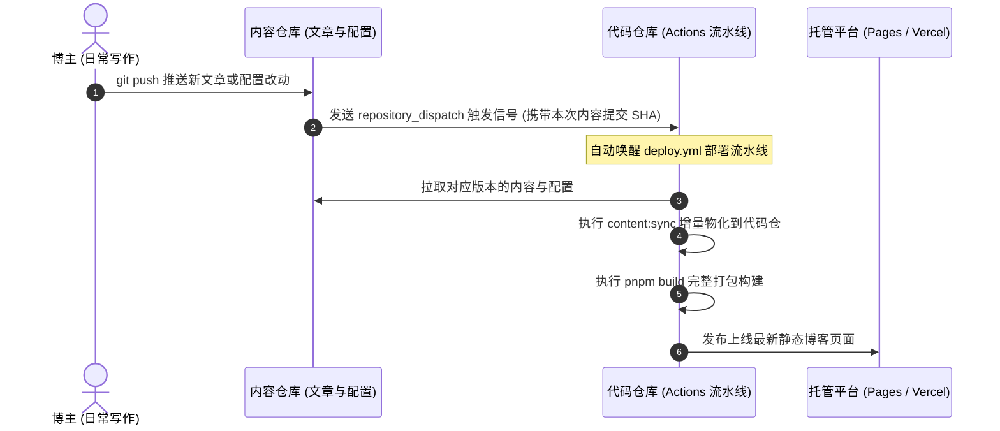

# 内容分离：双仓自动化构建部署与迁移指南

> 本文约定内容分离架构下的双仓 GitHub Actions 自动化构建部署、Secrets 权限配置与单仓向双仓的迁移流程。  
> 顶层总纲见 [内容分离总览](README.md)；CLI 工具说明见 [CLI 工具链与核心工作流](cli-workflows.md)。

---

## 双仓自动化构建部署架构



### 代码仓部署工作流 (`deploy.yml`)

代码仓负责接收触发信号、拉取对应版本的内容并完成打包与发布上线。

#### 1. 启用部署工作流
1. 主题根目录下已预置模板文件 `.github/workflows/deploy.yml.example`；
2. 将其复制并重命名为 `.github/workflows/deploy.yml`（去掉 `.example` 后缀后 Actions 才会识别并执行）；
3. 打开该文件，将 `CONTENT_REPOSITORY: OWNER/shirone-content` 替换为你自己的内容仓库；
4. 根据你的托管平台（如 Vercel、GitHub Pages、自有云服务器或 Deploy Hook），在文件末尾替换对应的发布步骤（模板末尾已提供四种平台的开箱即用示例）。

#### 2. 流水线的核心保障机制
- **精确锁定内容版本**：每次触发构建时，均严格按照触发信号中携带的具体版本号检出内容，而不是盲目拉取最新的分支顶端。这保证了构建的内容与你的提交严格对应，杜绝连续推送时的版本错乱；
- **并发构建自动打断与后发先至（Concurrency Control）**：代码仓 `deploy.yml` 声明了全局 `concurrency: group: deploy, cancel-in-progress: true`。当博主在短时间内同时推送了代码仓与内容仓、或多次高频提交时，后续新触发的构建会自动强制取消正在执行中的前一个旧构建，并自动结合最新代码与最新内容完成打包，杜绝并发竞争冲突；
- **独立物化与防止缺字**：流水线会先执行 `pnpm content:sync` 将文章与配置同步到位，再进行中文字体子集裁剪与打包，确保字体绝对不会缺字；同时在 Actions 运行日志中将“内容同步”与“前端构建”明确分离，出错时极易排查；
- **增量缓存优化构建**：说说缩略图与本地编译缓存具备内容指纹缓存机制。每次部署时，未修改的静态资源直接命中缓存，仅对新增或修改过的图片进行重新计算，大幅缩短每次线上构建时间；
- **复用预检流程**：仓库内另提供了 `content-validate.yml`，可供内容仓在提交合并请求时跨仓调用，在合并前自动完成内容语法与类型安全检查。

### 内容仓触发工作流 (`trigger-build.yml`)

运行 `pnpm content:eject` 初始化双仓时，已自动在内容仓的 `.github/workflows/trigger-build.yml` 生成了触发工作流：
- **精准路径过滤**：仅当推送改动涉及文章、数据、图片或配置文件时才触发跨仓构建，修改说明文档或草稿不会浪费 Actions 额度；
- **携带版本信息**：自动抓取当前提交的版本号并发送给代码仓，实现跨仓库精准对齐；
- **并发防抖截断**：配置了 `concurrency: group: trigger-build, cancel-in-progress: true`，在连续快速提交时自动取消前一次排队中的派发作业，仅向代码仓发送最新一次触发。

### Secrets 密钥与权限配置

| 配置仓库 | Secret 名称 | 所需权限与说明 |
| --- | --- | --- |
| **内容仓** | `DISPATCH_TOKEN` | 个人访问令牌，仅需对**代码仓**授予 `Contents: Read and write` 权限（用于跨仓发送触发信号） |
| **代码仓** | `CONTENT_REPO_TOKEN` | 个人访问令牌，仅需对**内容仓**授予 `Contents: Read` 权限（若内容仓为公开仓库则完全不需要配置） |
| **代码仓** | `BILI_SESSDATA` | 可选，用于构建期自动同步 B 站番剧数据 |
| **代码仓** | 托管平台部署凭据 | 根据部署方式选填（如 `VERCEL_TOKEN`、`DEPLOY_SSH_KEY` 等） |

> **提示与令牌选择**：
> - **想要一劳永逸（永不过期）**：可创建 GitHub 经典个人访问令牌（Tokens classic），过期时间直接勾选 `No expiration`，勾选 `repo` 权限即可，无需定期手动续期；
> - **注重权限最小化**：可创建细粒度访问令牌（Fine-grained PAT），仅对指定仓库授权（GitHub 限制其最长有效期为 1 年，需定期手动续期）；或创建专用的 GitHub App 配合 `actions/create-github-app-token` 实现兼顾安全与永不过期的自动化构建。

### 版本溯源与一键回滚

每次部署完成后，GitHub Actions 会在运行摘要中生成完整的构建报告，并附带本次使用的内容版本快照。

- **零代码紧急回滚**：如果线上刚发布的文章存在重大错误，无需在本地手忙脚乱地撤销提交；
- **操作方式**：直接在代码仓进入 Actions 页面，选择 `Deploy` 工作流并点击 **Run workflow**，在弹出的 `content_ref` 输入框中填入历史版本的 Git Commit 即可一键重新拉取历史版本并部署上线。

---

## 从单仓向双仓模式迁移指南

在你自己的 Fork 仓库中执行以下三步，即可将默认的单仓博客平滑升级为双仓解耦架构：

### 第一步：一键初始化迁出 (`content:eject`)

在代码仓根目录运行一键解耦命令，将文章、数据与基础配置迁出到外部独立目录：

```powershell
pnpm content:eject          # 预演：仅打印迁移计划与生成清单
pnpm content:eject --yes    # 实际执行（默认导出到 ../shirone-content）
pnpm content:eject --yes --out ..\my-content  # 指定自定义导出路径
```

`--yes` 会自动完成以下四项核心初始化动作：
1. **生成内容仓标准结构**：在目标目录导出文章与数据，并生成 `README.md`、`.gitignore`、基础配置起步文件与 `trigger-build.yml` 触发脚本；
2. **配置代码仓忽略**：自动将代码仓内的文章、数据等挂载目录写入 `.gitignore`，防止误提交；
3. **安全取消 Git 跟踪**：执行 `git rm -r --cached` 让代码仓停止跟踪文章等文件，但物理文件仍保留在工作区，本地预览完全不受影响；
4. **生成本地内容源指向**：在代码仓生成 `shirone.content.json`，将内容源自动指向导出的外部目录。

> **为什么只导出站点身份配置？**  
> `config/` 仅导出 `site.yaml`（站点基本信息）与 `profile.yaml`（个人信息）。刻意不全量导出所有默认配置，是为了避免把配置“写死”在当前主题版本，确保日后主题升级新增的默认值仍能自动生效。

### 第二步：将内容仓推送到 GitHub 远端

打开终端进入刚才导出的外部内容目录，将其初始化为独立的 Git 仓库并推送到你的 GitHub（推荐设为私有仓库）：

```bash
cd ../shirone-content
git init -b main
git add .
git commit -m "feat: init content repo"
git remote add origin https://github.com/OWNER/shirone-content.git
git push -u origin main
```

### 第三步：配置自动化工作流与密钥

1. **启用代码仓部署流水线**：在代码仓将 `.github/workflows/deploy.yml.example` 复制或重命名为 `deploy.yml`（去掉 `.example` 后缀），并将里面的 `CONTENT_REPOSITORY` 修改为你的内容仓库名（如 `OWNER/shirone-content`）；
2. **启用内容仓触发流水线**：若从模板仓库克隆内容仓，在内容仓将 `.github/workflows/trigger-build.yml.example` 复制或重命名为 `trigger-build.yml`（去掉 `.example` 后缀生效；通过 `pnpm content:eject` 自动生成的文件已默认就绪）；
3. **配置仓库访问密钥**：
   - 在**内容仓库**的 `Settings > Secrets and variables > Actions` 中添加 Secret `DISPATCH_TOKEN`（个人访问令牌，需对代码仓拥有读写权限）；
   - 在**代码仓库**的 `Settings > Secrets and variables > Actions` 中添加 Secret `CONTENT_REPO_TOKEN`（若内容仓为私有，填入对内容仓拥有读取权限的个人访问令牌）；
4. **大功告成**：此后只需在内容仓专心写作，每次 `git push` 就会全自动触发代码仓拉取最新文章进行打包构建，并自动发布上线！
