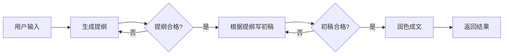
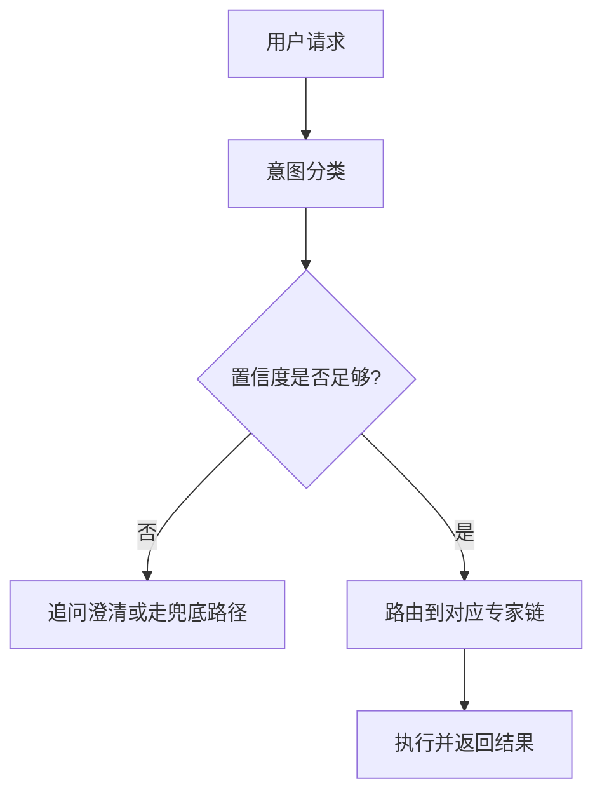
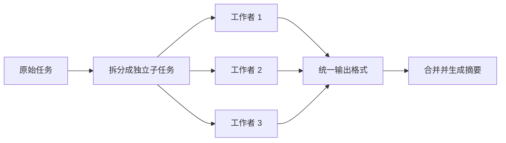
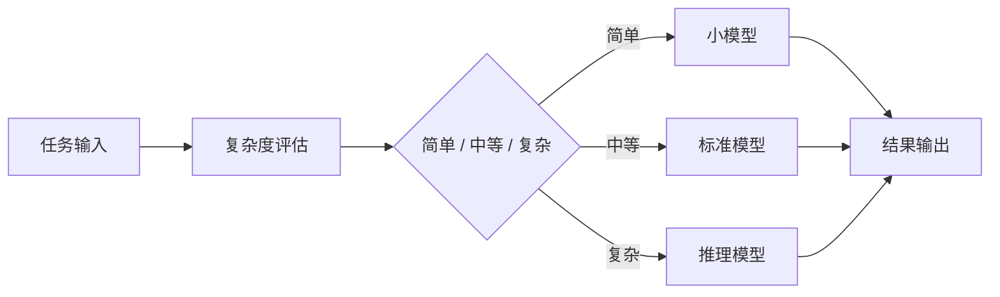

常见的 Agent 组织方式我整理成了 20 个模式。

对我来讲提示词链、路由、并行化三个词这三个词分开看都懂，放在一起就很容易混。尤其当我看到一个追问时，脑子里也停了一下：

> 并行化不就是把任务分给不同 Agent 吗？那它和路由有什么区别？

这篇文章先把这三者拆开，再补上资源感知优化。它们都属于控制流模式，解决的问题却不一样。

## 1. 先看 20 种模式的分组

原文把 20 种模式分成了 8 组：

| 分组 | 模式 |
| :--- | :--- |
| 流程控制型 | 提示词链、路由 |
| 效率提升型 | 并行化、资源感知优化 |
| 质量保障型 | 反思、评估与监控 |
| 协同管理型 | 多智能体协作、人类在环 |
| 知识处理型 | RAG、记忆管理 |
| 推理决策型 | 推理技术、目标监控、优先级管理 |
| 错误处理型 | 异常处理与恢复、学习与适应 |
| 通信与高级模式 | 智能体间通信、规划、工具使用、探索与发现 |

这篇文章只覆盖前两组里最核心的四个模式。它们的共同点是决定任务怎么流动，区别在于任务路径是固定的、选出来的、并行的，还是按资源动态调整的。

## 2. 提示词链：把固定步骤串起来

提示词链适合步骤可以提前写死的任务。比如写一篇教程，流程可能是先列提纲，再写初稿，最后润色。每一步都拿上一步的结果当输入，中间加一个验证点。

用 Mermaid 画出来是这样：



Python 里大概是这样：

```python
def run_article_chain(topic: str) -> str:
    outline = llm("根据主题列一份提纲", topic)
    if not check_outline(outline):
        outline = retry("重新列提纲", topic)

    draft = llm("按照提纲写初稿", outline)
    if not check_draft(draft):
        draft = retry("根据问题清单修改初稿", draft)

    final = llm("润色这段文字", draft)
    return final
```

每一步的验证可以是规则、单测、检索证据，或者一个专门的评估模型。验证点让错误尽早暴露，代价是每加一步就多一次模型调用。

链式流程有三类常见代价：

- 上下文越来越长，后续步骤容易把前面所有内容一起带上，成本和幻觉风险都会增加。
- 前面步骤出错，后面的步骤会继承这个错误。
- 每多一个模型推理点，整体延迟就往上加。

文档原文给出的经验值是 3 到 5 步。超过这个范围，收益通常会被成本和延迟吃掉。这个数字和我的使用感受基本一致，适合大多数“写报告、做整理、生成规格”这类工作。

## 3. 路由：先判断任务属于哪一类

路由不急着执行任务，它先做分诊。客服系统里有技术、销售、账户三类问题，路由会先判断用户这一句属于哪一类，再交给对应的专家链。



Python 伪代码：

```python
def route_request(user_input: str) -> str:
    result = classifier(user_input)
    label, confidence = result["label"], result["confidence"]

    if confidence < 0.7:
        return ask_for_clarification(user_input)

    if label == "billing":
        return billing_chain(user_input)
    if label == "tech_support":
        return tech_chain(user_input)

    # 分类器给出未知标签时，不要硬塞进某个专家链
    return human_fallback(user_input)
```

路由的核心难点是分错之后的兜底。置信度可以用模型评分，或者写规则判断。两类手段通常要一起用：规则负责处理明确模式，模型负责处理自然语言里的模糊表达。

路由和提示词链的区别在于“路径是否提前固定”。提示词链的步骤是开发者写死的，路由的下一步则取决于输入本身。

## 4. 并行化：拆成独立块再同时跑

并行化适合子任务彼此独立的场景。比如把一份长文档拆成几个章节，同时让多个工作者提取要点，最后统一合并。



Python 可以用 `asyncio.gather` 写法：

```python
import asyncio

async def parallel_extract(sections: list[str]) -> list[dict]:
    tasks = [extract_section(section) for section in sections]
    results = await asyncio.gather(*tasks, return_exceptions=True)

    normalized = []
    for item in results:
        if isinstance(item, Exception):
            normalized.append({"error": str(item)})
        else:
            normalized.append(item)
    return normalized
```

并行化的关键不只是同时去做一件事，把它分开。它还包含两件事：

1. 输出格式要统一，否则合并阶段会写满判断分支。
2. 结果要能溯源，某个工作者失败时要知道失败在哪一段。

并行化也会放大复杂度。每个工作者都有调用成本、超时和错误处理。并发数量上去之后，合并逻辑会成为新的故障点，所以一般来讲处理可以分布的且量大的任务可以使用jev+并行/路由+并行。

## 5. 三者到底差在哪

| 维度 | 提示词链 | 路由 | 并行化 |
| :--- | :--- | :--- | :--- |
| 执行路径 | 固定顺序 | 先选择路径 | 多个路径同时执行 |
| 核心动作 | 前一步输出喂给后一步 | 分类后交给专家 | 拆分、执行、合并 |
| 适用任务 | 步骤稳定的流程 | 多意图入口 | 子任务彼此独立 |
| 主要风险 | 错误传播、上下文膨胀 | 分错类、边缘情况 | 合并冲突、并发失控 |
| 验证点 | 每一步都可以验证 | 验证分类置信度 | 验证各工作者输出格式 |
| 成本形态 | 线性增加 | 一次分类加专家链成本 | 并发越多成本越集中 |

选择时可以按顺序问自己三个问题：

- 路径能不能提前写死？能，就用提示词链。
- 入口是不是有多种意图？是，就用路由。
- 子任务能不能互不依赖地同时做？能，就用并行化。

如果这三个条件同时出现，还可以组合。典型结构是路由先选大方向，专家链内部用提示词链，链里的独立步骤再并行处理。

## 6. 资源感知优化：模型也分档

资源感知优化负责另一件事：同样的任务，用什么档位的模型。

简单分类、字段抽取可以用小模型。复杂规划、代码修复、长文档推理用强模型。中间还有一档标准模型。判断依据可以来自任务类型、输入长度、历史监控数据，或者模型自己给出的复杂度评分。



监控指标通常看三类：

- Token 消耗
- 响应时间
- API 成本

优化手段里，提示词缓存很实用。系统提示和工具定义这些稳定前缀可以缓存起来，后续请求不用重复发送完整内容。还有一个更朴素的做法：先跑一次快速测试，看任务是否复杂，再决定要不要升级模型。

资源感知优化的风险在于判断标准不好定。判断错了，要么用大模型浪费成本，要么用小模型产出不稳定结果。所以它需要和历史监控数据配合，不能只靠一个拍脑袋的分类器。

## 7. 什么时候再上推理技术

推理技术这一组包括链式思维、树状思维、自我一致性、对抗性辩论等方法。它们适合数学推理、战略规划、法律分析这类复杂问题。

原文给了一个很保守的提醒：90% 的场景不需要上高级推理技术。我认可这个判断。高级推理会增加 Token 消耗，还会把延迟拉高。很多业务问题用提示词链加工具调用就能解决，上树状思维反而会拖慢系统。

选择顺序可以先从简单流程开始。只有当简单流程在评估集上持续失败，且失败原因确实来自推理深度时，再考虑升级。

## 8. 选择清单

把这一篇压缩成一份可以带走的清单：

1. 先画任务路径，判断它是否能被预先枚举。
2. 路径固定，优先用提示词链，步骤控制在 3 到 5 步。
3. 入口有多个意图，先做路由，再加兜底和澄清。
4. 子任务互不依赖，用并行化，先统一输出契约。
5. 成本敏感，再加资源感知优化，用监控数据决定模型档位。
6. 简单结构解决不了，再考虑推理技术，不要反过来。

:::note 系列说明
本文选题与 20 种模式分类拓展自 lvy 的博客《20种Agent 设计模式》：
[原文链接](https://blog.csdn.net/2301_80171004/article/details/160947992)

虽然题材和20种设计的结论参考了lvy大佬的文章，但文章内容均由本人学习过程中的感悟总结而提炼出，系列里的结构图均按文章需要重新绘制。
:::
