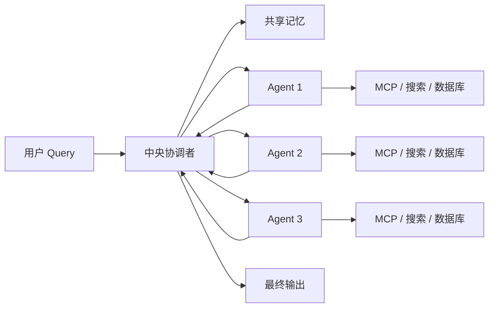
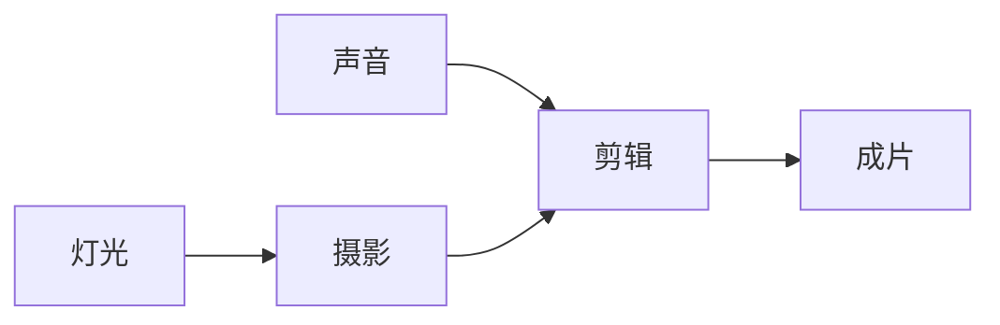
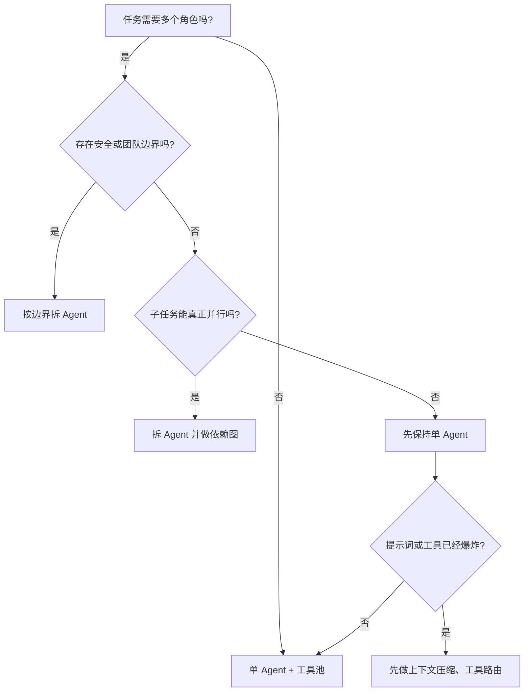

有个问题我后来被问过好几次：

> 多个 Agent 在一起工作时，它们知道彼此存在吗？会像聊天室一样互相发消息吗？

这个问题正好对应 20 种模式里的多智能体协作、共享记忆、规划、工具使用和智能体间通信。它也是多 Agent 系统最容易被讲乱的部分。

这篇先把 Agent 之间的真实关系讲清楚，再往实现层拆。

## 1. 三种关系：隔离、黑板、直接通信

多 Agent 协作不等于多个 Agent 开群聊。落地时有三种常见关系：

| 关系 | Agent 是否知道彼此 | 数据怎么流动 | 风险 |
| :--- | :--- | :--- | :--- |
| 完全隔离 | 不知道 | 协调者把输入写进工单，Agent 只认工单 | 协调者成为单点，工单设计要足够清楚，风险和微服务之前的Java业务一样 |
| 共享黑板 | 不直接知道，但能读同一块记忆 | 上游写进共享记忆，下游按 key 读取 | 命名空间冲突、脏读、记忆无限膨胀 |
| 直接通信 | 知道，能互相发消息 | Agent 之间直接传递消息 | 对话轮次爆炸、死循环、责任边界模糊 |

大多数企业项目落在前两种。中央协调者加流水线的结构通常属于第二种，Agent 之间不直接对话，数据通过协调者或共享记忆中转。

## 2. 中央协调者、工单和契约

把第二种结构画出来，大概是这张图：



协调者做的事情可以拆成四步：

1. 拆解任务，生成依赖关系图。
2. 按依赖顺序派发工单。
3. 收集 Agent 输出，写进共享记忆。
4. 按验收标准检查，通过就继续，不通过就打回重做。

最小实现可以写成这样：

```python
memory = {}
dag = {
    "lighting": {"inputs": []},
    "camera": {"inputs": ["lighting"]},
    "sound": {"inputs": []},
    "editing": {"inputs": ["camera", "sound"]},
}

def dispatch(ticket, memory):
    agent = get_agent(ticket["agent"])
    inputs = {name: memory[name] for name in ticket["inputs"]}
    return agent.run(ticket["goal"], inputs)

def run_plan(dag):
    for node in topological_order(dag):
        ticket = build_ticket(node, dag)
        retries = 0
        while retries < ticket["max_retries"]:
            result = dispatch(ticket, memory)
            memory[f"{node}.output"] = result
            if validate(result, ticket["acceptance_criteria"]):
                break
            retries += 1
        else:
            return replan(node)
    return memory["editing.output"]
```

这段代码里真正重要的是几个约束：

- `topological_order` 保证上游先做。
- `ticket["inputs"]` 声明依赖，协调者据此从共享记忆取数据。
- `validate` 是契约验证，不达标不放行。
- `max_retries` 防止无限循环。
- `replan` 是失败后的回溯路径。

工单设计得越清楚，Agent 越不需要知道别的 Agent 存在。它只要知道目标、输入和验收标准。

## 3. 共享记忆怎么落地

共享记忆不是所有人随便读写一个大字典。它会出两类问题：两个 Agent 同时写同一个 key，或者下游读到上游没写完的半成品。

常见做法是把存储和权限分开：

| 维度 | 常见实现 |
| :--- | :--- |
| 短期记忆 | 进程内字典、Redis、会话级向量库 |
| 长期记忆 | 向量数据库、关系库、对象存储 |
| 写入方 | 协调者独占写，Agent 只返回结果 |
| 读取方 | 协调者按工单把数据作为输入传入 |
| 防冲突 | 按任务和 Agent 划命名空间，例如 `task-123.camera.output` |

只要写入方只有一个，记忆重叠的概率就会低很多。Agent 在结构上更接近纯函数：输入进去，结果出来，不直接碰共享状态。

这里也能看出 RAG 和记忆管理的分工。RAG 面向外部知识检索，查询的是相对静态的文档库。记忆管理保存用户偏好、任务进展和历史状态，写入更频繁，还要考虑过期和清理。两者可以共用向量数据库，但生命周期和访问模式不同。

## 4. 规划任务是统一下发吗，谁等谁

只要任务有依赖，就会出现等待。

例如灯光数据要先出来，摄影才能开始；摄影和声音可以并行；剪辑必须等摄影和声音都完成。依赖图画出来是这样：



协调者通常按依赖图做拓扑排序，算出每一批可以同时执行的节点。同一批里没有依赖的 Agent 可以并行跑，下一批必须等上游完成。

等待方式分两种：

- 同步等待：协调者发出工单后停在原地，等结果回来再继续。
- 异步等待：协调者把工单挂到任务队列，继续派发其他分支；有依赖的节点通过信号或轮询确认上游完成。

同步实现简单，但一条慢链路会拖住整个流程。异步吞吐量高，代价是状态管理和超时处理更复杂。

规划任务并不一定要在一开始全部下发。原文也提到，一种更稳的做法是边做边重规划：每完成一个小阶段就检查状态，必要时调整后面的依赖关系。这比一次生成几十步计划更容易控制。

## 5. Swarm 里的数据流

Swarm 提供了另一种多 Agent 运行时，它和中央协调者模式不完全一样。

在 Swarm 里，Agent 是一份配置，包含指令、模型和函数列表。Swarm 是运行时，负责把消息和工具清单交给模型，执行模型要求的工具调用，处理 Agent 之间的交接。

一次 `run()` 里，关键数据流是：

```python
result = client.run(
    agent=agent,
    messages=messages,
    context_variables={"user_id": "u-123", "vip": True},
)
```

`context_variables` 在一次 run 内共享。工具函数可以读取，instructions 函数也可以读取。它解决的是“同一次运行里，Agent 和函数怎么共享字段”，不负责跨会话保存。

Handoff 的本质是一个特殊工具。模型决定调用它，Swarm 收到返回的目标 Agent，然后更新当前 Agent，下一轮循环继续。

这套机制和我之前写过的 Swarm 入门篇可以连起来看：那一篇讲的是最小骨架，这一篇讲的是骨架里数据怎么流动。

## 6. Context Variables 和 LangChain Memory 的区别

这两个东西名字都带记忆，但负责的范围不同：

| 维度 | Swarm Context Variables | LangChain Memory |
| :--- | :--- | :--- |
| 生命周期 | 一次 run 内 | 跨轮次、跨会话 |
| 主要作用 | 同一次运行里共享字段 | 保存历史对话和用户状态 |
| 存储位置 | 调用方传入的字典 | 外部存储或框架管理的状态 |
| 谁来持久化 | 调用方 | Memory 组件和调用方配合 |
| 典型用途 | 用户 ID、订单号、权限标记 | 用户偏好、历史摘要、长期档案 |

所以“刷新网页后还记得吗”这个问题的答案取决于 Memory，而不是 Context Variables。要跨会话记住用户偏好，需要外部持久化，再加每次运行前注入。

## 7. 企业为什么默认单 Agent 多工具

多 Agent 看起来很热闹，但企业项目通常不会一开始就拆出一堆 Agent。

更常见的选择是单 Agent 加多模型、多工具、多环境。工具池统一接进来，用工具选择和路由优化控制规模。只有当出现下面几类条件时，才考虑拆成多 Agent：

- 安全或合规边界要求隔离。例如交易准备和交易验证必须运行在不同环境。
- 团队所有权边界不同。不同团队维护不同领域，需要独立开发和部署。
- 子任务确实可以并行，串行瓶颈已经被验证出来了。

如果只是工具很多，优先做工具池和权限管理。如果只是提示词太长，优先做上下文压缩和检索。多 Agent 会带来额外的协调成本、状态同步和故障面。

## 8. 什么时候该拆 Agent



拆 Agent 之前还要准备三件事：共享状态怎么存、通信协议怎么定、失败怎么回溯。少任何一件，系统都会变得更加难调。

## 9. 其余三块：工具、规划和探索

工具使用模式关心模型怎么发现工具、检查权限、传对参数、处理失败。工具描述和 schema 写不好，模型就会选错工具，后面的流程再漂亮也救不回来。

规划模式关心目标分解、检查和重规划。它和本文第 4 节说的依赖图是同一件事的两面。

探索与发现模式面向开放式研究任务：从论文、数据和专家来源里找模式、聚类主题、判断哪个方向值得继续。它消耗资源多，通常放在明确目标之后，而不是任务一开始就开跑。

:::note 系列说明
本文选题与 20 种模式分类拓展自 lvy 的博客《20种Agent 设计模式》：
[原文链接](https://blog.csdn.net/2301_80171004/article/details/160947992)

原文图片没有直接搬运，系列里的结构图均按文章需要重新绘制。
:::
