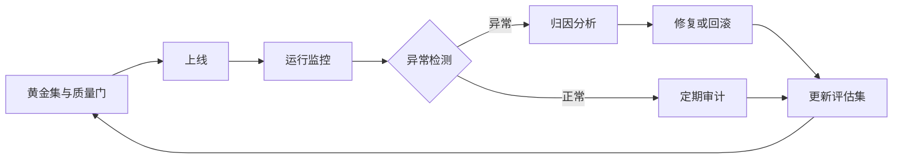

评估与监控这一节，我看到一个很实际的问题：

> 部署前的内容我可以让人工审核，部署后这些判断靠什么？定期脚本？外挂 Agent？还是人工？

这个问题刚好把质量保障、人类在环、异常恢复和学习适应几个模式串到一起。Agent 上线之后，真正的难点从“能不能回答”变成了“怎么知道它回答得对”。

## 1. 上线前：质量门和黄金测试

质量门是上线必须满足的条件。比如准确率不低于 95%，核心路径响应时间不超过 200ms，高风险工具调用必须经过权限校验。

质量门需要一套测试来支撑：

| 测试类型 | 检查什么 |
| :--- | :--- |
| 单元测试 | 解析、清洗、参数拼装这类局部逻辑 |
| 契约测试 | 工具接口、模型输出格式、上下游约定 |
| 集成测试 | 多个模块组合后的行为 |
| 关键路径测试 | 下单、审批、工单关闭这类核心流程 |

黄金集是质量门里最值得先投入的部分。找 20 到 50 条真实用例，覆盖核心场景和典型失败场景。没有黄金集，后面的模型升级和提示词改动都会变成凭感觉。

```python
GOLDEN_CASES = [
    {"input": "...", "expected_tool": "query_order", "must_contain": ["订单号"]},
    {"input": "...", "expected_tool": "refund", "risk": "high"},
]

def quality_gate(run_agent) -> bool:
    passed = 0
    for case in GOLDEN_CASES:
        result = run_agent(case["input"])
        if check_case(result, case):
            passed += 1
    return passed / len(GOLDEN_CASES) >= 0.95
```

这段代码里 `check_case` 可以先从规则和人工标注开始，后面再逐步换成更细的评估器。

## 2. 上线后：四类监控

上线后的监控通常看四个维度：

- 准确性：答案是否正确，工具选择是否合理。
- 性能：延迟、吞吐量、错误率。
- 成本：Token 消耗、单次调用成本。
- 漂移：数据分布和模型行为是否偏离预期。

判断方式不是单点，而是三层配合：

| 层级 | 负责什么 | 例子 |
| :--- | :--- | :--- |
| 脚本 | 可确定性判断 | 格式校验、接口错误、超时、Token 统计 |
| 评估 Agent | 模糊质量判断 | 相关性评分、事实一致性、回答结构 |
| 人工 | 高风险和边缘情况 | 退款审批、医疗建议、合同条款 |

脚本适合处理能被代码判断的指标。评估 Agent 适合处理需要语义判断的样本，但评估器本身也要定期校准。人工只处理高风险和低置信度样本，不能把所有人都拉进审核队列，否则告警疲劳很快就会来。

```python
def evaluate(trace):
    if trace.error:
        return {"status": "fail", "reason": "tool_error"}

    if not trace.output_schema_valid:
        return {"status": "fail", "reason": "schema_error"}

    score = llm_judge(trace.input, trace.output, trace.evidence)
    if score < 0.6:
        return {"status": "review", "reason": "low_score"}

    return {"status": "pass", "score": score}
```

评估逻辑要先处理确定性错误，再进入语义判断。这样能避免让模型评估一堆本来就格式错误的结果。

## 3. 漂移与回归

模型漂移指的是同一个模型、相似的输入，输出质量随着时间慢慢变差或者变得不可预测。推荐系统里用户兴趣变了，风控系统里欺诈模式变了，都可能引发漂移。

回归是另一种信号：原本稳定的指标突然偏离。比如准确率长期在 95% 左右，某天掉到 80%，并且持续不回升。

处理漂移和回归时，有三个动作比较实用：

1. 保留每次运行的输入特征、工具调用和输出摘要。
2. 按周或者按版本对比核心指标，监控均值和方差。
3. 阈值触发后先归因，不要直接把问题推给模型。

漂移可能来自数据变化、模型版本变化、工具接口变化，还可能来自提示词或上下文组装逻辑。只看最终准确率，很难判断该改哪一层。

## 4. 反思模式不能自己评自己

反思模式让模型先生成初稿，再批评和修正。这个模式在写作、代码修复、方案优化里都很有用。

但它有一个前提：批评必须有外部信号。

如果只让模型自己评价自己，它很容易围绕同一套叙事反复修改，甚至把正确内容改错。工程上要加三类约束：

- 外部标准：测试用例、检索证据、规则校验、评分器。
- 变更记录：保存每一轮的 diff，知道改了什么。
- 最大轮次：通常 2 到 3 轮就够，超过后收益会快速下降。

```python
def refine_with_reflection(task, max_rounds=3):
    output = generate(task)
    for _ in range(max_rounds):
        issues = critique(output, task)
        if not issues:
            break
        output = revise(output, issues)
        if not external_check(output, task):
            output = rollback()
            break
    return output
```

其中 `external_check` 是关键。它可以是单测，可以是检索到的证据，或者一套评分标准。没有它，反思只是在同一层里绕圈。

## 5. 护栏分四层

护栏与安全模式容易被理解成“入口过滤敏感词”。真实系统里，护栏至少要覆盖四层：


- 输入护栏处理提示注入、恶意内容和隐私信息。
- 模型输出护栏处理政策、合规和品牌安全。
- 工具调用护栏检查权限、参数范围和风险等级。
- 最终输出护栏检查交付内容是否越权、是否泄露内部信息。

只做输入过滤挡不住模型生成阶段的风险，还挡不住工具参数越权。高风险动作需要审批和沙箱，不能只靠提示词约束。

## 6. 人类在环

人类在环不是“系统做不了就找人”。它应该是一个有触发条件、有队列、有超时的流程。

常见触发条件：

- 风险等级高，例如退款、删除数据、对外发送邮件。
- 置信度低，模型无法确认下一步。
- 金额、权限或合规阈值被越过。
- 评估器给出低分，或者多个评估器结论冲突。

人工介入时，界面要展示完整上下文、变更 diff 和可执行动作。批准、拒绝、接管、补充信息这些操作都要有明确结果，做完之后再把控制权交还给系统。

人类在环会增加延迟，所以不能所有请求都走人工。把明确规则交给脚本和评估 Agent，把真正需要判断的部分留给人。

## 7. 异常处理与恢复

异常处理模式可以按错误类型分三条路：

- 永久性错误：重试没有意义，走备用方案或人工处理。
- 临时性错误：指数退避重试，限制最大次数。
- 关键响应错误：保存现场、通知团队、必要时中止流程。

```python
def call_with_recovery(action):
    for attempt in range(3):
        try:
            return action()
        except TemporaryError:
            sleep(2 ** attempt)
        except PermanentError:
            return fallback()
    save_checkpoint()
    return escalate_to_human()
```

恢复逻辑要和状态保存配合。长任务必须把已完成步骤、当前输入和失败位置写下来，否则重试只能从头开始。

## 8. 学习与适应

学习与适应模式收集用户修正、评分和自动化评估结果，用来更新提示词、策略或者工具配置。微调模型通常是最后选项，不是第一反应。

反馈数据要先清洗和验证，防止把恶意反馈或者错误标注学进去。更新之后还要做 A/B 测试，确认指标真的变好，再逐步放大。

```python
def learn_from_feedback(case, feedback):
    if not validate_feedback(feedback):
        return
    if feedback["type"] == "prompt":
        update_prompt_examples(case, feedback["correction"])
    elif feedback["type"] == "tool":
        update_tool_description(case, feedback["correction"])
```

学习闭环不适合追求自动更新一切。提示词示例、工具描述和评估集比模型权重更容易控制，改动成本也更低。

## 9. 目标与监控

目标监控模式要求把目标写成可衡量的形式，再在执行过程中持续检查。

一个可用的目标需要包含四个部分：

| 部分 | 例子 |
| :--- | :--- |
| 目标 | 把退款工单平均处理时间降到 5 分钟 |
| 约束 | 高风险退款必须人工确认 |
| 指标 | 处理时间、人工介入率、错误率 |
| 检查点 | 每 100 单检查一次 |

目标监控的难点是冲突。处理时间下降可能带来错误率上升，人工介入减少可能带来风险增加。监控多个指标时，要提前定义谁优先，不能等冲突出现再临时决定。

## 10. 可靠性闭环

把前面这些串起来，是一个完整的闭环：



这个闭环里，评估集不是一次性的验收文档。每次线上事故和边缘情况都应该回流到评估集，让下一轮上线质量门更接近真实问题。

:::note 系列说明
本文选题与 20 种模式分类拓展自 lvy 的博客《20种Agent 设计模式》：
[原文链接](https://blog.csdn.net/2301_80171004/article/details/160947992)

原文图片没有直接搬运，系列里的结构图均按文章需要重新绘制。
:::
