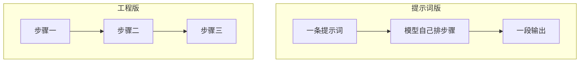
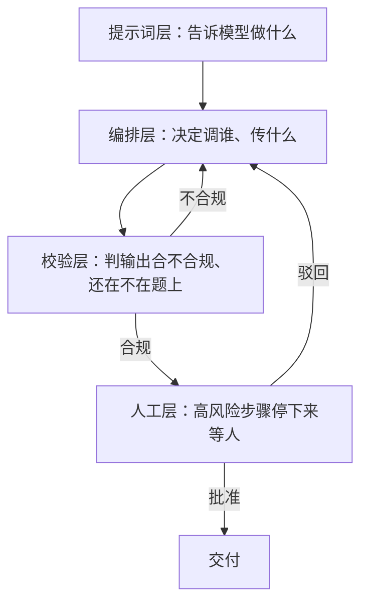

有人问过我一个问题：提示词链和规划是不是都属于提示词层面的东西，有没有机制能强制校验 Agent 有没有跑题。

这个问题问得准。我把之前一条竞品分析链里的校验点全删掉，只留一段「请按以下三步执行」，结果第二步它就开始写报告，第三步又把第二步换个说法重复了一遍。

写下步骤等于告诉模型该怎么做，不等于它必须这么做。

系列前三篇分别写了控制流、多 Agent 协作和可靠性。这一篇补的是它们底下那层东西：软约束和硬校验各自长在哪里，谁能真的拦住跑题。

## 1. 一条没有校验的链

那条链的任务是写竞品分析：提取竞品信息 → 分析优劣势 → 写报告。提示词里我明确写了「请按以下三步执行，每步单独输出」。跑出来的过程大概是这样：

```text
第 1 步：已收集到 A、B、C 三家竞品的信息。

第 2 步：A 家最近在做行业整合，整个赛道从 2024 年以来……
（后面跟了八百多字行业历史）

第 3 步：综上所述，A 家在这轮行业整合中的位置如下……
```

第二步写成了行业综述，第三步把第二步的结论换个说法抄了一遍。整段输出读起来完整，没有报错，没有任何地方提醒我它偏了。

提示词给出的是顺序，不是约束。下面把两种实现分开看。

## 2. 提示词链的两种实现

提示词链有两种写法，差别不在步骤本身，而在谁控制步骤之间的流转。

| 维度 | 提示词版 | 工程版 |
| :--- | :--- | :--- |
| 步骤写在哪 | 同一条提示词里 | 代码里的调用顺序 |
| 谁决定下一步的输入 | 模型自己挑 | 上一个函数的返回值 |
| 能不能跳步 | 能 | 不能，没有那个入口 |
| 跳步能不能被发现 | 看不出来 | 返回值对不上 schema 就暴露了 |
| 出错怎么定位 | 只能整段重跑 | 定位到具体某一步 |
| 改一步的成本 | 改提示词，牵动其他步骤 | 改那个函数 |

提示词版长这样：

```python
prompt = """请按以下步骤完成任务：
1. 提取需求
2. 根据需求生成大纲
3. 根据大纲写正文
每一步单独输出，不要跳步。"""
answer = llm(prompt, user_input)
```

这段提示词给了模型一个顺序。它可以照做，能合并两步、跳过一步，或者在第二步顺手把第三步一起做完。你拿到的是最终那段文字，从里面分辨不出它是怎么走到这里的。

工程版长这样：

```python
outline = llm("根据主题列一份提纲", topic)
draft = llm("按照提纲写初稿", outline)
final = llm("润色这段文字", draft)
```

第三步的输入就是第二步的返回值，模型没有跳过第二步的入口。它能自由发挥的范围被压到单次调用内部。



工程版也不是万能的。它管住的是步骤之间的边界，单步内部的质量还是空的。第三步的提示词要求「只写三个自然段」，模型写了五个，调用顺序看不出来。这类问题要等校验层来接，见第 5 节。

## 3. 计划放哪儿

规划模式有两套实现，区别在计划存在哪里。

```python
resp = llm("先列出完成这个任务的步骤，然后按步骤执行。", task)
```

这里的计划是模型输出里的一段文字，躺在对话上下文里。后面几轮推理把它挤掉一部分，模型就可能自己长出新的步骤。执行到一半时，你也没法问它「第二步做完了吗」。

```json
{
  "goal": "写一份竞品分析报告",
  "steps": [
    { "id": 1, "task": "收集竞品信息", "status": "done" },
    { "id": 2, "task": "分析优劣势", "status": "in_progress" },
    { "id": 3, "task": "撰写报告", "status": "pending" }
  ]
}
```

计划变成了一份数据结构。能改它的是代码，模型提交的是某一步的结果，而不是「我觉得现在该做第四步了」。

| | 提示词里的计划 | 系统里的计划 |
| :--- | :--- | :--- |
| 存在哪 | 对话上下文 | 结构化状态 |
| 谁能改 | 模型 | 代码 |
| 进度能不能查 | 不能 | 读 status 就行 |
| 失败之后怎么办 | 让模型重写一段计划 | 把这一步重置成 pending 再跑 |
| 重启之后还在吗 | 不在 | 在，只要状态落了盘 |

## 4. 软约束会怎么失效

把上面那条链的翻车方式列出来，一共六种：

| 失效方式 | 具体表现 | 纯提示词能不能发现 |
| :--- | :--- | :--- |
| 跳步 | 从需求直接跳到正文 | 不能 |
| 合并步骤 | 大纲和正文挤在一段里 | 不能 |
| 插入无关内容 | 竞品分析里写了半页行业历史 | 不能 |
| 忘记目标 | 报告越写越像市场调研 | 不能 |
| 自造步骤 | 多出「总结行业趋势」这一步 | 不能 |
| 格式跑偏 | 该出 JSON 的地方出了一段散文 | 能，前提是你写了校验 |

前五种都要读输出才能判断，而读输出这件事如果没有外部标准，最后还是模型自己说了算。第六种有确定的判据，所以能写成代码拦住。

## 5. 四种硬校验

:::note 判据从哪来
每一层校验都要有一个不依赖模型的判据：schema、状态约束、权限表、人的决定。判据是模型自己给的，校验就退化回软约束。
:::

### 5.1 结构校验

```python
def call_with_schema(prompt, payload, schema, retries=2):
    for _ in range(retries + 1):
        raw = llm(prompt, payload)
        try:
            data = json.loads(raw)
        except json.JSONDecodeError:
            continue
        if validate(data, schema):
            return data
    raise SchemaError("连续三次都没有给出合规输出")
```

判据是确定的：字段有没有漏、类型对不对、枚举值在不在范围内。代价是重试，最坏情况多两次调用。

### 5.2 目标校验

```python
ON_TOPIC = """原始目标：{goal}

这一步的输出：{output}

判断这段输出是否仍然服务于原始目标。
只返回 JSON：{{"on_topic": true, "reason": "偏离原因"}}"""

def check_on_topic(goal, output):
    return json.loads(llm(ON_TOPIC.format(goal=goal, output=output), ""))
```

判定交给另一个模型，判据是自然语言写的一句话。这里多出一个新的不确定性：判定器自己会不会看走眼。上线之前先攒一批人工标过的输出当黄金集，量出它的准确率，再让它拦主流程。

### 5.3 状态机校验

```python
def run_plan(plan, step_impl):
    while True:
        running = [s for s in plan["steps"] if s["status"] == "in_progress"]
        if running:
            raise PlanViolation("上一步还没收尾")
        step = next((s for s in plan["steps"] if s["status"] == "pending"), None)
        if step is None:
            return plan
        step["status"] = "in_progress"
        try:
            step["result"] = step_impl[step["id"]](plan)
            step["status"] = "done"
        except Exception as exc:
            step["status"] = "failed"
            step["error"] = str(exc)
```

循环只从 pending 里取步骤，取之前先确认没有正在跑的步骤。跳步在这里没有实现路径：第三步想跑，它得先变成 pending，而只有代码能改 status，模型交回来的只是一段结果。

### 5.4 权限与审批点

这三类检查放在调用层，不放在提示词里：

- 工具白名单：模型请求调用列表外的工具，直接拦下。提示词里写「不要调用删除接口」，挡不住它。
- 参数范围：退款金额超过阈值就转人工，规则写在代码里。
- 审批断点：高风险步骤停下来等人确认，确认结果写进状态，进程重启之后不会丢。

:::warning 提示词不是权限
在提示词里写「不要做某件事」，等于把这条规则的执行权交给了被约束的那一方。权限类规则要在工具调用层拦。
:::

## 6. 四层结构



| 层 | 硬还是软 | 靠什么生效 | 失效的时候 |
| :--- | :--- | :--- | :--- |
| 提示词层 | 软 | 模型的遵循程度 | 跑题了也没人知道 |
| 编排层 | 半硬 | 代码里的调用顺序 | 顺序能保证，单步内部的质量保证不了 |
| 校验层 | 硬 | schema、规则、判定器 | 不合规就打回重做 |
| 人工层 | 硬 | 审批动作 | 没批准进不了下一步 |

:::important 编排层只是半硬
它管得住步骤之间的边界。第三步的提示词要求只写三点，模型写了七点，状态机看不出来。这种情况要交给校验层的结构校验，或者把这一步的输出也定义成 schema。
:::

## 7. 最小骨架

把四种校验拼成一个循环，大概四十行：

```python
def run_pipeline(goal, plan, steps, next_input, approver=None):
    while True:
        step = next((s for s in plan["steps"] if s["status"] == "pending"), None)
        if step is None:
            return plan

        if approver and step["id"] in approver["ids"]:
            if approver["ask"](goal, step) != "approve":
                step["status"] = "rejected"
                return plan

        step["status"] = "in_progress"
        spec = steps[step["id"]]
        data = call_with_schema(spec["prompt"], next_input, spec["schema"])

        verdict = check_on_topic(goal, data)
        if not verdict["on_topic"]:
            step["status"] = "off_topic"
            step["reason"] = verdict["reason"]
            return plan

        next_input = data
        step["status"] = "done"
```

循环停下来的时候只有四种状态：done 是走完了，failed 是调用失败，off_topic 是判定跑题，rejected 是人工驳回。任何一种停下来，调用方都能从 plan 里读到停在哪一步、为什么停。这段代码做的事情，是把「跑题」从一个读输出才能察觉的现象，变成一条带原因的状态记录。

## 8. 加在哪一层

每一层都有成本。结构校验的重试和目标校验的判定器都是额外的模型调用，延迟和 token 直接跟着涨；判定器要维护黄金集，规则要跟着业务改。

| 任务类型 | 建议到哪一层 | 理由 |
| :--- | :--- | :--- |
| 内部草稿、日志摘要 | 结构校验 | 出错了没人看见，重跑一遍就行 |
| 对外内容、客服回复 | 结构校验 + 目标校验 + 状态机 | 跑题会被用户直接看到 |
| 花钱、发信、改数据 | 上面三层 + 权限校验与审批断点 | 失败的代价不可逆 |

顺序上我建议从 schema 开始，再加状态机，然后是目标校验，最后才是审批断点。反着做，前期投入会花在还用不到的地方。

## 9. 脉络表

| 要回答的问题 | 靠什么 |
| :--- | :--- |
| 该按什么顺序做 | 提示词链、规划 |
| 这一步的输出合不合格 | 结构校验 |
| 这一步还在不在题上 | 目标校验 |
| 能不能进下一步 | 状态机 |
| 能不能用这个工具 | 权限校验 |
| 出错之后怎么办 | 异常处理与恢复 |
| 该不该让人看一眼 | 人类在环 |

配合前三条看会更顺：[控制流](/posts/agent-design-patterns-control-flow/)、[多 Agent 与记忆](/posts/agent-design-patterns-multi-agent-memory/)、[可靠性](/posts/agent-design-patterns-reliability/)。这一篇补的是它们共用的那套校验骨架。

下一步可以玩什么：

- 给现有的链加一个 schema，把跳步变成能检测的失败，而不是等到读输出才发现。
- 把计划从提示词搬进 JSON，跑一遍，看模型卡在哪一步。
- 给判定器攒三十条人工标过的样本，先量准确率再上线。
- 挑一个高风险步骤做审批断点，把人驳回的原因记下来看分布。

:::note 系列说明
本文选题与 20 种模式分类拓展自 lvy 的博客《20种Agent 设计模式》：
[原文链接](https://blog.csdn.net/2301_80171004/article/details/160947992)

原文图片没有直接搬运，系列里的结构图均按文章需要重新绘制。
:::
