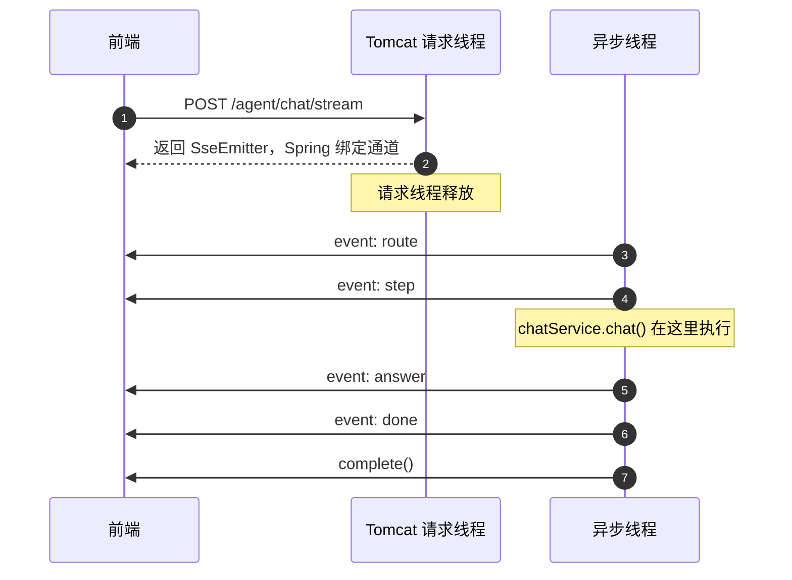

我在写一个 Agent 项目，按 M1 到 M4 分期推进。M1 要落地的第一块是对话接口的流式返回：用户发一句话进来，后端把路由结果、工具调用、回答正文和 token 用量这几类事件陆续推给前端。

这块逻辑我前前后后问了很多轮，问题散在类型声明、异步执行、事件命名、data 结构、收尾方式这些点上，索性整理成一份模板。代码是模板级的伪代码，接口名和字段按你项目里的实际命名替换。

## 1. 这类接口为什么用 SSE

一次 Agent 问答要经过路由、工具调用、检索和生成，中间会跨好几秒甚至几十秒。前端如果只拿得到最终结果，用户全程都在盯着一个转圈图标。

SSE 是服务端单向推，浏览器用原生 `EventSource` 就能接，Agent 对话的数据流向刚好是单向的。

| 需求 | 选什么 |
| :--- | :--- |
| 单向推送、文本事件流 | SSE |
| 前端也要频繁主动推 | WebSocket |
| 一次性返回 | 普通 REST 接口 |
| 大文件、二进制流 | `StreamingResponseBody` 或文件下载 |

可能你会想：既然要推送，那直接上 WebSocket 不就行了。Agent 对话里双向通信的场景很少，多出来的能力反而要自己处理心跳、重连和帧解析。SSE 走普通 HTTP，重连交给浏览器，后端按事件格式往外写就行。

## 2. 完整模板代码

```java
import org.springframework.http.MediaType;
import org.springframework.web.bind.annotation.*;
import org.springframework.web.servlet.mvc.method.annotation.SseEmitter;

import jakarta.validation.Valid;
import java.io.IOException;
import java.util.HashMap;
import java.util.Map;
import java.util.concurrent.CompletableFuture;

@RestController
@RequestMapping("/agent")
public class AgentStreamController {

    private final ChatService chatService;
    private final Executor agentExecutor;   // 建议自定义线程池，别用 commonPool

    public AgentStreamController(ChatService chatService, Executor agentExecutor) {
        this.chatService = chatService;
        this.agentExecutor = agentExecutor;
    }

    /**
     * SSE 流式对话接口
     *
     * 关键点：
     * 1. produces = text/event-stream，告诉 Spring 这是流式响应
     * 2. 返回类型必须是 SseEmitter，Spring 才会走 SSE 处理、建立通道
     * 3. 真正的耗时逻辑放到异步线程，避免占用 Tomcat 请求线程
     * 4. 通过 emitter.send 多次推送事件，最后 complete 关闭
     */
    @PostMapping(
            value = "/chat/stream",
            produces = MediaType.TEXT_EVENT_STREAM_VALUE
    )
    public SseEmitter chatStream(@Valid @RequestBody ChatRequest request) {

        // ① 创建 emitter，设置超时（0L 表示永不超时）
        SseEmitter emitter = new SseEmitter(120_000L);

        // ② 注册生命周期回调，便于排查客户端断开、超时等情况
        emitter.onCompletion(() -> log.info("SSE completed, session={}", request.getSessionId()));
        emitter.onTimeout(()    -> log.warn("SSE timeout, session={}", request.getSessionId()));
        emitter.onError(e      -> log.warn("SSE error, session={}, msg={}", request.getSessionId(), e.getMessage()));

        // ③ 异步执行，避免阻塞 Tomcat 请求线程
        CompletableFuture.runAsync(() -> {
            try {
                // ===== 1. route 事件：通知前端路由到哪个 agent =====
                emitter.send(SseEmitter.event()
                        .name("route")
                        .data(Map.of("agent", "code_agent")));

                // ===== 2. step 事件：通知前端当前执行步骤 =====
                Map<String, Object> stepData = new HashMap<>();
                stepData.put("type", "tool_call");
                stepData.put("tool", "search_code");
                stepData.put("args", Map.of("query", request.getMessage()));
                emitter.send(SseEmitter.event()
                        .name("step")
                        .data(stepData));

                // ===== 3. 真正执行业务逻辑 =====
                ChatResponse response = chatService.chat(request);

                // ===== 4. answer 事件：推送回答正文与引用 =====
                emitter.send(SseEmitter.event()
                        .name("answer")
                        .data(Map.of(
                                "content",   response.getContent(),
                                "citations", response.getCitations()
                        )));

                // ===== 5. done 事件：推送统计信息并正常结束 =====
                Map<String, Object> usage = new HashMap<>();
                usage.put("promptTokens",     response.getPromptTokens());
                usage.put("completionTokens", response.getCompletionTokens());
                usage.put("totalTokens",      response.getTotalTokens());
                usage.put("latencyMs",        response.getLatencyMs());

                Map<String, Object> doneData = new HashMap<>();
                doneData.put("traceId", response.getTraceId());
                doneData.put("usage",   usage);

                emitter.send(SseEmitter.event()
                        .name("done")
                        .data(doneData));

                // ===== 6. 正常结束 =====
                emitter.complete();

            } catch (Exception e) {
                // ===== 7. 异常兜底：尽量推一个 error 事件 =====
                try {
                    emitter.send(SseEmitter.event()
                            .name("error")
                            .data(Map.of(
                                    "message",
                                    e.getMessage() == null ? "Agent 执行失败" : e.getMessage()
                            )));
                } catch (IOException ignored) {
                    // 客户端可能已断开，忽略
                } finally {
                    emitter.completeWithError(e);
                }
            }
        }, agentExecutor);

        // ④ 关键：必须 return emitter，Spring 才能绑定响应、建立 SSE 通道
        return emitter;
    }
}
```

## 3. 返回类型得是 SseEmitter

Spring 靠方法声明的返回类型挑处理器。声明成 `SseEmitter`，才会走 `SseEmitterReturnValueHandler`，把响应设成 `text/event-stream`、保持连接打开、绑定 emitter。

换成 `Object`、`String` 或者 `void`，请求会走普通处理那一套，SSE 通道根本没建起来，异步线程里的 `send` 也就发不出去。

## 4. return emitter

`return` 是方法唯一的出口，只执行一次。

它把 emitter 交给 Spring，Spring 在 return 之后才把 emitter 和 HTTP 响应绑到一起。异步线程里的 `send` 要等绑定完成才会真正写到响应上。返回 null 或者别的对象，通道都建立不起来。

:::important 两件事的顺序
Tomcat 请求线程先 return emitter，Spring 再绑定通道，异步线程才能 send。
:::

## 5. 耗时逻辑交给异步线程

```java
CompletableFuture.runAsync(() -> { ... }, agentExecutor);
```

Tomcat 请求线程跑的是建立通道这一步，几秒到几十秒的 Agent 逻辑丢给它，会把线程池占满。

放到异步线程之后，请求线程在 return 那一刻就释放了，SSE 连接由 emitter 自己维持。线程池建议自己建一个，默认的 `ForkJoinPool.commonPool` 在并发上来之后不够用。

## 6. 事件名管分类，data 管内容

```java
SseEmitter.event().name("route").data(Map.of("agent", "code_agent"))
```

`.name()` 决定前端按哪个事件名分流，`.data()` 是这一帧的负载，Spring 用 Jackson 把它序列化成 JSON。

Agent 场景里常用的五类事件：

| 事件名 | 时机 | data 内容 | 前端用途 |
| :--- | :--- | :--- | :--- |
| `route` | 开始 | `{agent}` | 显示路由到哪个 agent |
| `step` | 执行中 | `{type, tool, args}` | 显示步骤条或工具调用 |
| `answer` | 出结果 | `{content, citations}` | 渲染回答正文 |
| `done` | 结束 | `{traceId, usage}` | 停止加载、显示用量 |
| `error` | 异常 | `{message}` | 显示错误、停止加载 |

`.name()` 是可选项，但前端要靠它分流，写上是省事的选择。

## 7. 推送顺序



`route` 和 `step` 是过程通知，不依赖业务结果，可以早发。`answer` 和 `done` 的 data 来自 `chatService.chat()` 的返回值，得等它返回。所以中间那段耗时逻辑删不掉，这几帧也合并不了一帧。

## 8. 异常兜底与收尾

Agent 执行可能超时、检索失败、模型报错，整个流程要用 try-catch 包住。

出错时尽量推一个 `error` 事件出去，让前端有明确反馈，而不是永远转圈。推 `error` 本身也可能失败，客户端断开的时候就会抛 `IOException`，所以在 catch 里再包一层 try-catch。

收尾分两种：正常走 `complete()`，异常走 `completeWithError(e)`。只 send 不关闭，连接会一直挂着。

## 9. 前端怎么接

```js
const es = new EventSource('/agent/chat/stream');  // 或 fetch + ReadableStream

es.addEventListener('route',  e => showStatus(`路由到 ${JSON.parse(e.data).agent}`));
es.addEventListener('step',   e => appendStep(JSON.parse(e.data)));
es.addEventListener('answer', e => renderAnswer(JSON.parse(e.data)));
es.addEventListener('done',   e => { stopLoading(); console.log(JSON.parse(e.data).usage); });
es.addEventListener('error',  e => showError(JSON.parse(e.data).message));
es.onerror = () => es.close();
```

前端只管挂监听器，后端 send 一次就触发一次对应回调。通道一直开着，直到 `complete()` 关上。

## 10. 什么场景别用

| 场景 | 更合适的方案 |
| :--- | :--- |
| 前端也要频繁主动推数据 | WebSocket |
| 数据量极大、二进制流 | `StreamingResponseBody` 或文件下载 |
| 只要一次返回 | 普通 `@RestController` |

第三种情况硬上 SSE，多出来的是一套事件协议和一段异步收尾逻辑，收益基本为零。

## 11. 速记卡

```
【SseEmitter 模板速记】

接口签名:
  @PostMapping(produces = TEXT_EVENT_STREAM_VALUE)
  public SseEmitter xxx(@RequestBody Req req)

方法体:
  1. new SseEmitter(timeout)          ← 造通道
  2. 注册 onCompletion/onTimeout/onError
  3. CompletableFuture.runAsync(() -> {
         try {
             send(route)                ← 过程通知
             send(step)                 ← 过程通知
             resp = service.call(req)   ← 真正耗时逻辑
             send(answer)               ← 结果通知（依赖 resp）
             send(done)                 ← 结束通知（依赖 resp）
             complete()                 ← 正常关闭
         } catch (Exception e) {
             send(error)                ← 异常兜底
             completeWithError(e)       ← 异常关闭
         }
     }, executor)
  4. return emitter                    ← 必须！交给 Spring 建通道

事件规范:
  .name("route" | "step" | "answer" | "done" | "error")
  .data(Map / DTO)                     ← 会被序列化成 JSON

三条铁律:
  ① 返回类型必须是 SseEmitter
  ② 必须 return emitter
  ③ 正常 complete / 异常 completeWithError
```

## 12. 后面还有什么

M1 阶段的第一部分先放这些能直接复用的内容。同一条线上的后续我按顺序往下写：

- 事件协议怎么定版本、加字段时不破坏前端
- `answer` 拆成 `token` 事件做出打字机效果
- 断线重连和 `Last-Event-ID` 续传
- 客户端主动中断时后端的资源回收
- 多实例部署时 SSE 连接怎么落到同一个节点

返回 `SseEmitter` 建通道，异步线程多次 `send` 推事件，最后 `complete` 关掉。name 分类，data 装内容，异常兜底，return 交权，写 Agent 流式接口要落的就这几步。
