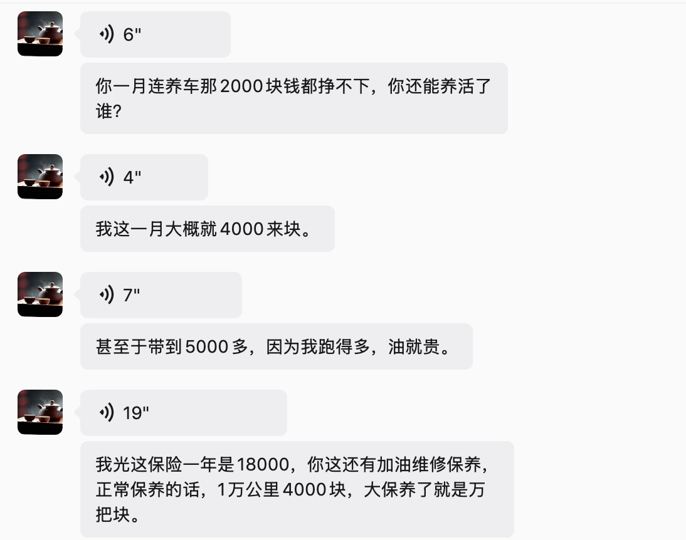
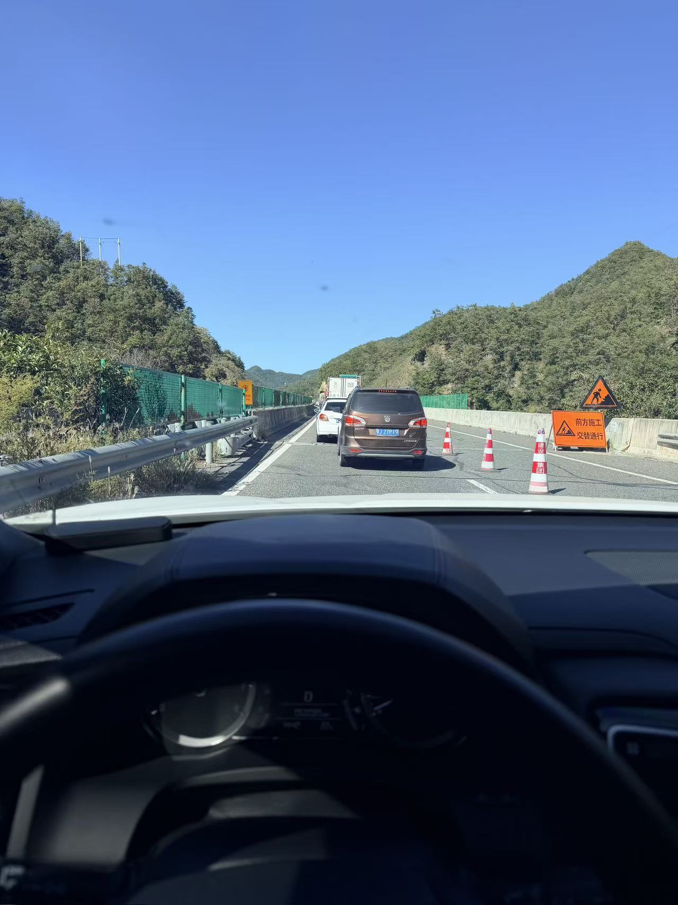

买得起BBA，不等于养得起BBA。  
这句话我以前听过，但直到今年国庆，我才算真正有了体会。

国庆回家，我给老爹当司机。驾照刚考下来，给父亲开车，在我看来是理所当然的事。老爹有一台GLE450，我爸知道我不敢开，所以没让我碰。我也没逞强，转身拿了老妈那台本田URV的钥匙。

URV车身宽大，坐姿比轿车高，方向盘偏轻，开起来没有看起来那么笨重。我调好座椅，老爹坐进副驾，后座还坐着其他人。我们出发去山阳。

路上总得说话，聊着聊着就聊到了车。老爹看着前方，语气很平常：“等你毕业，或者结婚的时候，给你买一台E300L豪华吧。这车也配得上你。”

我盯着前面的路，没敢立刻接话。倒不是怕显得我太想要。我喜欢E300L这件事，家里早就知道，根本不是秘密；只是车里还坐着其他人，当着外人的面答应，我有点不好意思，好像我多迫不及待要老爹给我买车似的。

E300L我确实从高中就喜欢。以前跟老爹出门，路上只要闪过一辆E300，我会立刻停下正在说的话题，眼睛跟着它走，直到它拐弯或者被车流挡住。那时候我没驾照，对车的喜欢也停在表面。我只知道这车内饰好看，晚上氛围灯亮起来很优雅，开起来很从容。保险、保养、油耗、停车费这些，我根本没想过。

直到这次从山阳回来，我才认真算了一笔账。保险、保养、油费，加上一线城市的停车费，各种开支摊到每个月，大概两千到三千。然后手机开始给我推各种视频，封面上的字很吓人：月入一万，慎入。视频一个接一个，博主们列账单、画图表，说得头头是道。我看了半天，心里那点喜欢慢慢冷静下来。

按一个大四学生出去实习，或者刚毕业初入社会那点实习工资来算，想养E300L，确实不太现实。

于是我又去看别的车。亚洲龙、雷克萨斯、宝马三系、凯迪拉克CT5。看来看去总能找到槽点：外观好看的内饰差点意思，内饰好看的外观又小气。CT5外观内饰我都挺喜欢，可它那个“仁王盾”喝油不是一般的厉害，后排空间也难受。最后我只能承认，BBA不坑穷人。穷人连被坑的资格都没有。

但转头我又骂自己没出息。一个二十出头的人，连每个月两千块的养车钱都怕，以后还能干什么？更何况我根本不用背贷款。家里对我的托举已经够多了。家里在我名下买了两套房，都是全款给我的，一是有能力一次性付清，二是怕我负担大。这已经充分证明，家里真的很惯我。

所以我会想，如果我家境没那么好呢？如果毕业以后房贷车贷都压在身上呢？难道我也要因为一辆E300L的养车成本，就对所有要背的东西退缩？

我记得有种说法，一个人可能攒不下一百万，但绝对能还清一百万。以前我没太当回事，现在倒有些认同。哪怕视频里都在说月入一万养不起E300L，我算完账还是觉得，两千多块没有那么夸张。我可以把它当成毕业后的第一份挑战。否则车和房都由家里全款买了，连养车都还要靠家里，那和废物有什么区别。

后来我想，我一开始觉得养不起，可能不全是钱的问题。我从小家里条件其实没那么好，那种匮乏感会留在性格里，变成一种不高的配得感。比如之前找实习，线上有个老板给我开一天一百二。钱不算多，可我打心底觉得自己不配靠技术赚钱。但道理上讲，我的产出肯定超过一百二，否则没人会倒贴钱招实习生。奇怪的是，这种不配得感在其他地方不太明显，偏偏在薪资上特别严重。大概是我对自己的技术栈和掌握深度不够自信，对整个行业也不够自信。

再往深里想，这种不配得感可能还有一部分原因：家里把我保护得太好了。我从小没去打过工，没真正靠自己的手赚过钱，所以在我这里，“赚钱”一直是一件难度很高的事。人对自己没接触过的事情，总会先退一步。换一个从小就要自己挣零花钱、自己找活干的环境，我大概不会是这个心态。不过环境影响人，这样的性格我也没什么可抱怨的。以后改就是了。

说到不自信，其实我的学生时代也没什么值得炫耀的。小学、初中、高中，我从来都不是学霸。相反，我学得还算认真，成绩却常年排在年级40%到50%之间。现在回头看，我一直挺老实，成绩却不靠前，大抵是努力了，但没努力到点子上。英语常年在及格线附近；数学我自称学得不错，却也只能考到110；物理常常只有60；化学更不算擅长。越学越没自信，最后我把这些都归结为天赋。可能人的智商和天赋确实有上限，直到现在，我还认为这个说法有一定道理。

其实英语差这件事挺冤的。我小学时英语很好，但有一次上课，我和同学在课上扔纸球。等我反应过来时，语法已经听不懂了；再一抬头，大半年过去了。如果当时没扔那个纸球，我的英语会不会一直好下去？高中开始练口语，大学出国留学？虽然也考虑过出国，但我的English确实有点poor。之后真要去，可能只考虑日本、俄罗斯这些国家了。意大利或者英国，我也很想去。算了，真有必要的话，我会继续学英语的。

跑题了，说回刚刚的话题。

我不认为IT还能像2018年那样遍地黄金。2026年的IT在AI的影响下半死不活，对初级开发者尤其致命。我没有信心保证，自己现在学的东西十年后还能准时换成一份工资。但话说回来，这些也都是胡思乱想。汽车出现后，拉车的师傅失业了，可司机这个职业也跟着诞生了。无论如何，只要肯学、肯干，甚至肯出力，总还是能在社会上找到立足之地。实在不行，去日本或者美国出卖劳动换报酬，再回国花，这也能算一条求生思路。这里不赘述了。

写到这里，我也说不清文章到底讲了什么。我只是想吐槽一下自己的懦弱，顺便感慨BBA养车真贵。不知不觉写了这么多，想说的也都说到了。

后来有人问我，家境好是不是可以躺平。我说句反常识的：不太能，起码刚达到A8的家境，还不足以让你彻底放下一切。也可能我的思维一直停留在家里比较贫寒的2015年。我始终认为，人的立身之本从来不是家底，而是自己手上那点能拿去社会上换饭吃的技术。

我这人有毛病，喜欢拿别人的长处比自己的短处。看到技术好的人，我羡慕他的技术，忽略他的不足；看到情商高的人，我感慨他的情商，忘记他花钱大手大脚。面对我父亲时，这个毛病更严重。我很佩服他一生三起三落，仍然能给家里提供优渥的环境。换成我，可能第一次落下去就撂挑子了，跑去出苦力还债。可他撑住了。我一直想，打工无法大富大贵，但在金矿时代结束以后，这真的是二代们最好的归宿。越有钱的老板越在意体面，那我自然想做好自己的工作。一部分为了我自己，更多是为了老爹在外人面前提起我时，能因为我而体面、自豪。

扯远了，哥们。就写到这里吧。最后附上几张图：

