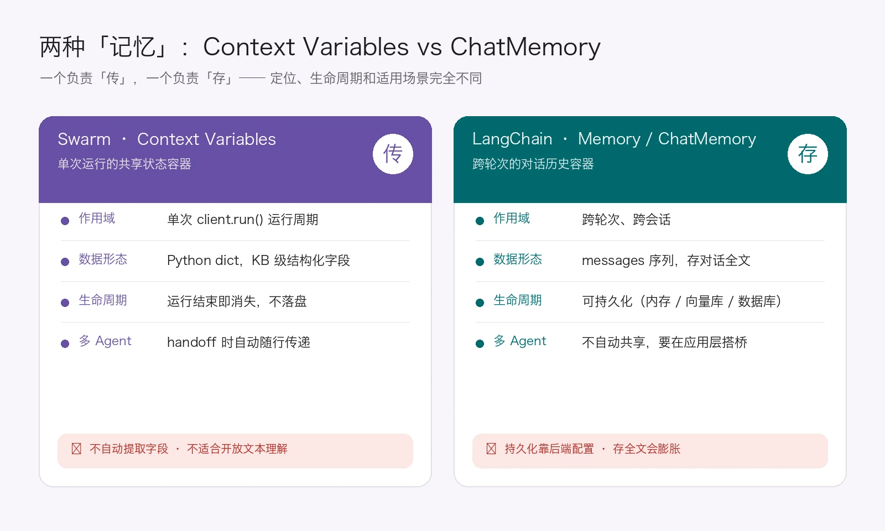
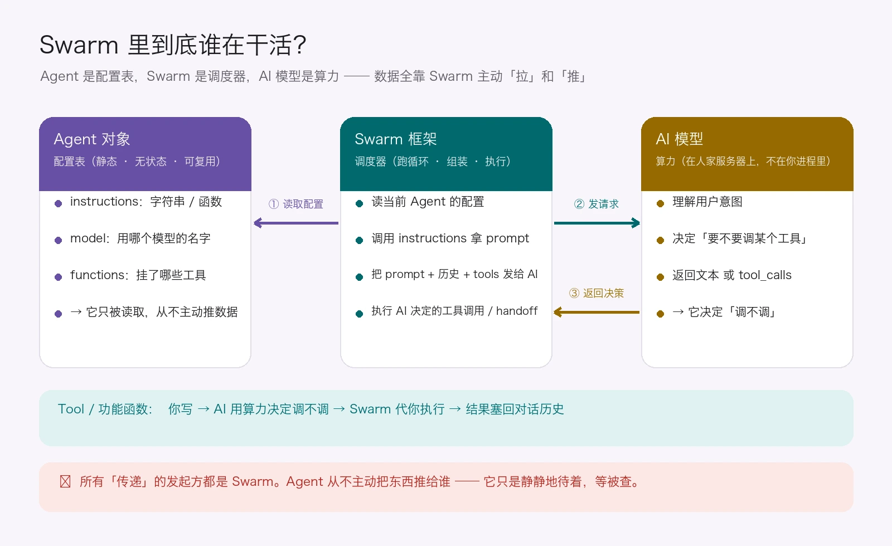
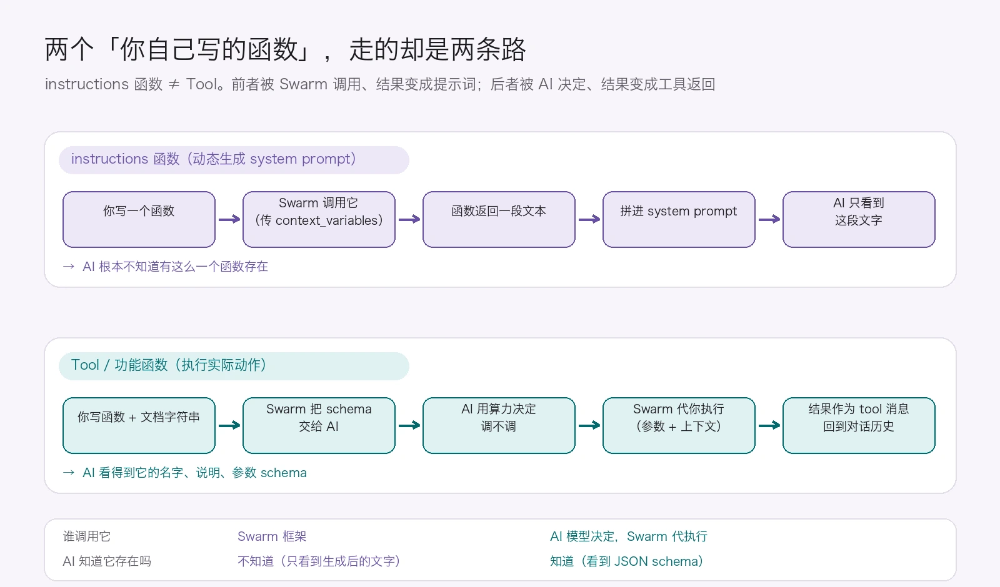
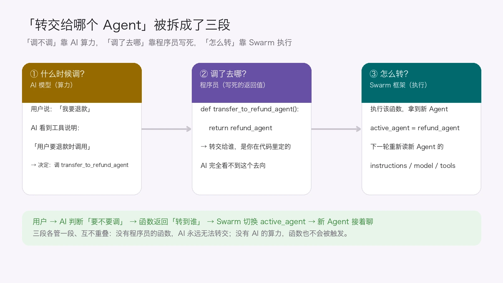
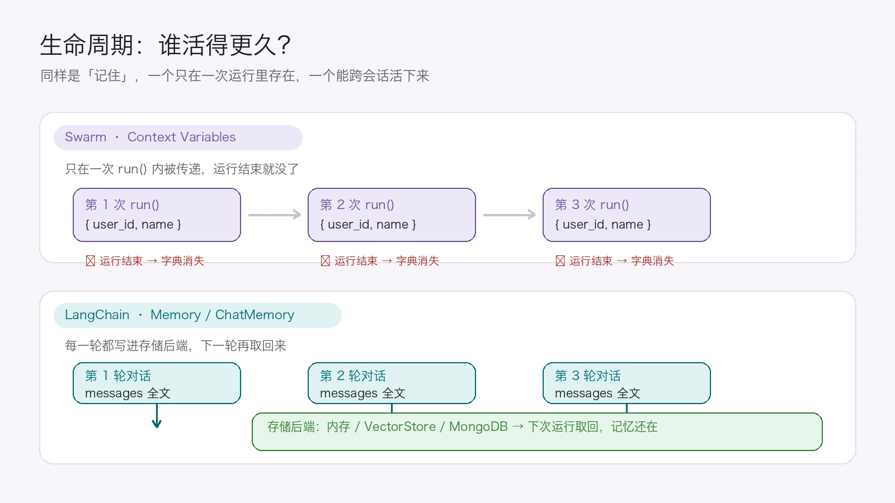
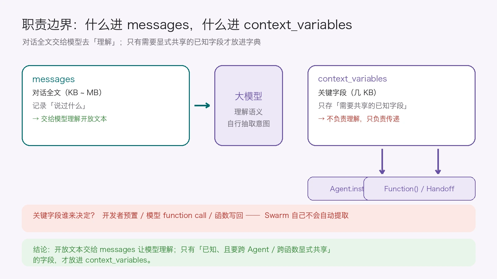

上一篇我们用 Swarm 把多 Agent 协作的最小骨架过了一遍：Agent、Handoff、Context、run() 这几个抽象，以及一次运行里消息是怎么流转的。

写完以后我又回去把那张时序图盯了很久，越看越觉得有个地方不对劲：智能体对象（Agent）在整张图里，好像从头到尾没给谁传过任何东西。

顺着这个疑问往下想，问题就一个个冒出来了：

- Agent 一直"被获取"，那它自己到底干不干活？
- 指令函数（instructions）和工具函数（Tool），不都是我自己写的 Python 函数吗，它们是一回事？
- 决定"转交给哪个 Agent 专家"的，是模型的算力，还是我写死的代码？
- 用户之前说过的话被共享给了多个 Agent，我关掉网页再刷新进来，它还记得吗？

这几个问题问得有点杂，但最后都指向同一件事：在 Swarm 里，到底谁在干活。

这篇就按这个顺序往下捋，先把角色分清楚，再顺着"记忆"这条线走到底。



*图：两种「记忆」各自负责的部分。*

# 第一部分　先把几个人认清楚

一张 Swarm 的图里其实站着五个人：

| 角色 | 是什么 | 在哪 |
| :--- | :--- | :--- |
| **Agent 对象** | 配置表：我是谁、我怎么说话、我能用什么工具、我用哪个模型 | 你的 Python 进程内存里 |
| **instructions 函数** | Agent 配置的一部分，用来生成系统提示词 | 你写的代码里 |
| **Tool / 功能函数** | Agent 配置的一部分，真正执行动作（查天气、查账户） | 你写的代码里 |
| **AI 模型** | 推理引擎，算力的来源 | 人家的服务器上 |
| **Swarm 框架** | 调度器：读配置、组请求、执行工具、处理交接 | 你的 Python 进程内存里 |



*图：几者之间的数据流。*

## 1. 智能体对象：它不干活，只被查

可能你会想：智能体对象夹在 Swarm 和指令函数中间，到底是干嘛的？

答案有点朴素：它什么都不干，只被读取。

把时序图放大看，Agent 只出现在两个动作里：

```
Swarm框架 → 获取agent.instructions → 智能体对象
          → 获取agent.model        → 智能体对象
```

注意箭头方向。是 Swarm 主动去取 Agent 的属性，而不是 Agent 把什么东西推给 Swarm。

```python
agent = Agent(
    name="客服",
    instructions=instructions,   # 字符串 或 函数
    model="gpt-4o",              # 用哪个模型
    functions=[...],             # 挂了哪些工具
)
```

对象创建完就静静待着，不执行、不推理，也不调用任何函数。它是一张等着被查询的配置表。

至于"它全程没传递东西"，这个观察是对的，而且这正是设计意图。Agent 是无状态的配置对象，可以预先创建、反复复用。如果它主动往外推数据，就得自己维护状态，还得知道当前在跟谁说话、消息发到哪了，那它就不叫 Agent 了。

:::tip 打个比方
Agent 是演员，提供角色设定和技能；Swarm 是导演，决定什么时候让谁上场、带什么道具。演员不会自己冲上台，得导演叫。
:::

## 2. 指令函数和工具函数，是两条路

可能你会想：指令函数能不能当成自己写的 Tool 用？反正都是我写的 Python 函数。

不能。它们都是你写的函数，但走的是两条完全不同的路。



*图：两种函数的调用路径。*

| | instructions 函数 | Tool / 功能函数 |
| :--- | :--- | :--- |
| **谁调用它** | Swarm 框架 | **AI 模型决定**，Swarm 代执行 |
| **什么时候** | 每次准备 AI 请求之前 | AI 返回 `tool_calls` 之后 |
| **传什么参数** | `context_variables` | AI 提取的参数 + `context_variables` |
| **返回值给谁** | 返回给 Swarm，拼进系统提示词 | 作为 tool 消息塞回对话历史 |
| **AI 知道它存在吗** | **不知道**，只看到它生成后的文字 | **知道**，看到它的 JSON schema |

指令函数由 Swarm 调用，返回的内容会被拼进系统提示词。工具函数由 AI 决定是否调用，Swarm 负责执行，返回的内容作为 tool 消息回到对话历史。

所以指令函数不碰数据库和 API，只负责根据上下文拼一段提示词。真正干活的是工具函数。

### 2.1 那"很多段动态 prompt"是怎么选的

可能你会想：一个 Agent 可以准备很多段动态 prompt，Swarm 怎么确认这次用哪一段？靠 AI 判断吗？

不靠 AI，而且这里没有"从多个 prompt 里挑一个"这个动作。

Swarm 做的事很朴素：

```python
if callable(agent.instructions):
    instructions = agent.instructions(context_variables)  # 是函数 → 调用它
else:
    instructions = agent.instructions                     # 是字符串 → 直接用
```

`callable()` 是 Python 内置函数，用来判断一个对象能不能加括号执行。函数返回 `True`，字符串返回 `False`。

所谓的"很多段动态 prompt"，其实是同一个函数根据不同的 `context_variables` 返回不同的字符串：

```python
def instructions(context_variables):
    if context_variables.get("vip"):
        return "你是一位 VIP 专属客服，语气要更热情。"
    return "你是一位普通客服，语气专业即可。"
```

这里没有什么智能的成分。哪段提示词被拼出来，完全取决于你写在函数里的判断。Swarm 在准备调用 AI 之前就把这段提示词定好了，之后才连同对话历史、工具 schema 一起发给模型，AI 看到的只是最后那段文字。

### 2.2 顺带一个细节：Tool 怎么拿到上下文

AI 在决定调用工具时，只能从用户说的话里提取参数，比如 `location="Paris"`。`context_variables` 不在它的视野里，那是框架自己维护的状态。

Swarm 在中间补了一手：

```python
if __CTX_VARS_NAME__ in func.__code__.co_varnames:
    args[__CTX_VARS_NAME__] = context_variables   # 向功能注入上下文
raw_result = func(**args)                          # 执行功能
```

翻译一下：你这个工具函数的参数列表里如果写了 `context_variables`，Swarm 就把当前上下文塞进去；没写就不塞。

这样你的工具函数就能同时拿到 AI 提取的参数和 Swarm 维护的上下文。

## 3. 模型不是 Swarm 挑的

可能你会想：Swarm 拿到提示词和工具之后，会判断该用哪个模型吧？

不会。模型名是 Agent 自己配好的，Swarm 只是把它读出来。

```python
agent = Agent(model="gpt-4o", ...)      # 这里就定死了
# Swarm 内部： chat.completions.create(model=agent.model, ...)
```

Swarm 把 `agent.model` 直接填进请求里，中间没有挑选的动作。

模型唯一会变的情况是 handoff：当前 Agent 把对话交给另一个 Agent，Swarm 更新 `active_agent`，下一轮循环重新去读新 Agent 的 `agent.model`。变的原因只是换了 Agent。

### 3.1 "没有算力，Agent 靠什么告诉 Swarm"

这里有个问题值得多花两句：Agent 不需要算力判断调用吗？没有算力，它怎么告诉 Swarm 该干嘛，难道靠程序员写的逻辑？

答案是，这两件事要分开看。

程序员写的逻辑负责的是"声明"：Agent 叫什么、用哪个模型、挂哪些函数、instructions 是字符串还是函数。这些写代码的时候就定好了，不需要算力。

真正需要算力的部分，是判断用户这句话该不该触发某个函数调用。是调退款函数还是天气函数，还是什么都不调直接回复，这些是模型算出来的。

| | 谁负责 | 需要算力吗 |
| :--- | :--- | :--- |
| 有哪些 Agent、有哪些工具、用哪个模型 | 程序员（声明） | 不需要 |
| 这次该不该调工具、调哪一个 | AI 模型 | 需要 |
| 调完之后怎么执行、状态怎么更新 | Swarm | 不需要 |

所以更准确的说法是：Agent 负责声明能力和边界，AI 模型负责在边界内做决定，Swarm 负责把决定执行下去。

顺便说一下，Agent 对象里并没有"装"着 AI 模型，它存的只是模型名字，比如 `"gpt-4o"`。真正的模型在别人的服务器上。

写成分式的话，Agent 对象差不多等于 instructions、functions 这些外置内容，再加上一个"用哪个模型"的指针。

## 4. 转交给哪个 Agent，谁说了算

可能你会想：AI 模型和智能体对象，谁才是 Agent？又是谁判断什么时候调用哪个专家？

先说第一问：智能体对象才是 Agent。AI 模型是它调用的推理引擎。

第二问没有单一答案，因为这件事被拆成了三段：



*图：转交过程中的三个环节。*

| 环节 | 谁负责 | 靠什么 |
| :--- | :--- | :--- |
| **要不要触发转交** | **AI 模型** | 算力判断：用户说「我要退款」，该调 `transfer_to_refund_agent` |
| **转交给谁** | **程序员** | 写死的函数返回值：`def transfer_to_refund_agent(): return refund_agent` |
| **转交动作本身** | **Swarm 框架** | 执行函数 → 更新 `active_agent` → 下一轮用新 Agent 的配置 |

AI 模型看不到"会转到哪个 Agent"。它能看到的只是这个函数的名字和文档字符串，所以它决定的是调不调，至于调完之后去哪，不归它管。

这点很容易说糊涂。我第一次讲的时候直接说"是 AI 决定找哪个专家"，后来发现不对。准确的说法是：AI 模型决定要不要触发转交，程序员决定转交给谁。

如果程序员不写那个函数，AI 模型就永远转交不了，因为它的工具列表里没有这个选项。

## 5. 小结

到这儿第一部分可以收一下了：

- **Agent 对象**是定义者，决定了这个 Agent 的身份、说话方式、可用工具和模型；
- **AI 模型**是决策者，在 Agent 划定的范围内用算力做判断；
- **Swarm 框架**是执行者，负责读配置、组请求、调用模型、执行工具和切换 Agent。

记住谁在声明、谁在判断、谁在执行，后面就不会绕晕了。

# 第二部分　context_variables 到底是个什么东西

角色分清了，再回头看这个上下文变量。

## 1. 你传进去的字典，Swarm 会先复制一份

```python
def run(...):
    active_agent = agent
    context_variables = copy.deepcopy(context_variables)   # ← 这里
    while ...:
        completion = self.get_chat_completion(
            agent=active_agent,
            context_variables=context_variables,           # 传的是副本
            ...
        )
        if message.tool_calls:
            context_variables.update(partial_response.context_variables)
    return Response(context_variables=context_variables)   # 返回被改过的副本
```

你传进去的那个字典不会被改动。Swarm 在 run 开头做了 deepcopy，整个循环里传的都是副本；工具函数如果写回了新值，改的也是副本。循环结束时返回给你的，是这份被改过的副本。

想持久化这次运行产生的新数据，得自己从 `response.context_variables` 里取出来存。

## 2. 它只活在一次 run 里

它就是个普通 Python 字典，随 `client.run()` 而生，随 `client.run()` 而灭。框架不负责持久化。

可能你会想：用户之前说过一些信息，已经被多 Agent 共享了，我现在关掉网页、刷新重新进来，Agent 还记得吗？

不记得，刷新之后共享状态就清零了。

原因很简单：`context_variables` 只活在单次运行的内存里。刷新网页意味着原来的进程结束了，内存里的字典被回收；新会话调用 `client.run()` 时你不主动传，Swarm 拿到的就是空字典。

想要"还记得"，这些动作都得自己做：

```python
# 存：上次运行结束
response = client.run(...)
db.save(conversation_id, response.context_variables)

# 取：新会话开始
context = db.load(conversation_id)                     # {"name": "小明", "user_id": 456}

# 传：重新塞回去
response = client.run(
    agent=agent,
    messages=load_messages(conversation_id),           # 对话历史也要一起恢复
    context_variables=context,                         # 关键：手动传回
)
```

这里 `messages` 和 `context_variables` 是两回事。如果你把 `messages` 恢复了，AI 能从文本里看到之前聊过什么，但那是 AI 在读文本，不代表 `context_variables` 被恢复了。

# 第三部分　那两种「记忆」的区别

到这儿，可以正面回答最开始那个问题了。

## 1. 它们负责的事不一样

LangChain 的 Memory 是"存东西的地方"，关心的是数据放在哪、怎么持久化。Swarm 的 Context Variables 是"传东西的管子"，关心的是同一次运行里，不同组件怎么拿到同一份数据。

不过这个说法只是为了好记。严格说，把数据放进字典本身也是一种"存"，`context_variables = {"user_id": 456}` 当然是把 456 存起来了。

真正要分清楚的话，关键还是看这份数据能活多久、谁能看见它，以及运行结束后由谁负责把它留下来。

| 维度 | Swarm · Context Variables | LangChain · Memory / ChatMemory |
| :--- | :--- | :--- |
| **核心定位** | 单次运行内的共享状态容器 | 跨轮次 / 跨会话的对话历史容器 |
| **作用域** | 一次 `client.run()` 调用 | 跨轮次、跨会话 |
| **数据形态** | Python `dict`，几 KB 的结构化字段 | `messages` 序列，存对话全文 |
| **生命周期** | 运行结束即消失，框架不负责落盘 | 默认在内存；**配了后端**才能持久 |
| **多 Agent 共享** | `handoff` 时**自动**跟着走 | 框架层面**不为此设计**，要共享得自己搭桥 |



*图：两种「记忆」的存活范围。*

## 2. 我前面有句话说得不对

写这篇的过程中我翻回去看了下自己之前的说法，得纠正一句："LangChain 持久、Swarm 临时"这个对比是不准确的。

准确的事实是：LangChain 的默认实现 `ConversationBufferMemory` 把数据存在内存里，进程重启、刷新页面同样会丢，默认并不持久。只有当它挂上持久化后端（`RedisChatMessageHistory`、`PostgresChatMessageHistory` 这类）之后，数据才写进外部存储，才能跨会话恢复。

"可以持久"和"默认持久"是两回事。真实的区别在于框架有没有给你现成的方案：

| | LangChain Memory | Swarm context_variables |
| :--- | :--- | :--- |
| 默认存哪 | 内存 | 内存 |
| 刷新后默认记得吗 | **不记得** | **不记得** |
| 框架提供持久化后端吗 | **提供**，换个 Memory 类就能接数据库 | **不提供**，全靠自己写 |
| 要实现持久得写多少代码 | 配置一下 | 自己写「存 / 取 / 传」三套逻辑 |
| 主要存什么 | 对话消息历史（messages） | 结构化共享字段 |

:::important 这是这一篇里我最想纠正的一点
两者默认都不持久，刷新后都不记得。差别是 LangChain 提供了接数据库就能用的现成方案，Swarm 需要你自己写。
:::

## 3. 那到底该用哪个

"既然都要自己持久化，那我直接用 LangChain 的 ChatMemory 不就行了"。这个判断其实不太成立，因为它们解决的不是同一个层面的问题。

如果你要的是对话历史的持久化，比如刷新后还能看到之前聊过什么，那 LangChain 的 Memory 加持久化后端确实更省事。如果你要的是多 Agent 之间共享结构化状态，比如 `user_id`、账户类型这种字段，又不想把它们塞进对话文本里，那 `context_variables` 是原生设计，LangChain 反而没有直接对应的机制。

两者不是替代关系。你可以在 LangChain 里也维护一份类似的共享字典，或者在 Swarm 外面套一层 LangChain 的持久化消息历史。

## 4. 什么该进 messages，什么该进 context_variables

可能你会想：假设用户一口气说了"我叫小明，我在 A 高中上学，周末要和小美去约会，晚上还得写作业，帮我找个近点的好吃的店"，这段东西我该往 `context_variables` 里塞什么？

这段文本本身，什么都不用塞。



*图：两种数据的去向。*

把完整对话交给模型，它自己就能读出用户叫小明、在 A 高中、赶时间。这些信息不需要你提前结构化进字典。只有当某个信息需要被跨 Agent、跨函数显式传递时，才需要把它放进 `context_variables`。

这里最关键的一点是，"提取"这个动作是开发者做的，Swarm 不参与。它不会替你从原文里挑字段，只负责把字典传进 `run()`、handoff 时带着它走、把工具函数写回的值合并进去。

字段的来源通常有几种：你自己写规则提取、调一次 LLM 做结构化抽取，或者让工具函数通过 `Result` 写回。

## 5. 两边的边界都在哪

Context Variables 这边不太能指望的：

- **不自动提取**，它是个空箱子，放什么完全由你和你的函数决定；
- **只适合预设场景**，你得提前知道有哪些字段要共享，比如客服、订票、账户查询这类流程固定的业务；
- **不适合理解开放文本**，用户输入完全开放时提前定义字段是徒劳的，这种场景交给 `messages`；
- **不持久化**，运行结束就没了；
- **容量小**，官方定位是 KB 级，塞大段文本会拖慢执行，因为它会被传给 instructions 函数和所有工具函数。

Memory / ChatMemory 这边不太能指望的：

- **持久化需要配置**，不是自带的；
- **不负责跨 Agent 共享**，LangChain 的多 Agent 通常走工具调用和任务分发，各子 Agent 有自己的上下文，要共享得自己在应用层搭桥；
- **存全文会膨胀**，对话越长，token 成本和延迟越高，通常还需要自己裁剪、摘要或检索；
- **它管"说过什么"，不管"关键字段是什么"**，想要一个可靠的 `user_id`，还是得自己结构化出来。

## 6. 实际项目里怎么搭

```python
# 1) 取出「说过什么」和「关键字段」，这两份都由你自己持久化
messages = load_messages_from_db(conversation_id)
context = load_context_from_db(conversation_id)   # {"user_id": 123, "name": "张三"}

# 2) 关键字段交给 Swarm，让它在本次运行里自动传给各 Agent / 函数
response = client.run(agent=agent, messages=messages, context_variables=context)

# 3) 运行结束，两份分别存回去
save_messages_to_db(response.messages)            # 对话全文 → ChatMemory 的职责
save_context_to_db(response.context_variables)    # 关键字段 → 自己持久化
```

# 最后

回到最开始那几个问题：

1. **Swarm 里，Agent 是配置表，AI 模型提供算力，Swarm 负责执行。** 调不调工具由模型判断，调了之后去哪由程序员的代码决定，具体执行交给 Swarm。
2. **`context_variables` 只在单次运行内有效**，随 handoff 自动流动，运行完就没了。它不会自动提取字段，要持久化得自己存、取、传。
3. **LangChain 的 Memory 默认也是内存、刷新也会丢**，它比 Swarm 多的是现成的持久化插件。开放文本的理解交给 `messages`，只有已经确定、并且需要跨组件显式共享的字段，才放进 `context_variables`。
