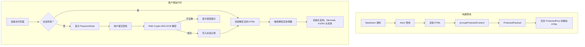

# 密码保护文章

恭喜你！你已经成功解锁了这篇加密文章。浏览器在本地使用 **Web Crypto API（AES-256-GCM + PBKDF2）** 解密了这份预先编译好的内容。

---

## 1. 安全架构与核心特性

Shirone 的文章加密系统与受保护相册共用同一套安全底座，为静态发布提供了企业级的安全性：

1. **静态 HTML 产物中零明文**
   在 Astro SSG 构建管线中，文章 Markdown 会先被编译成 HTML，并在输出页面之前立刻用 AES-256-GCM 加密。最终发布的静态 HTML 中，受保护正文与大纲的**明文为零**。

2. **带 AAD 作用域绑定的认证加密**
   - 密钥派生遵循 OWASP 建议，使用 **310,000 次 PBKDF2 迭代**（SHA-256）与一个密码学随机生成的 16 字节盐值；
   - 每一次加密载荷都会生成独立的 12 字节随机 IV；
   - **附加认证数据（AAD）** 绑定 `shirone-protected-content:1:post:${slug}`，确保密文无法被跨文章或跨相册重放。

3. **会话保持与密码零落盘**
   - 解密后的内容缓存在浏览器临时会话存储中，30 分钟后过期；
   - 明文密码永远不会写入磁盘或存储；
   - 在同一次会话内，解密状态可以跨 Swup 客户端导航和页面刷新无缝保持。

4. **全站防泄漏**
   - **搜索索引**：静态页面不含明文，搜索引擎与 Pagefind 都无法索引私密内容；
   - **RSS 订阅**：受保护文章在订阅源中只输出本地化的占位文本，RSS 聚合器抓不到敏感内容；
   - **卡片摘要与字数**：当配置 `hideHomeContent: true` 时，索引页与归档页上的描述和字数会被遮蔽；
   - **目录（TOC）**：标题层级在解锁前保持隐藏，解密后再动态重建并与 M3E 样式同步。

> 💡 **演示说明**：这篇演示文章的默认解锁密码是 `shirone-secret`。

---

## 2. 交互式富内容演示

文章解密后会与运行时辅助模块协同工作，动态挂载语法高亮、代码折叠、可交互 Mermaid 图、LaTeX 公式和图片灯箱。

### 2.1 代码块与语法高亮

下面的代码块用于检验 Expressive Code 的语法高亮、复制操作与行装饰：

```typescript
import { decryptProtectedContent, type ProtectedPayload } from "@/utils/password-protection";

/**
 * Client-side post decryption example
 */
async function unlockArticle(payload: ProtectedPayload, password: string): Promise<string> {
    const scope = payload.scope;
    console.log(`[Shirone] Decrypting scope: ${scope}`);
    
    // Execute AES-256-GCM decryption with AAD verification
    const decryptedHtml = await decryptProtectedContent(payload, password, scope);
    console.log("[Shirone] Decryption successful, length:", decryptedHtml.length);
    return decryptedHtml;
}
```

```bash
# Verify build and type checking
npx.cmd astro check
pnpm.cmd type-check
pnpm.cmd test
```

### 2.2 Mermaid 架构图

下面的流程图由 Mermaid 渲染，并在解密后动态绑定：



### 2.3 LaTeX 数学公式

行内公式：欧拉恒等式 $e^{i\pi} + 1 = 0$，以及高斯积分 $\int_{-\infty}^{\infty} e^{-x^2} dx = \sqrt{\pi}$。

独立公式会自动带上横向滚动容器：

$$
f(x) = \frac{1}{\sigma \sqrt{2\pi}} \exp\left( -\frac{(x - \mu)^2}{2\sigma^2} \right)
$$

$$
\mathcal{L}_{\text{AES-GCM}} = \text{GHASH}_H(A \parallel C \parallel L) \oplus \text{AES}_K(J_0)
$$

### 2.4 提示框

:::note 架构说明
这套加密系统遵循原子化设计原则与最小改动约定，同时不牺牲 SSR 稳定性。
:::

:::tip 主题联动
解锁之后，不妨切换一下浅色与深色模式，或者改变主色调；解密后的组件会动态适配当前生效的设计令牌。
:::

:::important 安全边界
静态客户端加密的设计目标是防止未授权浏览与自动化索引。如果你要保护的是关键商业机密，建议改用服务端鉴权。
:::

:::warning 密码找回
静态加密没有中心化的服务端数据库。一旦忘记密码，加密内容将无法恢复。
:::

### 2.5 GitHub 仓库卡片

::github{repo="withastro/astro"}

---

## 3. 配置项参考

| 参数 | 类型 | 必填 | 默认值 | 说明 |
| :--- | :--- | :--- | :--- | :--- |
| `encrypted` | `boolean` | 否 | `false` | 显式标记该文章已加密。设置了 `password` 时会隐式视为 `true`。 |
| `password` | `string` | 是 | 无 | 明文密码，构建期用于加密、运行时用于解锁。 |
| `passwordHint` | `string` | 否 | `""` | 可选的提示语，显示在密码输入框下方。 |
| `hideHomeContent` | `boolean` | 否 | `true` | 在索引卡片、归档页与 RSS 订阅中隐藏文章描述与字数指标。 |

---

## 4. 小结

这篇演示验证了 Shirone 中完整的加密生命周期：静态产物零明文、稳健的密码学校验、跨导航与页面刷新的会话保持，以及运行时的动态再水合。
