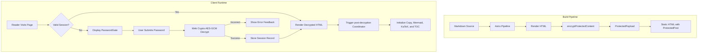

# Password Protected Article

Congratulations! You have successfully unlocked this encrypted post. The browser decrypted this pre-compiled content locally using the **Web Crypto API (AES-256-GCM + PBKDF2)**.

---

## 1. Security Architecture and Core Features

Shirone's post encryption system shares a unified security foundation with protected albums, providing enterprise-grade security for static publishing:

1. **Zero Plaintext in Static HTML Build**  
   During the Astro SSG build pipeline, post Markdown is compiled to HTML and immediately encrypted with AES-256-GCM before emitting pages. The published static HTML contains **zero plaintext** of the protected body or outline.

2. **Authenticated Encryption with AAD Scope Binding**  
   - Key derivation follows OWASP recommendations with **310,000 PBKDF2 iterations** (SHA-256) and a cryptographically random 16-byte salt;
   - Every encryption payload generates an independent 12-byte random IV;
   - An **Additional Authenticated Data (AAD)** binding `shirone-protected-content:1:post:${slug}` guarantees that ciphertexts cannot be replayed across different posts or albums.

3. **Session Persistence and Zero Disk Password Storage**  
   - Decrypted content is cached in ephemeral browser session storage with a 30-minute expiration;
   - Plaintext passwords are never written to disk or storage;
   - Decrypted states persist seamlessly across Swup client-side navigations and page reloads in the same session.

4. **Full-Site Leakage Prevention**  
   - **Search Indexing**: Static pages contain no plaintext, preventing search engines and Pagefind from indexing private content;
   - **RSS Feed**: Protected articles emit localized placeholders in feeds, preventing RSS aggregators from pulling sensitive text;
   - **Card Summaries & Word Counts**: When `hideHomeContent: true` is configured, descriptions and word counts are masked on index and archive cards;
   - **Table of Contents (TOC)**: Heading hierarchies remain hidden until unlock, and are dynamically rebuilt and synchronized with M3E styling upon decryption.

> 💡 **Demo Note**: The default unlock password for this demo post is `shirone-secret`.

---

## 2. Interactive Rich Content Demonstration

Post decryption coordinates with runtime helpers to dynamically mount syntax highlighting, code collapse, interactive Mermaid diagrams, LaTeX formulas, and image lightboxes.

### 2.1 Code Blocks and Syntax Highlighting

The code block below tests Expressive Code syntax highlighting, copy actions, and line decorations:

```typescript
import { decryptProtectedContent, type ProtectedPayload } from "@/utils/password-protection";

/**
 * Client-side post decryption example
 */
async function unlockArticle(payload: ProtectedPayload, password: string): Promise<string> {
    const scope = payload.scope;
    console.log(`[Shirone] Decrypting scope: ${scope}`);
    
    // Execute AES-256-GCM decryption with AAD verification
    const decryptedHtml = await decryptProtectedContent(payload, password, scope);
    console.log("[Shirone] Decryption successful, length:", decryptedHtml.length);
    return decryptedHtml;
}
```

```bash
# Verify build and type checking
npx.cmd astro check
pnpm.cmd type-check
pnpm.cmd test
```

### 2.2 Mermaid Architecture Diagram

The flowchart below is rendered via Mermaid and dynamically bound upon decryption:



### 2.3 LaTeX Mathematical Formulas

Inline formulas: Euler's identity $e^{i\pi} + 1 = 0$ and Gaussian integral $\int_{-\infty}^{\infty} e^{-x^2} dx = \sqrt{\pi}$.

Display mathematical formulas with horizontal scroll containers:

$$
f(x) = \frac{1}{\sigma \sqrt{2\pi}} \exp\left( -\frac{(x - \mu)^2}{2\sigma^2} \right)
$$

$$
\mathcal{L}_{\text{AES-GCM}} = \text{GHASH}_H(A \parallel C \parallel L) \oplus \text{AES}_K(J_0)
$$

### 2.4 Admonitions

:::note Architecture Note
This encryption system adheres to atomic design principles and minimal patch conventions without compromising SSR stability.
:::

:::tip Theme Integration
After unlocking, try switching between light and dark modes or changing the primary hue; decrypted components adapt dynamically to active design tokens.
:::

:::important Security Scope
Static client-side encryption is designed to prevent unauthorized browsing and automated indexing. For mission-critical commercial secrets, server-side authentication is recommended.
:::

:::warning Password Recovery
Static encryption has no centralized server database. If a password is forgotten, the encrypted content cannot be recovered.
:::

### 2.5 GitHub Repository Card

::github{repo="withastro/astro"}

---

## 3. Configuration Reference

| Parameter | Type | Required | Default | Description |
| :--- | :--- | :--- | :--- | :--- |
| `encrypted` | `boolean` | No | `false` | Explicitly marks the post as encrypted. Implicitly `true` if `password` is set. |
| `password` | `string` | Yes | None | Plaintext password used to encrypt at build time and unlock at runtime. |
| `passwordHint` | `string` | No | `""` | Optional hint displayed under the password input field. |
| `hideHomeContent` | `boolean` | No | `true` | Hides post description and word count metrics in index cards, archive, and RSS feeds. |

---

## 4. Summary

This demo verifies the entire encryption lifecycle in Shirone: zero plaintext in static output, robust cryptographic verification, session persistence across navigation and page reloads, and dynamic runtime rehydration.
