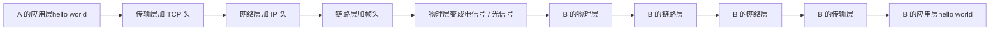
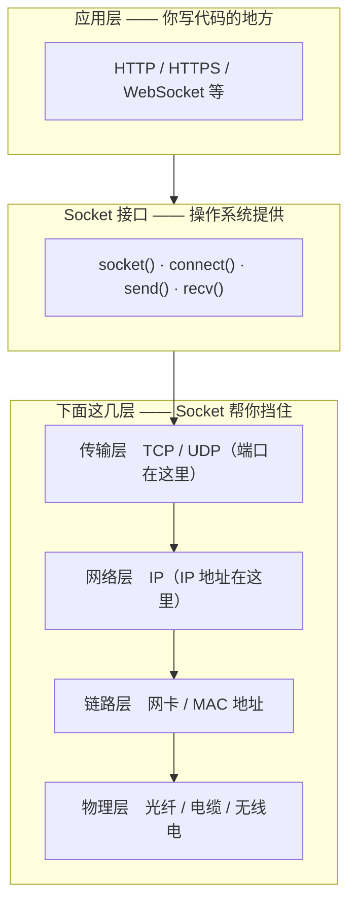
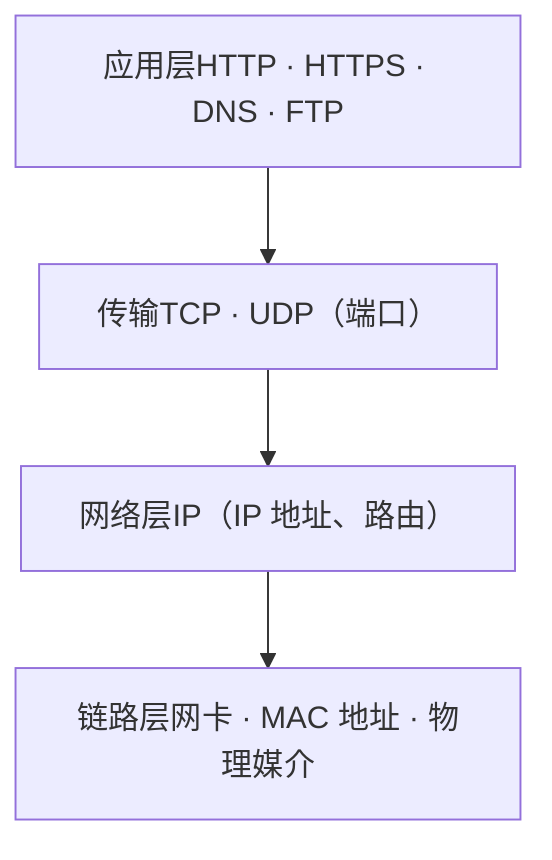
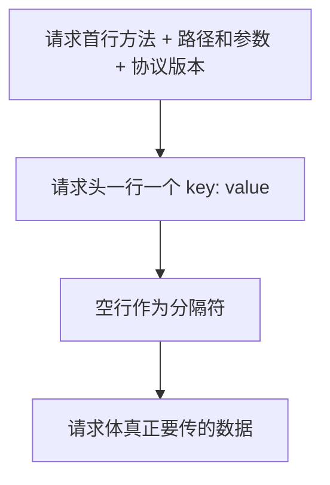
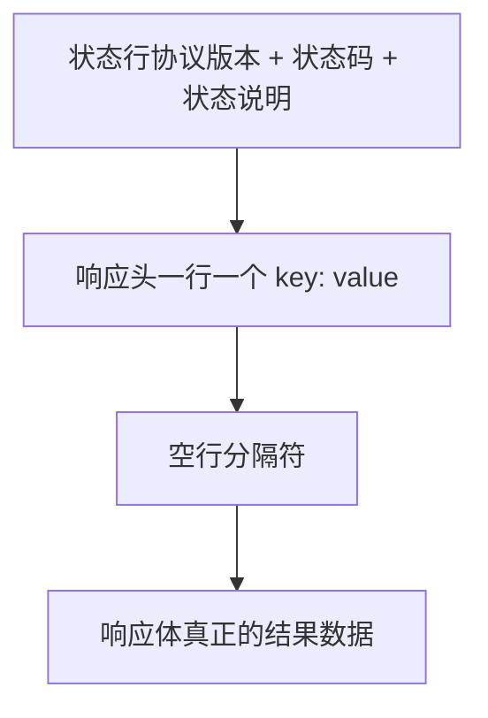
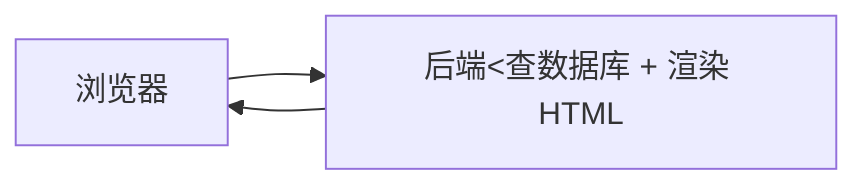
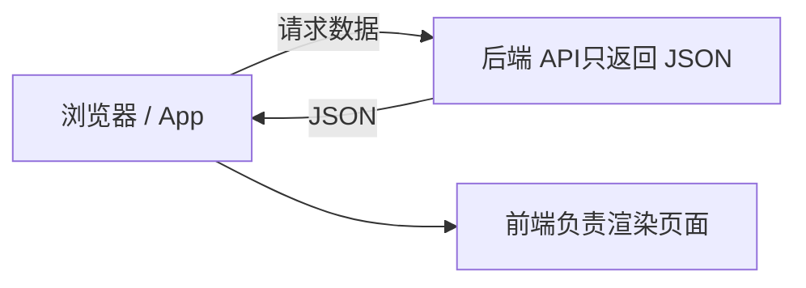
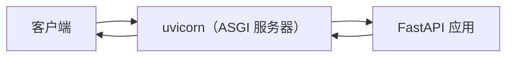
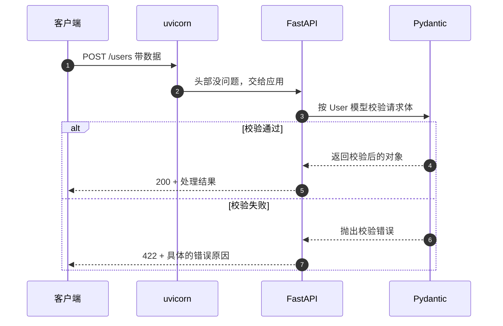

上一篇我们写了一个能跑起来的爬虫，你可以暂时理解为，用的是 `requests.get(url)`、`headers` 伪装、`resp.encoding` 这些。

但说实话，那时候我们是在**照抄**：知道这样写能跑通，却不知道底下发生了什么。`.get()` 里的 `get` 为什么是 `get`？`headers` 里的 `User-Agent` 到底是给谁看的？"请求"这个词，物理上究竟指什么东西？

为了解决这些烦恼，我写了这篇内容

:::note 读完你应该能做到
- 弄懂"协议"到底是什么，为什么没有他就没法通信
- Socket 是什么、他在最基础的应用层是干啥的
- 了解 HTTP 请求
- 分清 GET / POST、路径参数 / 查询参数
- 用 FastAPI 跑起你的第一个接口，并在 `/docs` 里调试它（Fast API在后续的应用方向主要为Python后端+Agent方向，如果你的最终目的是为了找一份还不错的工作在大学期间提升知识储备，对计算机底层，系统内核等内容没有兴趣，我推荐你学他，这是目前半淘汰掉Java后较为主流的岗位，如果你是比较喜欢研究计算机底层原理而非为了就业目的观摩本篇暂时不要学这个了，先去夯实相关基础知识吧）
:::

---

# 第一部分　地基：协议与 Socket

## 1. 协议：两个人说话，总得先约好

先问一个很傻但很重要的问题：**两台电脑之间靠什么才算"能通信"？**

答案是：不是靠"能连上"，而是靠**双方都认可的那套规矩**。

举个生活中的例子。你跟朋友约定"我说'开始'你就跑"，那么你喊"开始"他才会跑；如果你临时喊一声"冲啊"，他可能愣在原地——不是他没听见，而是**你们约定的词对不上，他没法解包**。

计算机之间也是这个道理：

- **发送方**必须按某个格式把数据打包
- **接收方**必须按同一个格式把数据解开
- 这个"双方都认的格式约定"，就叫**协议（Protocol）**

:::tip 一句话记住协议
协议 = 通信双方对「怎么发、发什么格式、收到怎么解」达成的共同约定。
:::

这也是为什么本篇后面会反复强调一句话：**格式是不能改的**。你不按约定的协议发，服务器那边根本没法解包；反过来，服务器不按约定打包，浏览器也一样解不开。

## 2. Socket：程序之间那根看不见的管子

### 2.1 没有 Socket 之前，程序都是"单机程序"

在没有 Socket 的年代，程序基本只能跟自己和本地文件打交道。它想让**另一台机器上的另一个程序**收到点东西，就得自己去处理网卡、网线、信号、重传、校验……这显然不现实。

于是操作系统站出来了：**我把底下那些麻烦事全包了，给你一个简单的接口，你只管往里写数据。**

这个接口就是 Socket。

### 2.2 一次 "hello world" 的旅程

假设 A 想给 B 发一句 `hello world`。我们自己写代码时只是 `send("hello world")` 或者 `printf("hello world")`，但这句话实际上要走完下面这条路：



每一层都在原始数据外面**加一层自己的头**（这个过程叫封装），到了对面再**一层层拆开**。

你可以把它想象成寄快递：你的信是"数据"，装进信封写明收件人是"传输层头"，再装进快递袋写明区域分拣是"网络层头"，最后扔上货车走公路是"物理层"。收件人那边反过来拆。

### 2.3 Socket 抽象掉了什么

如果每发一句话都要你自己去处理 TCP 头、IP 头、帧头、电信号，那写 Web 程序的人得疯。

**Socket 的作用，就是把这底下四层整体收起来，对外只给你一个"管子"。**



:::important 一个关键认知
**Socket 发送出去的，本质上是一串字符串/字节。**

Socket 自己**完全不关心**这串字符是什么意思——它是 `hello world`，还是一段 JSON，还是一张图片的前半截，对 Socket 来说都一样。至于"这串字符代表什么、该怎么解释"，那是**上层的协议**（比如 HTTP）该管的事。

这就是为什么下一篇讲 HTTP 之前，得先把 Socket 讲明白：**HTTP 是跑在 Socket 之上的"约定"，Socket 只负责把字节送过去。**
:::

## 3. TCP/IP 四层模型

为了方便描述，人们把整条链路拆成几层。我们现在要用的 HTTP，就是**建立在 TCP/IP 之上**的。



| 层 | 它负责什么 | 关键名词 |
| :--- | :--- | :--- |
| **应用层** | 规定"这些字节是什么意思" | HTTP、HTTPS、DNS |
| **传输层** | 端到端地把数据送到**某个程序**（不是某台机器） | TCP、UDP、**端口** |
| **网络层** | 在**不同网络之间**找路、转发 | IP、IP 地址、数据包、路由 |
| **链路层** | 在一段物理网络上把数据搬过去 | 网卡、MAC 地址、光纤/电缆/无线 |

日常说的"物理层"，在这套四层模型里被归进链路层一起讲了：它指的就是**真正负责传信号的硬件**——光纤、电缆、无线信号这些。

### 3.1 网卡和 MAC地址（这个Mac并不是巧不思在美国创建的Bpple公司的Mac系列产品） 

**网卡（Network Interface Card）** 是设备连接网络的硬件组件，负责接收和发送数据包，并通过有线或无线方式接入局域网或互联网。

网卡需要驱动程序才能工作：操作系统通过驱动程序给网卡下命令。驱动大致负责四件事：

- **通信管理**：数据包的收发
- **性能优化**：缓存、分段、重组，提升传输效率
- **兼容性支持**：不同品牌型号的网卡需要各自的驱动
- **错误检测**：发现碰撞、丢包等问题并处理或上报

**MAC 地址**则是网卡出厂自带的、类似身份号的物理地址——它是"这一块网卡"的身份，而不是"这台设备在互联网上的门牌号"（后者是 IP 地址）。

### 3.2 TCP 和 UDP

两者都在传输层，但脾气完全不同：

| | TCP | UDP |
| :--- | :--- | :--- |
| 特点 | 可靠、有序、面向连接 | 不保证到达、不保证顺序、无连接 |
| 适合 | 网页、文件、登录（**不能丢数据**） | 直播、游戏、语音（**要快，丢一点没关系**） |
| 代价 | 慢一些（要握手、要重传） | 快，但可能丢包 |

HTTP 选择的是 **TCP**。所以你打开网页时，数据是会被可靠、按顺序送到的。

## 4. 什么是 HTTP 协议

### 4.1 超文本传输协议

**HTTP = HyperText Transfer Protocol，超文本传输协议。**

"超文本"这个词容易让人误会成"只能传文字"。实际上它指的是"不止是纯文本"：图片、音频、视频、JSON 都能传。准确的说法是——**它不限于传输文本字符串**。

### 4.2 谁和谁达成的协议

HTTP 是**客户端（发送方）**和**服务器（接收方）**之间达成的约定。

- **客户端**：绝大多数情况下是浏览器；但也可以是 `requests`、`curl`、你写的爬虫——**只要是主动发起请求的一方，就是客户端**
- **服务器**：负责接收请求、处理、把结果打包回传

:::note 一个反直觉的点
在 HTTP 里，**客户端和服务器不是平等的**。服务器没有"主动给你发消息"的能力——它只能等你来问，然后回答。
:::

### 4.3 HTTP 的四个关键特性

:::steps[HTTP 的四个特性]
1. **基于 TCP/IP**

   底层用 TCP 保证可靠传输。上面讲的那四层，HTTP 就坐在最顶上。

2. **请求-响应模式**

   只能由客户端先发起请求，服务器**必须**给出响应。原本两台机器可以互相随便发消息，但 HTTP 把这件事规定成了"一问一答"。

3. **无状态**

   服务器**不会记住你上一次来过**。你这次访问，它不会知道你已经访问过几次、之前问过什么。每次请求在服务器眼里都是"第一次见面"。

4. **有长连接和短连接之分**

   - HTTP/1.0 默认**短连接**：连上、传输、断开。连接是有限资源，不会让你一直占着，等下次访问再重新连。
   - HTTP/1.1 默认**长连接**：一次连接可以连续处理多个请求，省掉反复握手。
:::

:::details 无状态带来的问题：那我登录之后为什么没被踢出去？
因为**无状态不等于无记忆**。服务器确实不记你，但客户端可以"自带身份证明"——这就是 Cookie / Session / Token 存在的意义。浏览器每次都把凭证捎上，服务器一看就知道你是谁。HTTP 本身依然是无状态的。
:::

---

# 第二部分　把 HTTP 报文拆开看

HTTP 通信时，双方来回传的东西叫**报文**。请求有请求报文，响应有响应报文，格式都是定死的。

## 5. 请求报文的格式



### 5.1 请求首行（三个部分）

```
POST /login?from=web     HTTP/1.1
└─┬┘ └───┬───┘ └──┬──┘
方法   路径 + 参数         协议版本
```

- **方法**：要干什么（GET / POST / PUT / DELETE …）
- **路径**：访问哪个资源；路径和参数之间用 `?` 隔开，没有参数也行
- **协议版本**：用哪个版本的 HTTP

### 5.2 请求头

请求首行之后，是一行一个的键值对，**有多少行不固定，具体看浏览器**。

每一个请求头都是在给服务器递一张"说明卡片"：

| 请求头 | 它在说什么 |
| :--- | :--- |
| `Content-Type` | 我这次发的数据是什么格式（比如 JSON） |
| `User-Agent` | 我是谁——什么操作系统、什么浏览器 |
| `Host` | 我要访问的是哪个站点 |
| `Cookie` | 我身上带着的身份凭证 |

回想上一篇爬虫里的 `User-Agent` 伪装——现在你应该明白它到底在干嘛了：**我们就是在伪造这张说明卡片，让服务器以为"来的是个浏览器"。**

### 5.3 空行和请求体

**请求头和请求体之间必须有一个空行**，它是两者的分隔符，不能省。

请求体是真正放数据的地方。POST 请求会把账号、密码这类数据放进请求体里。

### 5.4 一个完整的请求示例

```
POST /login HTTP/1.1
Host: www.example.com
Content-Type: application/json
Content-Length: 42
User-Agent: Mozilla/5.0 (Windows NT 10.0; Win64; x64) AppleWebKit/537.36

{"username": "alice", "password": "123456"}
```

注意最后那个空行——它上面是头，下面是体。

## 6. GET 和 POST 的区别

这两兄弟的区别，**根本上是"数据放哪儿"**：

| | GET | POST |
| :--- | :--- | :--- |
| 数据放哪 | 放在 **URL 里**（路径的 `?` 后面） | 放在**请求体**里 |
| 容量 | 有限（地址栏能装的东西有限） | 大得多 |
| 安全性 | 差一些（参数直接暴露在 URL 里，会被日志、历史记录留下） | 好一些（不在地址栏里） |
| 典型用途 | 查询、获取数据 | 提交、新增数据 |

:::warning 顺便纠个常见笔误
写文章或搜索时常见有人写成"Git 请求"——Git 是版本控制工具，跟这个没关系。这里说的是 **GET 请求**。
:::

## 7. URL 解剖：路径参数与查询参数

这一节很重要，因为后面 FastAPI 的两种参数类型全靠它。

以一个虚假招聘网站链接为例：

```
https://www.example.com:443/jobs/python?city=shanghai&years=3-5#top
```

| 部分 | 内容 | 说明 |
| :--- | :--- | :--- |
| 协议 | `https` | 用哪个协议 |
| 域名 | `www.example.com` | 人好记的名字，实际会被解析成 IP 地址 |
| 端口 | `443` | HTTPS 默认端口（HTTP 是 80），通常会自动省略 |
| 路径 | `/jobs/python` | 访问哪个资源 |
| 查询参数 | `?city=shanghai&years=3-5` | `?` 之后的键值对，多个用 `&` 连接 |
| 锚点 | `#top` | 页面内的位置，**不会被发送给服务器** |

:::note 关于域名
常见误解是"域名就是数字组成的 IP"。其实不是：**域名是给人看的名字**（比如 `www.baidu.com`），DNS 负责把它翻译成 IP 地址；IP 才是机器用来寻址的数字。你可以把域名理解成通讯录里的名字，IP 理解成电话号码。
:::

对比一下招聘网站的真实参数：

```
/jobs?xl=本科&gj=3-5年&kd=python
```

翻译过来就是"学历=本科、工作经验=3-5 年、关键词=python"——这就是**查询参数**，用来在一个页面里做筛选查询。

而 `/jobs/python` 里的 `python`，是"路径里的一截"，属于**路径参数**。

注意：正常来讲你遇到的链接都不长这样，即GET，这样的写法会把数据暴露出来，别人只要拿到这个链接就拿到了数据，比如你的数维网站如果这样存储数据，那么我只要拿到了链接就获得了你的学号+密码，如果高考志愿填报也这样搞那获取你这串链接的人就可以修改你的志愿了

:::tip 记忆口诀
- `?` **左边**是路径，`?` **右边**是查询参数
- 路径参数是"资源的一部分"（哪一份数据），查询参数是"筛选条件"（怎么挑）
:::

## 8. 响应报文的格式

服务器收到请求后，要按规定的格式打包回传：



### 8.1 状态行与状态码

```
HTTP/1.1     200   OK
└──┬──┘ └┬┘ └┬┘
 协议版本 状态码 说明
```

状态码告诉客户端"这次怎么样了"：

| 状态码 | 含义 | 常见场景 |
| :--- | :--- | :--- |
| **2xx** | 成功 | `200 OK`：一切正常 |
| **3xx** | 重定向 | `301`、`302`：资源搬到别处了 |
| **4xx** | **你**的问题 | `404` 找不到页面、`403` 没权限、`401` 没登录 |
| **5xx** | **服务器**的问题 | `500` 服务器内部错误 |

### 8.2 响应头与响应体

响应头同样是键值对，告诉客户端"我给你的东西是什么、多大、什么格式"：

```
HTTP/1.1 200 OK
Content-Type: application/json
Content-Length: 27

{"token": "abc123", "ok": true}
```

响应体就是真正要的数据。**响应体和响应头之间同样用一个空行隔开。**

## 9. Content-Type：别让服务器猜你的数据格式

这是非常关键的一个点，值得单独拎出来讲。

设想一下：你发过去一段数据，服务器得**按某种格式去解包**。如果你的数据是 JSON（如果不知道这是什么的同学现在立刻去参拜DeepSeek大王），但服务器按表单格式去解，那必然报错或解析出一堆垃圾。

**Content-Type 就是用来解决"怎么解包"这个问题的**——它明确告诉对方"我这包数据是什么格式，请按这个格式解"。

| Content-Type | 数据是什么 |
| :--- | :--- |
| `application/json` | JSON |
| `application/x-www-form-urlencoded` | 表单（键值对） |
| `multipart/form-data` | 带文件的表单（上传图片用） |
| `text/html` | HTML 页面 |
| `text/plain` | 纯文本 |

:::warning 没有它会发生什么
对方只能**猜**。猜错了就是乱码、解析失败、报错。

这跟上一篇爬虫里"编码不对就满屏乱码"是同一类问题——**你不主动声明，对方就没法正确理解你。**
:::

---

# 第三部分　从网页到接口：API 与 FastAPI

## 10. API 是什么

**API 接口**的意思是：客户端要访问网站的某个功能，后端的程序员开发的 API 只负责**提供客户要的数据和程序**。

听起来抽象，用"前后端分不分离"来理解最直观（或者现在去B站搜一下API-KEY以及调用API，这也是让你迅速对API有一个初步概念的法子）。

### 10.1 前后端不分离

后端既处理数据、**又**负责把数据渲染进 HTML 页面，然后把整个页面返回给客户端，事先说明，前后端不分离这个概念现在企业开发很少用，你只要了解就好



它需要遵循**模板语法**，把数据库里的数据"嵌入"到 HTML 里再返回。好处是简单，坏处是后端要操心页面。

### 10.2 前后端分离（）




后端从此**不再关心任何一行 HTML 代码**。这正是现代 Web 开发的主流方式，也是 FastAPI 这类框架最擅长的场景。

## 11. RESTful：给接口定一套规矩
#### 如果你是刚接触编程/计算机，这部分内容对你来讲可能理解起来会很抽象，上面的内容理解后就已经达到了科普基础内容的目的，接下来的内容适合你已经频繁接触编程/计算机一段时间后再来理解

在开发 API 的过程中，每个程序员的习惯都不一样，导致最终的代码风格千差万别。如果能有一套统一的习惯，别人**大致一看就知道这个接口是干什么的**，那就方便多了——这就是 RESTful 想解决的问题。

### 11.1 反面例子

假设你做了一个学生网站：

```
http://example.com/student/inquire    # 查询学生
http://example.com/student/add        # 添加学生
http://example.com/student/delete     # 删除学生
```

这是初级开发最喜欢的方式，但不够好：**动作被塞进了路径里**，路径越写越长，语义也重复。

### 11.2 用 HTTP 方法来表达动作

把动作从路径里拿出来，路径只表示"操作哪个资源"：

```
http://example.com/student
```

那服务器怎么知道你要干嘛？——**看请求方法**：

| 方法 | 用来做什么 | 例子 |
| :--- | :--- | :--- |
| **GET** | 查询 | `GET /student` 查学生列表 |
| **POST** | 新增 | `POST /student` 新增一个学生 |
| **PUT** | 修改 | `PUT /student/1` 修改 1 号学生 |
| **DELETE** | 删除 | `DELETE /student/1` 删除 1 号学生 |

路径负责"对谁做"，方法负责"做什么"。这就是 RESTful 风格的核心思想。

## 12. 路由映射

**路由映射**指的是：把客户端请求的 **URL 路径**，映射到服务器端相应的**处理函数**上。

当你访问 `/student/1` 时，服务器根据预先定义好的规则，找到负责处理这个路径的函数，执行它，再把返回值打包成响应发回来。

## 13. 动手：第一个 FastAPI 程序

前面铺垫了这么多，终于可以动手了。

:::steps[跑起你的第一个接口]
1. **安装依赖**

   FastAPI 是框架本体，uvicorn 是运行它的服务器（下一节解释为什么需要它）。

   ```bash
   pip install "fastapi[standard]" uvicorn
   ```

2. **写一个 `main.py`**

   ```python
   from fastapi import FastAPI

   app = FastAPI()

   @app.get("/")
   def read_root():
       return {"message": "你好，FastAPI"}
   ```

3. **启动服务**

   ```bash
   uvicorn main:app --reload
   ```

   这行的意思是：启动 uvicorn，加载 `main.py` 里的 `app` 对象，并开启热重载（改代码自动重启）。

4. **打开文档页面**

   浏览器访问 `http://127.0.0.1:8000/docs` —— FastAPI 会根据你的代码**自动生成交互式接口文档**，可以直接在页面上点按钮发请求。
:::

:::tip 为什么 FastAPI 会"自动"有这么好的文档？
因为它把你的**类型注解**当成了信息来源。你写 `student_id: int`，它既知道要校验成整数，也知道文档里该写"integer"。这是 FastAPI 最爽的地方之一。
:::

## 14. uvicorn 是什么？ASGI 又是什么？

上面我们装了 `uvicorn`，但没说它是干嘛的。

### 14.1 服务器不只是"一台机器"

先纠正一个概念：**我们平时说的"Web服务器"，通常指的不是那台计算机，而是计算机上启动的 Web 应用程序。**

当你在本地跑 `uvicorn main:app`，你的电脑**同时扮演了两个角色**：它既是物理上的机器，也是运行着 Web 程序的服务器。

### 14.2 WSGI 和 ASGI

Web 框架和 Web 服务器之间需要一个"翻译官"，否则双方说不通话。Python 世界里有两套翻译规则：

| | WSGI | ASGI |
| :--- | :--- | :--- |
| 全称 | Web Server Gateway Interface | Asynchronous Server Gateway Interface |
| 同步/异步 | 同步 | 异步 |
| 代表框架 | Flask、Django（传统模式） | **FastAPI**、Starlette |
| 代表服务器 | Flask/Django 自带的开发服务器 | **uvicorn**、Daphne |
| 支持 WebSocket | ❌ | ✅ |

**uvicorn 就是一个遵循 ASGI 规范的服务器。**

### 14.3 为什么 Flask 不用装 ASGI 服务器，FastAPI 就要？

这是很多人的困惑。答案是：**Flask 是同步框架，用的是 WSGI，自带开发服务器；FastAPI 是异步框架，基于 ASGI，需要配一个 ASGI 服务器来跑。**



:::details 一定要用 ASGI 吗？简单页面用 WSGI 行不行？
对于**简单的、同步的**网页程序，用 WSGI 完全够了——Flask 和 Django 默认就是 WSGI，自带开发服务器，开箱即用。

但 WSGI 不支持异步特性（比如 WebSocket 这类实时通信）。如果你的应用需要**处理高并发**或者**实时通信**，ASGI 会是更好的选择。

所以：**用什么，取决于你的需求**，不是越新越好。
:::

### 14.4 三者的分工

这里有个容易混的点，值得单独说明：

| 角色 | 它管什么 |
| :--- | :--- |
| **uvicorn** | 解析 HTTP 报文（方法、路径、`Content-Length` 等），把请求交给应用，再把响应发回去 |
| **FastAPI** | 根据路由把请求分发到你的函数 |
| **Pydantic** | **校验请求体的内容**是否符合你定义的结构 |

:::important 一个关键细节
**uvicorn 只解析 HTTP 头部和基本的请求体数据，不会深入校验请求体的内容。**

也就是说：即使客户端发来的数据结构是错的，uvicorn 依然会照单全收，把它交给 FastAPI，而**不会主动拒绝**。真正做校验的是 Pydantic。这就是为什么"数据校验"要由框架层来负责。
:::

## 15. 路径参数

现在如果我想通过 id 查询某个学生：

```python
@app.get("/students/1")
def get_student_1():
    return {"student_id": 1}
```

只有一个学生还行，**一万个学生你总不能写一万个函数**。

正确做法是：**别把 `/students/` 后面的值定死**，而是给它一个变量，再把这个变量套进函数参数里：

```python
@app.get("/students/{student_id}")
def get_student(student_id: int):
    return {"student_id": student_id}
```

现在 `/students/1`、`/students/999` 都会进同一个函数。类型注解 `int` 还会自动帮你校验——传 `/students/abc` 会直接返回 422 错误，而不是让你在函数里手动判断。

打开 `/docs` 你会发现，接口说明从"无参数"变成了带参数的输入框。

:::warning 路径参数遵从「顺序原则」
如果两个路由都能匹配同一个请求，FastAPI 会**按注册顺序匹配，先匹配上的先执行**。

所以像下面这样写，`/students/me` 永远走不到第二个函数：

```python
@app.get("/students/{student_id}")   # 先注册，先匹配
def get_student(student_id: str):
    return {"id": student_id}

@app.get("/students/me")             # 永远轮不到它
def get_me():
    return {"name": "我自己"}
```

把更具体的路由写在前面，是避免踩坑的好习惯。
:::

## 16. 查询参数

路径参数讲完了，现在轮到**查询参数**——也就是上一篇 URL 里 `?` 后面的那部分。

规则很简单：

> **函数参数如果没出现在路径里，FastAPI 就默认把它当作查询参数。**

```python
@app.get("/jobs")
def search_jobs(keyword: str, city: str, years: str):
    return {"keyword": keyword, "city": city, "years": years}
```

访问 `/jobs?keyword=python&city=shanghai&years=3-5` 就能拿到结果。

### 16.1 让参数变成可选

上面的写法有个问题：**所有参数都必须传**，少一个就报错。但现实中的招聘网站显然不是这样——你搜"python"，城市和工作经验明明是可填可不填的。

解决办法：**给参数一个默认值 `None`。**

```python
from typing import Optional

@app.get("/jobs")
def search_jobs(
    keyword: str,
    city: Optional[str] = None,
    years: Optional[str] = None,
):
    return {"keyword": keyword, "city": city, "years": years}
```

:::tip 记住这条规则
- **没有默认值 → 必填**
- **有默认值 → 选填**

而且路径参数和查询参数是可以互相转换的：给参数加一对 `{}` 放进路径，它就成了路径参数；把 `{}` 去掉，它就变回查询参数。
:::

## 17. 请求体与 Pydantic

GET 用查询参数就够了，但 **POST 要提交的数据比较复杂**（比如一个完整的用户对象），这时候就要用**请求体**。

### 17.1 在类里定义数据类型

FastAPI 里，除了在函数上写类型注解，还可以**用类来定义一整个数据结构**。这个类就是"请求体的数据类型"。

```python
from pydantic import BaseModel

class User(BaseModel):
    name: str
    age: int

@app.post("/users")
def create_user(user: User):
    return {"received": user}
```

### 17.2 为什么 `User` 会自动变成请求体？

这是新手最容易困惑的地方：我只是写了个 `user: User`，为什么它就成了请求体，还自动出现在 `/docs` 里？

```python
async def data(data: User):
```

括号里这部分有两个作用：

1. **限制 `data` 的数据类型**：因为 `User` 继承自 `BaseModel`，FastAPI 会用 Pydantic 自动校验传进来的数据格式
2. **自动识别为请求体**：FastAPI 规定——**参数类型是 `BaseModel` 的，默认就从请求体里取数据**，你不需要额外声明

:::note 参数的命名是自由的
`async def data(data: User)` 里的 `data` 只是变量名，你写成 `user`、`payload`、`body` 都行，**重要的是类型注解那里的 `User`**。
:::

### 17.3 Pydantic 是什么

**Pydantic 就是负责检查客户端发来的数据是否符合标准的那一环。** 想让它生效，类就必须继承 `BaseModel`。

客户端传错类型的处理流程是这样的：



## 18. 数据校验：Field 与 validator

光有类型还不够。比如年龄，我们不希望它是 `-5` 或者 `9999`。

### 18.1 用 Field 加约束

```python
from pydantic import BaseModel, Field

class User(BaseModel):
    name: str = Field(min_length=2, max_length=20, pattern=r"^[a-zA-Z]")
    age: int = Field(default=0, ge=0, le=100)
```

- `ge=0` / `le=100`：大于等于 0，小于等于 100（不在范围内直接报错）
- `pattern`：正则约束，这里要求 name 必须以字母开头
- `default=0`：默认值

:::tip Pydantic 版本差异
网上很多教程写的是 `regex=`，那是 **Pydantic v1** 的写法；**v2 已经改成 `pattern=`**。如果你照着老教程写报错，先确认一下自己的版本。
:::

### 18.2 用 validator 写自定义校验

如果要校验的规则比较复杂（比如"必须全是字母"），就用校验器：

```python
from pydantic import BaseModel, field_validator

class User(BaseModel):
    name: str

    @field_validator("name")
    @classmethod
    def name_must_be_alpha(cls, value: str) -> str:
        assert value.isalpha(), "name must be alpha"
        return value
```

- `cls` 代表类对象本身
- `value` 是当前要校验的值——你输入什么，它就是什么
- `assert` 用来判断是否符合要求：通过就继续往下走，不通过就抛出后面那句话作为错误信息

:::note v1 的写法
Pydantic v1 用的是 `@validator("name")`，v2 改成了 `@field_validator("name")` 并且需要配合 `@classmethod`。逻辑是一样的。
:::

## 19. 模型的嵌套

真实的数据往往是嵌套的——一个用户里还带着一个地址：

```python
from pydantic import BaseModel

class Address(BaseModel):
    city: str
    street: str

class User(BaseModel):
    name: str
    age: int
    address: Address      # 直接引用另一个模型
```

FastAPI 会自动递归校验：`address` 里少一个字段，整个请求就会被拒绝，并明确告诉你是哪个字段出了问题。

## 20. async / await

FastAPI 对异步支持得非常好，所以你会在官方示例里频繁看到 `async def`：

```python
@app.get("/items/{item_id}")
async def read_item(item_id: int):
    return {"item_id": item_id}
```

### 20.1 为什么要异步

**I/O 操作**指的是程序与外部世界交换数据的过程——读文件、发网络请求、查数据库等等。这类操作的特点是要**等**。

同步编程里，程序发出 I/O 请求后只能**干等着**。而异步编程里，程序发起 I/O 后**不必等它完成**，可以先去干别的事，等结果回来了再处理。

对于 Web 服务器来说，这意味着**一个请求在等数据库返回的时候，服务器可以去处理别的请求**——并发能力因此大幅提升。

### 20.2 async 和 await

| 关键字 | 作用 |
| :--- | :--- |
| `async` | 定义一个异步函数（协程） |
| `await` | 在协程内部调用其他异步函数；表示"这里可能要等，但不会阻塞整个程序" |

```python
import httpx

@app.get("/proxy")
async def proxy():
    async with httpx.AsyncClient() as client:
        resp = await client.get("https://example.com")   # 等待期间，服务器能去处理别的请求
    return {"status": resp.status_code}
```

:::caution 不要为了 async 而 async
如果一个函数内部**根本没有异步操作**（没有 `await`），那加 `async` 只会引入额外开销，反而更慢。

**判断标准很简单：函数里有没有需要 `await` 的 I/O 操作？有就异步，没有就老老实实写 `def`。**
:::

---

## 21. 小结

把这一篇的脉络串起来：

| 层次 | 你学到的东西 |
| :--- | :--- |
| 最底层 | **协议**是双方对格式的约定；**Socket** 是把传输层以下全部封装起来的一根管子 |
| 中间层 | **TCP/IP 四层**；HTTP 建立在 TCP 之上；**HTTP 有四个特性**（基于 TCP/IP、请求-响应、无状态、长短连接） |
| 报文层 | **请求报文** = 首行 + 请求头 + 空行 + 请求体；**响应报文** = 状态行 + 响应头 + 空行 + 响应体 |
| 设计层 | **API** 与前后端分离；**RESTful** 用 HTTP 方法表达动作 |
| 框架层 | **FastAPI** + **uvicorn** + **Pydantic** 三者分工；路径参数、查询参数、请求体、数据校验 |

### 下一步可以玩什么

- 把上一篇的爬虫改成 FastAPI 服务：写一个 `/api/novel/{chapter}` 接口，让浏览器也能拿到数据
- 学一下 **依赖注入**（`Depends`），它是 FastAPI 处理登录鉴权、数据库连接的标准姿势
- 用 `APIRouter` 把接口拆成多个文件，再用 `include_router` 组装起来（大项目必学）

:::tip 从"能跑"到"懂原理"
上一篇我们追求的是**快速见效**——先让代码跑起来，尝到甜头。

这一篇补的是**底子**——协议、Socket、报文格式。这些东西平时写业务代码时不会天天想，但一旦遇到"请求为什么被拒""返回为什么是乱码""参数为什么校验不过"，它们就是你去排查问题的地图。

先跑起来，再搞明白。顺序别反了，也别停在前一步。
:::

如果你跟着敲完了，或者卡在某个环节，欢迎来[关于页](/about/)找我聊。上一篇在这里：[Python 爬虫入门：写一个能跑起来的小说爬虫](/posts/python-crawler-quickstart/)。
