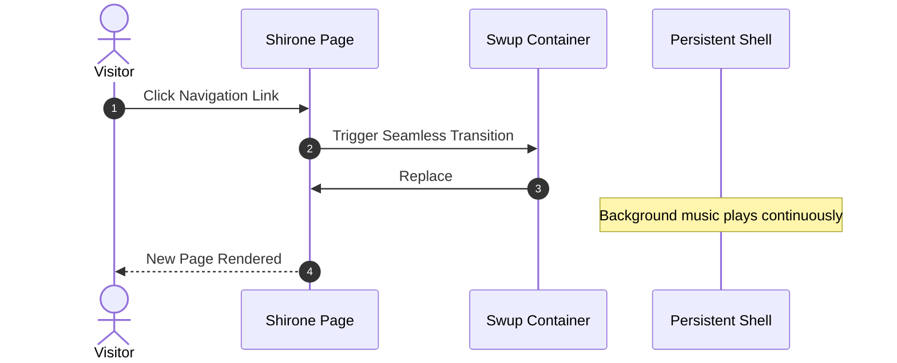

Welcome to **Shirone** (白音) — an expressive, anime-inspired blog theme crafted around **Astro 7**, **Svelte 5**, and the **Material 3 Expressive (M3E)** design system.

This guide walks you through post creation, frontmatter specifications, directory structure, and the full suite of built-in Markdown and MDX extensions.

:::tip
Shirone renders content server-side first (SSR-first). When navigating within the site, Swup seamlessly swaps the main container while preserving the outer application shell and continuous music playback.
:::

---

## 1. Creating a New Post

You can quickly scaffold a new post with standard frontmatter using the built-in CLI command:

```bash
# Create a single-file post
pnpm new-post my-first-post

# Or create a post in a sub-directory
pnpm new-post guides/getting-started
```

The newly created file will be placed in `src/content/posts/`.

---

## 2. Frontmatter Specification

Every Markdown (`.md`) or MDX (`.mdx`) post starts with a YAML frontmatter block defining its metadata.

### Example

```yaml
---
title: "Exploring Material 3 Expressive Design"
published: 2026-08-26
updated: 2026-08-27
publishedAt: 2026-08-26T10:00:00+08:00
updatedAt: 2026-08-27T09:30:00+08:00
pinned: true
description: "A deep dive into dynamic HCT color science and fluid transitions in Shirone."
image: "./cover.webp"
tags: [M3E, Design, Frontend]
category: Guides
draft: false
comment: true
---
```

### Supported Frontmatter Fields

| Field | Type | Required | Description |
| :--- | :--- | :---: | :--- |
| `title` | `string` | **Yes** | The main title of the post. |
| `published` | `Date` | **Yes** | Publication date in `YYYY-MM-DD` format. |
| `publishedAt` | `Date` | No | Precise publication instant used to order posts published on the same day. It must fall on `published` in the configured site time zone. |
| `updated` | `Date` | No | Last updated date. When provided, an update notice badge is displayed. |
| `updatedAt` | `Date` | No | Precise update instant used by feeds and machine-readable metadata. It must be paired with `updated`. |
| `pinned` | `boolean` | No | Pin the post to the top of article lists (default: `false`). |
| `description` | `string` | No | Post summary displayed in article cards, search results, and OpenGraph metadata. |
| `image` | `string` | No | Cover image path. Supports relative (`./cover.webp`), public (`/images/cover.jpg`), or remote URLs. |
| `tags` | `string[]` | No | Array of tag names for taxonomy filtering and tag clouds. |
| `category` | `string` | No | Primary category name for taxonomy indexing. |
| `draft` | `boolean` | No | Mark as draft. Draft posts are hidden during production build (`pnpm build`). |
| `comment` | `boolean` | No | Toggle comment section for this specific post (default: `true`). |
| `lang` | `string` | No | Language code (e.g. `en`, `zh_CN`, `ja`) if different from site default. |

---

## 3. Post Encryption

Shirone provides client-side post encryption. For private journals or restricted articles, specify a password in frontmatter:

```yaml
---
title: "Private Research Notes"
published: 2026-08-26
encrypted: true
password: "your-secret-passphrase"
passwordHint: "Favorite anime character"
hideHomeContent: true
---
```

- `encrypted`: Set to `true` to enable encryption;
- `password`: Passphrase string or number required to unlock the post;
- `passwordHint`: Optional hint shown above the password entry form;
- `hideHomeContent`: Hide word counts and content previews on the homepage to prevent data leakage.

---

## 4. Organizing Post Files

Shirone supports both folder-based co-location and single-file layouts:

### Folder Structure (Recommended for Local Assets)

Co-locating your post and its media makes asset management straightforward:

```text
src/content/posts/
├── my-great-post/
│   ├── index.md           <-- Post content
│   ├── cover.webp         <-- Cover image (image: "./cover.webp")
│   └── diagram.png        <-- Inline illustration referenced in markdown
```

### Single-File Structure (Lightweight Prose)

```text
src/content/posts/
├── hello-world.md
└── quick-thoughts.md
```

---

## 5. Rich Markdown & MDX Extensions

Shirone includes modern Markdown extensions out of the box:

### 5.1 Admonitions

Use container directives for notes, tips, warnings, and alerts:

```markdown
:::tip
Use admonition containers to highlight key takeaways or best practices.
:::

:::warning
Use warning containers to signal potential pitfalls or breaking changes.
:::
```

### 5.2 GitHub Repository Cards

Embed live, beautifully styled GitHub repository cards using the directive syntax:

```markdown
::github{repo="LyraVoid/Shirone"}
```

::github{repo="LyraVoid/Shirone"}

### 5.3 Expressive Code Blocks

Enhanced code blocks feature syntax highlighting, file name badges, line numbers, and selective line highlighting:

```typescript title="src/utils/theme.ts" {2,4-5}
// Dynamic HCT color token derivation
import { argbFromHex, themeFromSourceColor } from "@material/material-color-utilities";

const theme = themeFromSourceColor(argbFromHex("#f472b6"));
console.log("Primary color token:", theme.schemes.light.primary);
```

### 5.4 Mathematical Typesetting (KaTeX)

Render elegant LaTeX mathematical notation directly in Markdown:

- **Inline math**: $E = mc^2$ or Euler's formula $e^{i\pi} + 1 = 0$.
- **Block math**:

$$
\int_{-\infty}^{\infty} e^{-x^2} \, dx = \sqrt{\pi}
$$

### 5.5 Mermaid Diagrams

Create flowcharts, sequence diagrams, and architecture maps using plain text:



### 5.6 Image Galleries & Fancybox Lightbox

Images automatically integrate with Fancybox for lossless zoom, pan gestures, and full-screen preview:

```markdown

```

---

## 6. Next Steps & Customization

- **Site Configuration**: Learn about global settings in `src/config/siteConfig.ts` and [`src/config/README.md`](https://github.com/LyraVoid/Shirone/blob/main/src/config/README.md).
- **Design Tokens**: Explore tokens and color palettes in `DESIGN.md` and `docs/m3e-standard.md`.
- **Feedback & Community**: Share your ideas and questions on [GitHub Issues](https://github.com/LyraVoid/Shirone/issues).
