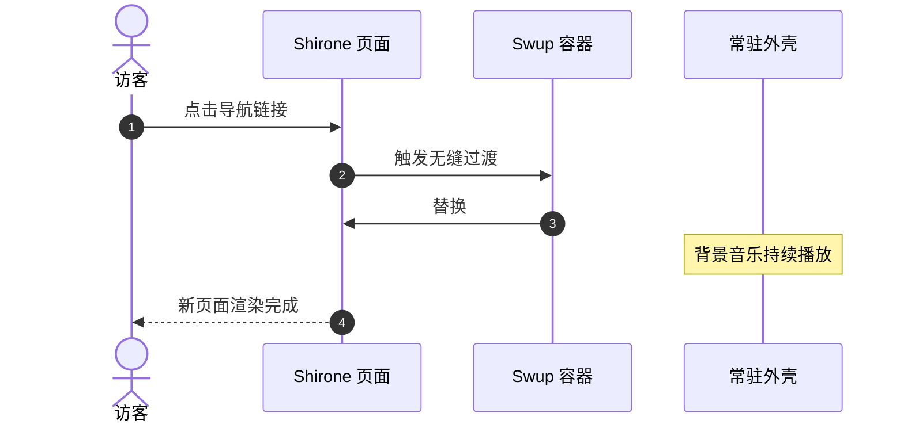

欢迎来到 **Shirone**（白音）—— 一个围绕 **Astro 7**、**Svelte 5** 与 **Material 3 Expressive（M3E）** 设计体系打造的、富有表现力的二次元风博客主题。

这份指南会带你走一遍：如何创建文章、Frontmatter 字段规范、目录结构，以及主题内置的完整 Markdown 与 MDX 扩展。

:::tip
Shirone 采用服务端优先渲染（SSR-first）。在站内切换页面时，Swup 会无缝替换主容器，同时保留外层应用外壳与持续播放的背景音乐。
:::

---

## 1. 创建一篇新文章

用内置的 CLI 命令，就能快速生成一篇带标准 Frontmatter 的文章：

```bash
# Create a single-file post
pnpm new-post my-first-post

# Or create a post in a sub-directory
pnpm new-post guides/getting-started
```

新建的文件会放在 `src/content/posts/` 下。

---

## 2. Frontmatter 字段规范

每篇 Markdown（`.md`）或 MDX（`.mdx`）文章都以一段 YAML Frontmatter 开头，用来定义它的元数据。

### 示例

```yaml
---
title: "Exploring Material 3 Expressive Design"
published: 2026-08-26
updated: 2026-08-27
publishedAt: 2026-08-26T10:00:00+08:00
updatedAt: 2026-08-27T09:30:00+08:00
pinned: true
description: "A deep dive into dynamic HCT color science and fluid transitions in Shirone."
image: "./cover.webp"
tags: [M3E, Design, Frontend]
category: 指南
draft: false
comment: true
---
```

### 支持的 Frontmatter 字段

| 字段 | 类型 | 必填 | 说明 |
| :--- | :--- | :---: | :--- |
| `title` | `string` | **是** | 文章主标题。 |
| `published` | `Date` | **是** | 发布日期，格式为 `YYYY-MM-DD`。 |
| `publishedAt` | `Date` | 否 | 精确的发布时间点，用于给同一天发布的文章排序。它落在站点配置时区下必须仍属于 `published` 那一天。 |
| `updated` | `Date` | 否 | 最后更新日期。填写后会显示一个更新提示徽章。 |
| `updatedAt` | `Date` | 否 | 精确的更新时间点，供订阅源和机器可读的元数据使用。必须与 `updated` 成对出现。 |
| `pinned` | `boolean` | 否 | 把文章置顶到列表顶部（默认 `false`）。 |
| `description` | `string` | 否 | 文章摘要，会显示在文章卡片、搜索结果和 OpenGraph 元数据里。 |
| `image` | `string` | 否 | 封面图路径。支持相对路径（`./cover.webp`）、公开路径（`/images/cover.jpg`）或远程 URL。 |
| `tags` | `string[]` | 否 | 标签名数组，用于分类筛选与标签云。 |
| `category` | `string` | 否 | 主分类名称，用于分类索引。 |
| `draft` | `boolean` | 否 | 标记为草稿。草稿在生产构建（`pnpm build`）时会被隐藏。 |
| `comment` | `boolean` | 否 | 为这一篇文章单独开关评论区（默认 `true`）。 |
| `lang` | `string` | 否 | 语言代码（例如 `en`、`zh_CN`、`ja`），当它不同于站点默认语言时使用。 |

---

## 3. 文章加密

Shirone 提供客户端文章加密。对于私人日记或受限文章，在 Frontmatter 中指定一个密码即可：

```yaml
---
title: "Private Research Notes"
published: 2026-08-26
encrypted: true
password: "your-secret-passphrase"
passwordHint: "Favorite anime character"
hideHomeContent: true
---
```

- `encrypted`：设为 `true` 即可启用加密；
- `password`：解锁文章所需的密码，可以是字符串或数字；
- `passwordHint`：可选的提示语，会显示在密码输入框上方；
- `hideHomeContent`：在首页隐藏字数与内容预览，避免信息泄露。

---

## 4. 组织文章文件

Shirone 同时支持"目录共置"和"单文件"两种布局：

### 目录结构（建议用于带本地资源的文章）

把文章和它的媒体文件放在一起，资源管理会变得非常直接：

```text
src/content/posts/
├── my-great-post/
│   ├── index.md           <-- Post content
│   ├── cover.webp         <-- Cover image (image: "./cover.webp")
│   └── diagram.png        <-- Inline illustration referenced in markdown
```

### 单文件结构（适合轻量随笔）

```text
src/content/posts/
├── hello-world.md
└── quick-thoughts.md
```

---

## 5. 丰富的 Markdown 与 MDX 扩展

Shirone 开箱即带一系列现代 Markdown 扩展：

### 5.1 提示框

用容器指令来写提示、建议、警告和提醒：

```markdown
:::tip
Use admonition containers to highlight key takeaways or best practices.
:::

:::warning
Use warning containers to signal potential pitfalls or breaking changes.
:::
```

### 5.2 GitHub 仓库卡片

用指令语法嵌入实时、样式精致的 GitHub 仓库卡片：

```markdown
::github{repo="LyraVoid/Shirone"}
```

::github{repo="LyraVoid/Shirone"}

### 5.3 表达力代码块

增强后的代码块支持语法高亮、文件名徽章、行号，以及指定行高亮：

```typescript title="src/utils/theme.ts" {2,4-5}
// Dynamic HCT color token derivation
import { argbFromHex, themeFromSourceColor } from "@material/material-color-utilities";

const theme = themeFromSourceColor(argbFromHex("#f472b6"));
console.log("Primary color token:", theme.schemes.light.primary);
```

### 5.4 数学排版（KaTeX）

直接在 Markdown 里渲染优雅的 LaTeX 数学记号：

- **行内公式**：$E = mc^2$，或者欧拉公式 $e^{i\pi} + 1 = 0$。
- **独立公式**：

$$
\int_{-\infty}^{\infty} e^{-x^2} \, dx = \sqrt{\pi}
$$

### 5.5 Mermaid 图表

用纯文本创建流程图、时序图与架构图：



### 5.6 图库与 Fancybox 灯箱

图片会自动接入 Fancybox，支持无损缩放、手势平移与全屏预览：

```markdown

```

---

## 6. 下一步与自定义

- **站点配置**：全局设置见 `src/config/siteConfig.ts` 与 [`src/config/README.md`](https://github.com/LyraVoid/Shirone/blob/main/src/config/README.md)。
- **设计令牌**：令牌与配色方案见 `DESIGN.md` 与 `docs/m3e-standard.md`。
- **反馈与社区**：欢迎在 [GitHub Issues](https://github.com/LyraVoid/Shirone/issues) 上分享你的想法和问题。
