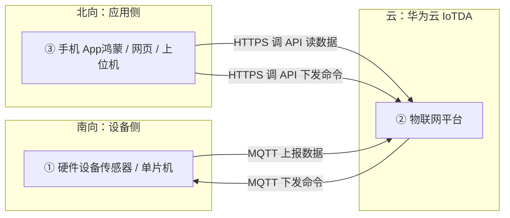
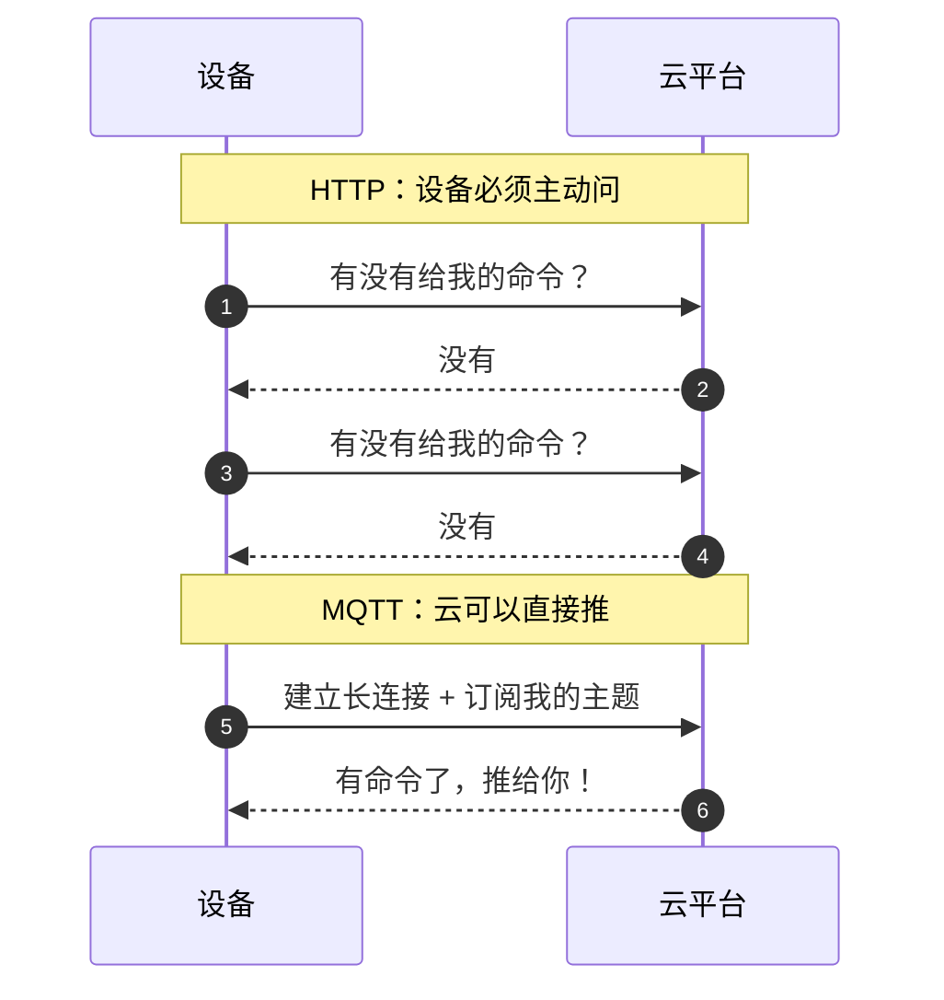
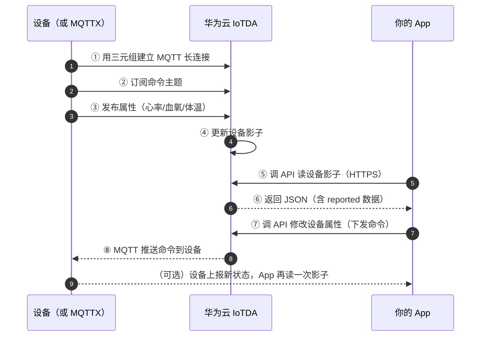
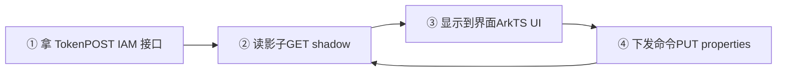

这章来讲讲鸿蒙北向吧
如果你是学**鸿蒙北向**的同学，多半会遇到这样的需求：

> "我们南向的设备把心率数据传到云上了，你做个 App 把数据显示出来，再做个按钮能控制风扇开关。"

这一章就是为解决此问题而出的教程

:::note 名词先说清：什么是北向、南向
- **南向**：设备侧。硬件怎么连上网、怎么把数据传到云平台。通常由硬件/嵌入式同学负责
- **北向**：应用侧。App、网页、上位机怎么调云平台的接口，读数据、下命令。

这一章会先带你走一遍南向的流程（因为不理解它，你就不知道数据长什么样，在哪，怎么上云的，怎么拉），但重点落在北向。
:::

---

# 第一部分　


物联网项目里其实有三条链路，初学最容易在脑子里搅成一团：



拆开说就是：

| 链路 | 谁到谁 | 用什么协议 | 谁负责 |
| :--- | :--- | :--- | :--- |
| ① → ② | 设备 → 云 | **MQTT** | 硬件同学 |
| ② → ① | 云 → 设备 | **MQTT**（下行） | 硬件同学 |
| ③ ↔ ② | App ↔ 云 | **HTTPS / REST API** | **你** |


**设备用 MQTT 跟云说话，App 用 HTTPS 跟云说话。**

设备走的是 MQTT，你走的是 HTTP 那一套，所以第二章学的 HTTP 请求、请求头、JSON、`Content-Type`，在这里**全都能直接用上**。
:::

### 1.1 为什么设备用 MQTT，而不用 HTTP？

你可能会问：既然 HTTP 这么好用，为什么设备不也用 HTTP？



| | HTTP | MQTT |
| :--- | :--- | :--- |
| 通信模式 | 请求-响应（**只能客户端先发起**） | 发布-订阅（**双方都能主动推**） |
| 连接 | 短连接，用完就断 | 长连接，一直挂着 |
| 开销 | 头部信息大 | 头部极小（最小只要 2 字节） |
| 适合 | 网页、调 API | 设备、传感器、弱网、省电场景 |

回想第二章讲的"HTTP 是无状态的、服务器不能主动给你发消息"，**这正是设备场景不能忍的地方**。

一台体温计不可能每隔几秒就跑去问云"有没有新命令"（那又费电又费流量）。它需要的是：连上就别断，云那边一有命令，立刻推过来。这就是 MQTT 的**发布-订阅**模型。

:::details MQTT 的核心概念：主题（Topic）
MQTT 不靠"你问我答"，而是靠**主题**：

- 设备**订阅**某个主题，就相当于"我盯着这个频道的消息"
- 谁**发布**到这个主题，订阅者就会收到

比如设备订阅了 `$oc/devices/{设备ID}/sys/commands/#`，那么云平台往这个主题发布一条命令，设备立刻就能收到。

`#` 是通配符，表示"这个目录下的所有子主题"。
:::

## 2. 云平台在中间干了什么

华为云 IoTDA（设备接入服务）扮演的是**中间人 + 账本**的角色：

- **设备管理**：谁注册过、在不在线、是什么型号
- **消息转发**：把设备上报的数据收下来
- **数据存储**：把设备最新状态存成"设备影子"，**这就是你待会儿要读的东西**
- **命令下发**：把你调的 API 请求，转成 MQTT 消息推给设备

:::important 记住「设备影子」这个词
**设备影子（Device Shadow）= 云平台上保存的设备最新状态快照，其实管你这了那了的，你就当设备影子就是设备数据。**

设备上报一次，云上就更新一次。App 想知道设备现在怎么样，**不用直接连设备**，只要读影子就行。

这解决了两个大问题：① 设备可能不在线，但影子还在；② App 不用关心设备用什么协议，读一个 HTTPS 接口就够了。
:::

---

# 第二部分　南向：设备是怎么接进来的

这部分内容**平时是硬件同学在做**，但你必须看懂，因为你要拿的就是这些配置信息。

## 3. 在 IoTDA 控制台上做四件事

:::steps[设备侧的四步]
1. **创建产品**

   产品 = 一类设备的"型号定义"。比如"智慧养老手环"就是一个产品。

2. **创建服务**

   服务 = 一个产品下面的一组功能集合。你可以先粗略理解成"一个大产品里包含的某个小硬件"。

   这一步基本上只需要你填一个**服务 ID**，记住它，后面会反复用到。

3. **创建属性**

   属性 = 具体的数据项，比如**心率、血氧、体温**。

   创建时要填名称和**数据类型**（整数、小数、字符串、布尔……），名称就是数据名。

4. **注册设备**

   设备 = 这个产品下的一台**具体**硬件。设备标识码和密钥可以自己填，注册完成后平台会给你一份信息，里面有**设备 ID 和密钥**：这两个东西**千万别弄丢，也千万别外传**。
:::

### 3.1 属性到底要不要建？

有个常见的纠结：**我到底该不该建属性？**

判断标准很简单：

- **需要把数据实时读到 App 里** → 建属性，让设备上报
- **只是 App 往设备下发命令**（比如开关风扇），不需要回传数据 → 可以不建属性

:::tip 比赛建议
如果要参赛，**建议多做一些互动元素**。比如风扇开关，除了下发开关命令，还可以专门建一个属性用来回传"风扇现在的工作状态"，这样 App 上就能显示实时状态，而不是只有一个盲操作的按钮。
:::

## 4. MQTT 三元组：设备登录云的"账号密码"

设备要连上云，需要三个东西，俗称 **MQTT 三元组**：

| 名称 | 作用 | 从哪来 |
| :--- | :--- | :--- |
| **ClientId**（客户端 ID） | 我是哪台设备 | 由工具根据设备 ID 生成 |
| **Username**（用户名） | 我属于哪个设备 | 通常是 `{设备ID}` |
| **Password**（密码） | 证明我真的是那台设备 | 由密钥签名算出 |

华为云提供了一个在线工具，把设备 ID 和密钥填进去，**三元组自动生成**：

```
https://iot-tool.obs-website.cn-north-4.myhuaweicloud.com/
```

:::warning 一个关键设置
工具里有「**签名类型**」这一项，选 **「不校验时间戳」**。

为什么？如果校验时间戳，生成的密码会跟时间绑定，过一段时间就失效，设备就得不停地重新生成。选不校验，这个密码就是**长期有效**的，方便调试。

代价是：**这个密码等于永久凭证，泄露了就等于设备被人接管了。** 所以绝对不能提交到 Git、不能贴在公开博客里（下面会专门讲）。
:::

生成出来的东西大概长这样（**下面是占位符，不是真实值**）：

```
ClientId：{设备ID}_0_0_{时间戳}
Username：{设备ID}
Password：{根据密钥算出的签名}
```

---

# 第三部分　没有硬件，怎么先跑起来

手头没有硬件怎么办？**用 MQTT 客户端软件模拟一台设备。** 这样你可以先把整条链路跑通，等硬件到了直接替换。

推荐用 **MQTTX**（跨平台，界面清爽）。

## 5. 连接信息从哪找

在 IoTDA 控制台的设备详情页里，能找到**设备接入地址**：

| 配置项 | 值 |
| :--- | :--- |
| **服务器地址** | `{你的设备接入域名}`（形如 `xxxxxx.st1.iotda-device.cn-north-4.myhuaweicloud.com`） |
| **端口** | `1883`（非加密）/ `8883`（TLS 加密）—— 端口号是固定的 |
| ClientId / Username / Password | 上一节生成的三元组 |

:::tip 连不上先 ping 一下
如果连接失败，先用域名 `ping` 一下，确认网络能通；再用域名解析工具确认域名能解析成 IP。

连不通通常就三类原因：**地址填错、三元组填错、公司/学校网络把端口拦了**。
:::

## 6. 发布和订阅

连上之后，就要用**主题（Topic）**收发数据了。IoTDA 的主题格式是固定的，你只需要把 `{设备ID}` 换成自己的：

| 你要干什么 | 主题 | 动作 |
| :--- | :--- | :--- |
| **上报属性**（设备 → 云） | `$oc/devices/{设备ID}/sys/properties/report` | 发布（Publish） |
| **订阅命令**（云 → 设备） | `$oc/devices/{设备ID}/sys/commands/#` | 订阅（Subscribe） |
| **订阅属性设置**（云 → 设备） | `$oc/devices/{设备ID}/sys/properties/set/#` | 订阅（Subscribe） |

### 6.1 上报的数据长什么样

上报属性的内容就是 **JSON**，格式是固定的两层结构：`services` 数组 → 里面是 `service_id` 和 `properties`：

```json
{
  "services": [
    {
      "service_id": "health",
      "properties": {
        "heart_rate": 78,
        "spo2": 98,
        "temperature": 36.5
      }
    }
  ]
}
```

:::note 几个容易踩的坑
- `service_id` 必须和你在控制台建服务时填的**完全一致**（大小写敏感）
- `properties` 里的字段名必须和建属性时的**名称一模一样**
- 类型要对得上，属性建的是整数，你传了字符串就会报错
:::

### 6.2 完整的通信流程



:::tip 到这里，南向的部分就结束了
剩下的事情（把数据真正显示出来、按钮点了能下发命令）**全是你的活儿**。下面进入北向。
:::

---

# 第四部分　北向：App 要调哪些接口

在动手写代码之前，先把三个问题回答清楚：

1. 调用什么 API 接口**获取**设备上传的数据？
2. 调用什么 API 接口**下发命令**给设备？
3. 调用这些接口**需要什么参数**？

## 7. 先拿凭证：IAM Token

App 要调华为云的接口，得先证明"我有权限"。这个凭证就是 **Token**。

:::note Token 是什么
**Token 是 App 访问服务器接口的通信凭证**，相当于一张临时通行证。

华为云要求你调任何业务接口时，都在请求头里带上 `X-Auth-Token: {你的token}`。没有它，一律 401。
:::

### 7.1 准备好这几样东西

| 名称 | 说明 |
| :--- | :--- |
| **IAM 账号 / 密码** | 你创建的子账号和密码 |
| **主账号名称** | 企业管理员名称（华为云账号名） |
| **AK / SK** | Access Key / Secret Key，程序调用时用的密钥对 |
| **项目 ID** | Project ID，标识你的资源在哪个项目下 |

**项目 ID 在哪找**：控制台右上角 → **我的凭证** → 项目列表 → 点进你在做的项目，就能看到**项目 ID** 和**所属区域**。

**AK/SK 怎么拿**：找到右上角**统一身份认证**，创建一个子账号，创建并配置完成后就会得到 `user name`（IAM 账号名）、**AK 和 SK**。

:::warning 关于 AK/SK
AK/SK 的权限非常大，**一旦泄露等于账号被人拿走**。

所以正确的做法是：**只在服务端存（或者只在你自己机器上的环境变量里存），绝对不要写进要发布的 App、也不要提交到 Git。**
:::

### 7.2 用 API Explorer 生成 Token

华为云的 **API Explorer** 可以在线帮你拼请求、直接调试、还会**自动生成 SDK 代码**，这是北向开发最省事的入口。

```
https://apiexplorer.developer.huaweicloud.com/
```

按顺序把参数填进去，遇到不确定的字段就用默认生成的，**只要最后右边的「生成 Token」是成功的就说明配对了**。

拿到 Token 后要注意：**它有有效期（通常是 24 小时）**，过期就会返回 `401`。所以 App 里要处理"token 失效就重新获取"这件事。

## 8. 读数据：查询设备影子

**这是回答"调用什么接口获取设备上传数据"的答案。**

| 项目 | 内容 |
| :--- | :--- |
| 接口名 | **查询设备影子数据（ShowDeviceShadow）** |
| 方法 | `GET` |
| 文档 | API Explorer 搜 `ShowDeviceShadow` |

请求地址的格式是：

```
GET https://{应用侧接入点}/v5/iot/{项目ID}/devices/{设备ID}/shadow
Header: X-Auth-Token: {你的 Token}
```

:::tip 怎么验证通了没
如果之前用硬件或 MQTT 客户端给服务器传过数据，那么接口响应体里的 **`reported`** 字段里就能看到你上报的参数。

比如你上报过 `heart_rate`，响应里就会出现：

```json
{
  "shadow": [
    {
      "service_id": "health",
      "reported": {
        "properties": { "heart_rate": 78, "spo2": 98 },
        "event_time": "20260917T120000Z"
      }
    }
  ]
}
```

**`reported` 就是设备上报的数据**，`desired` 则是你期望设备达到的状态。这两个词记住，调接口时不会再看花眼。
:::

## 9. 下命令：两种方式

回答第二个问题，**怎么让 App 控制硬件**。IoTDA 提供两条路：

| 方式 | 特点 |
| :--- | :--- |
| **法一：下发命令**（同步命令） | 语义明确，适合"立刻执行一次"的动作 |
| **法二：修改设备属性** | 语义是"把设备改成这个状态"，更贴近物联网场景 |

**两者除了接口不同，功能上没有本质区别。** 下面用**法二（修改设备属性）**来演示，因为它跟前面的"属性"概念是连贯的。

| 项目 | 内容 |
| :--- | :--- |
| 接口名 | **修改设备属性（UpdateProperties）** |
| 方法 | `PUT` |
| 地址 | `https://{应用侧接入点}/v5/iot/{项目ID}/devices/{设备ID}/properties` |

:::steps[下发命令的三个前提]
1. **保证设备在线**

   设备离线的话，命令发不出去。先在控制台确认设备状态是"在线"。

2. **填写数据**

   想改哪个属性就写哪个，注意类型和名字要和建属性时一致。

3. **构造并调试请求体**

   请求体是 JSON，格式必须自己写对，写完先在 API Explorer 里调试通过。
:::

请求体长这样：

```json
{
  "services": [
    {
      "service_id": "health",
      "properties": {
        "fan_switch": true
      }
    }
  ]
}
```

调试成功后，服务器就会把这条指令通过 MQTT **推给设备**。设备收到 `true`，代码里做个字符串判断，就可以打开风扇。

:::caution 少一步都会失败
**设备在线 + 数据格式对 + 请求体 JSON 正确**，三样缺一不可。新手最常卡在第二、三步。

排查顺序建议：先确认设备在线 → 再用 API Explorer 手动调一次 → 通了再写进代码。
:::

---

# 第五部分　落到鸿蒙：北向 App 怎么写

前面都是"看懂"，现在讲"写出来"。

## 10. 整体思路：四步走



## 11. ArkTS 里怎么发 HTTPS 请求

鸿蒙应用侧用 `@kit.NetworkKit` 的 `http` 模块就能发 HTTPS 请求。

:::warning 先加权限
别忘了在 `module.json5` 里声明网络权限，否则请求会直接失败：

```json
{
  "requestPermissions": [
    { "name": "ohos.permission.INTERNET" }
  ]
}
```
:::

### 11.1 拿 Token

```ts
import { http } from '@kit.NetworkKit';

const IAM_ENDPOINT = 'https://iam.cn-north-4.myhuaweicloud.com';
const PROJECT_NAME = 'cn-north-4';

export async function getToken(account: string, password: string, domain: string): Promise<string> {
  const req = http.createHttp();
  try {
    const resp = await req.request(`${IAM_ENDPOINT}/v3/auth/tokens`, {
      method: http.RequestMethod.POST,
      header: { 'Content-Type': 'application/json' },
      extraData: JSON.stringify({
        auth: {
          identity: {
            methods: ['password'],
            password: {
              user: { name: account, password, domain: { name: domain } }
            }
          },
          scope: { project: { name: PROJECT_NAME } }
        }
      })
    });

    // Token 不在 body 里，而是在响应头 X-Subject-Token 中
    return resp.header['X-Subject-Token'] as string;
  } finally {
    req.destroy();
  }
}
```

:::note 最容易栽的一个坑
Token **不在响应体里**，而是在**响应头** `X-Subject-Token` 里返回。

很多人一直去读 `resp.result`，然后发现是空的，就是这个原因。
:::

### 11.2 读设备影子

```ts
const APP_ENDPOINT = '{你的应用侧接入点}';
const PROJECT_ID = '{你的项目 ID}';
const DEVICE_ID = '{你的设备 ID}';

export async function getShadow(token: string): Promise<ShadowResp> {
  const req = http.createHttp();
  try {
    const resp = await req.request(
      `https://${APP_ENDPOINT}/v5/iot/${PROJECT_ID}/devices/${DEVICE_ID}/shadow`,
      {
        method: http.RequestMethod.GET,
        header: { 'X-Auth-Token': token }
      }
    );
    return JSON.parse(resp.result as string) as ShadowResp;
  } finally {
    req.destroy();
  }
}
```

### 11.3 下发命令（改属性）

```ts
export async function setFan(token: string, on: boolean) {
  const req = http.createHttp();
  try {
    return await req.request(
      `https://${APP_ENDPOINT}/v5/iot/${PROJECT_ID}/devices/${DEVICE_ID}/properties`,
      {
        method: http.RequestMethod.PUT,
        header: {
          'X-Auth-Token': token,
          'Content-Type': 'application/json'   // 别忘了它，服务器才知道怎么解包
        },
        extraData: JSON.stringify({
          services: [{ service_id: 'health', properties: { fan_switch: on } }]
        })
      }
    );
  } finally {
    req.destroy();
  }
}
```

:::tip 呼应第二章
注意 `Content-Type: application/json`：这不就是第二章讲的那个"告诉服务器怎么解包"的头吗？

还有 `X-Auth-Token`，它和第一章爬虫里伪装的 `User-Agent` 是同一类东西：**都是请求头，都是给对方看的说明卡片**。
:::

## 12. 写在最后：几个能让作品加分的地方

1. **别把凭证写死在代码里**
   Token 有 24 小时有效期，AK/SK 更是永久凭证。比赛演示可以在本地配置，**但提交的代码里一定要留占位符**。

2. **给状态加个"刷新"和"自动轮询"**
   设备状态会变，界面得能跟着变。最简单的做法是定时轮询影子接口（比如 3~5 秒一次），进阶可以用 WebSocket。

3. **命令下发要有反馈**
   按钮点下去之后，别只是"发了请求"。要提示"发送中 / 成功 / 失败"，最好再读一次影子确认状态真的变了。

4. **UI 是评委最直观的感受**
   数据卡片、状态色块、开关动画，这些"面子工程"在比赛里真的很重要，而且这正是**鸿蒙北向同学的核心优势**。

---

## 13. 小结

把这一章的三条链路再回顾一遍：

| 环节 | 谁做 | 用什么 | 你要关心的 |
| :--- | :--- | :--- | :--- |
| 设备连上云 | 硬件同学 | MQTT 三元组 | 知道设备 ID 就行 |
| 设备上报数据 | 硬件同学 | MQTT 发布到 `properties/report` | 知道服务 ID、属性名 |
| 云保存状态 | 华为云 IoTDA | 设备影子 | 记住 `reported` / `desired` |
| App 读数据 | **你** | HTTPS `GET .../shadow` | 带 Token |
| App 下命令 | **你** | HTTPS `PUT .../properties` | 设备在线 + JSON 正确 |

:::important 北向开发的本质
**北向开发本质上就是"带 Token 调 REST 接口"。**

前面两章学的 HTTP 请求、请求头、JSON、状态码，在这里一样都不用改。唯一的区别是：数据不是网页，而是设备的心跳。
:::

---

最后如果你在开发需要好用的API接口，你可以看看你想接入的任何产品接口文档，还有华为云自己的华为开发者联盟
