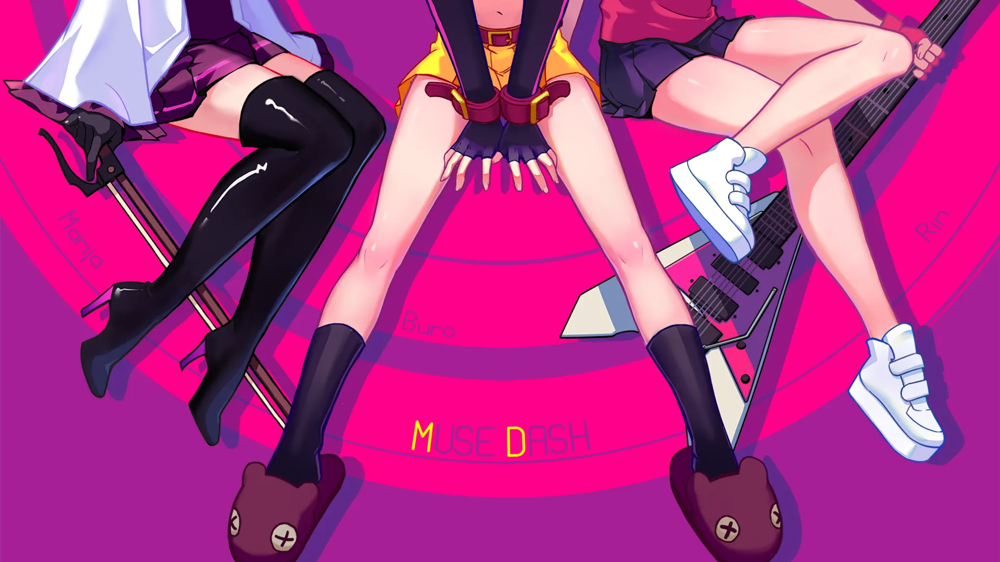
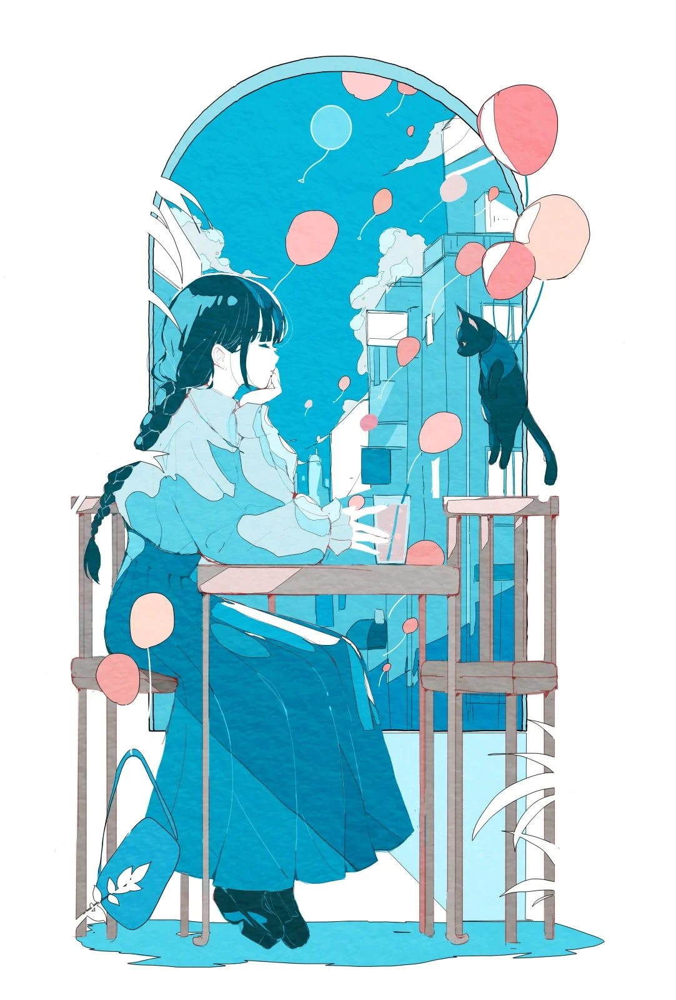

`:::grid` 是本博客的图片图库容器指令。它会把普通的 Markdown 图片排进一个宽高比一致的响应式网格，并自动启用灯箱查看。文章配图、截图、作品集或小型相册都可以用它。

同一个图库里的图片共用同一种卡片比例。默认情况下，居中裁切会填满每张卡片，让每一行都保持整齐；点击图片则会在灯箱里打开完整原图。每个图库都有自己独立的灯箱分组，不会和文章里的其他图片混在一起。

> 这篇文章既是功能文档，也是视觉测试页。建议分别在桌面、平板和手机宽度下查看这些示例，然后点击任意图片，验证灯箱的分组行为。

## 最小语法

直接在 `:::grid` 与结尾的 `:::` 之间书写 Markdown 图片即可：

````markdown
:::grid


:::
````

每张图片都必须独占一个段落，图片之间用一个空行隔开。图库里只放图片；段落、列表和代码块请写在容器外面。

下面是上面这段最小语法的实际效果。不带任何参数时，网格默认使用三列、`16/10` 比例与 `cover`。

:::grid


:::

## 参数速览

所有参数都写在起始指令后面的花括号里：`:::grid{parameter="value"}`。

| 参数 | 允许的取值 | 默认值 | 作用 |
| --- | --- | --- | --- |
| `columns` | `1` 到 `6` 的整数 | `3` | 桌面端每行的列数。非法值会回退为 `3`。 |
| `aspect` | 正数比例，例如 `16/9`、`3/4`、`1/1` | `16/10` | 卡片显示比例，不是原图比例。 |
| `fit` | `cover`、`contain` | `cover` | 图片填充方式。`cover` 裁切填满；`contain` 保留完整图片，可能留下空白。 |

完整示例：

````markdown
:::grid{columns="3" aspect="16/9" fit="cover"}


:::
````

下面的结果使用的就是上面这套三列横图语法。留意卡片比例、列数，以及标题如何优先于替代文本成为题注：

:::grid{columns="3" aspect="16/9" fit="cover"}



:::

## 题注与替代文本

图片的替代文本（alt）既充当无障碍替代描述，也作为它的默认题注。当图片带可选的标题（title）时，标题会取代替代文本成为题注：

```markdown

```

同一行里，所有题注都对齐到各自卡片的底部。某一则题注换行，也不会让其余卡片浮到不同高度。像 `3:4`、`16:9` 这样的比例文字，可以直接写在正文、标题和替代文本里，不需要转义。

这个示例演示了默认的替代文本题注、显式的标题题注，以及较长题注的底部对齐效果：

:::grid{columns="3" aspect="1/1"}


:::

## 布局与裁切

桌面端布局使用 `columns` 指定的列数。宽度低于 `768px` 时，网格最多两列；低于 `480px` 时切换为单列。卡片外层会固定 `aspect` 比例并裁掉圆角外的内容，而图片会填满整张卡片，不再带主题默认的图片外边距。

- 选择 `cover`：推荐的默认值。图片从中心裁切以填满卡片，让整个图库看起来整齐一致。
- 选择 `contain`：完整显示原图、不做裁切。当它的比例与卡片不一致时，主题背景会露出来；适合不能裁切的图片。
- 若想既保留完整图片又不留空白，请把 `aspect` 设成接近原图的比例，或者让这张图单独占一个网格。

下面的示例把同一组竖图放进 `16/9` 卡片里，分别使用 `cover` 与 `contain`。前者把它们裁掉，后者保留完整图像并留下背景空白。

````markdown
:::grid{columns="3" aspect="16/9" fit="cover"}


:::

:::grid{columns="3" aspect="16/9" fit="contain"}


:::
````

:::grid{columns="3" aspect="16/9" fit="cover"}



:::

:::grid{columns="3" aspect="16/9" fit="contain"}


:::

## 默认配置

不带任何属性时，默认是三列、`16/10` 比例与 `cover` 裁切。下面这三张竖图用来验证默认裁切与题注效果。

````markdown
:::grid


:::
````

:::grid


:::

## 三列竖图：3:4

使用 `aspect="3/4"` 时，三张竖图会填满比例一致的竖向卡片。如果原图比例不同，`cover` 会从中心裁掉它的边缘。

````markdown
:::grid{columns="3" aspect="3/4"}


:::
````

:::grid{columns="3" aspect="3/4"}


:::

## 三列横图：16:9

这一组演示三列布局下常见的视频封面比例。当横图本身接近卡片比例时，裁切量会很小。

````markdown
:::grid{columns="3" aspect="16/9"}


:::
````

:::grid{columns="3" aspect="16/9"}


:::

## 两列方图：1:1

当需要更大的预览卡片时，两列很好用。第三张图会移到下一行。最后一行会保持自己的网格轨道宽度，而不是把图片拉伸去填满整行。

````markdown
:::grid{columns="2" aspect="1/1"}


:::
````

:::grid{columns="2" aspect="1/1"}


:::

## 四列布局与 `contain`

`fit="contain"` 不会裁切原图。当图片比例与卡片比例不一致时，主题背景会露出来。这是有意为之，不是布局缺陷。它同时也验证了四列网格与各自独立的灯箱分组之间不会互相干扰。

````markdown
:::grid{columns="4" aspect="16/9" fit="contain"}


:::
````

:::grid{columns="4" aspect="16/9" fit="contain"}


:::

## 单列大图

当一张图需要更大的阅读尺寸时，单列很合适。它在桌面、平板和手机上都是一列，而原图依然可以在灯箱里查看。

````markdown
:::grid{columns="1" aspect="16/9"}

:::
````

:::grid{columns="1" aspect="16/9"}

:::

## 五列稀疏行

五列用来验证更高的受支持列数。只有三张图时，最后一行会保持左对齐，而不是把图片拉伸开来。

````markdown
:::grid{columns="5" aspect="1/1"}


:::
````


:::grid{columns="5" aspect="1/1"}


:::

## 六列混合图片

六列是目前的上限。混排横图与竖图，用来验证 `cover` 裁切、窄卡片上的题注，以及密集的桌面布局。出于阅读体验考虑，正文里通常还是两到四列更合适。

````markdown
:::grid{columns="6" aspect="1/1"}


:::
````

:::grid{columns="6" aspect="1/1"}


:::

## 四列方图：1:1

四张比例相同的方图，是典型的四列布局。桌面端一行显示全部四张；平板折叠为两列，手机折叠为一列。

````markdown
:::grid{columns="4" aspect="1/1"}


:::
````

:::grid{columns="4" aspect="1/1"}


:::

## 六列横图：16:9

六列横图很适合做缩略图预览、作品集和截图索引。即使原图比例略有差异，`cover` 也会把每张 `16/9` 卡片填得整整齐齐。

````markdown
:::grid{columns="6" aspect="16/9"}


:::
````

:::grid{columns="6" aspect="16/9"}


:::

## 三列竖图（六张）：3:4

这一组六张竖图演示人物、海报或手机截图的常见排版。图片排成两行三列，题注对齐在底部。

````markdown
:::grid{columns="3" aspect="3/4"}


:::
````

:::grid{columns="3" aspect="3/4"}


:::

## 边缘关键内容：`cover` 与灯箱

这些图片在靠近边缘的位置带有重要文字或细节。`cover` 能让网格保持整齐，但可能会把这些边缘裁掉；点击图片即可在灯箱里查看未裁切的完整原图。对边缘敏感的内容请写清题注，或者改用下面的 `contain`。

````markdown
:::grid{columns="3" aspect="16/9" fit="cover"}


:::
````

:::grid{columns="3" aspect="16/9" fit="cover"}


:::

## 极端比例与 `contain`

对于横幅、长截图以及其他极端比例的图片，`contain` 会完整显示原图。与 `cover` 不同，它可能留下主题背景的空白，但绝不会裁掉内容。

````markdown
:::grid{columns="3" aspect="16/9" fit="contain"}


:::
````

:::grid{columns="3" aspect="16/9" fit="contain"}


:::

## 透明背景图片

透明图片会透出卡片的主题背景。这个单列 `contain` 示例方便观察透明区域、原图边缘以及灯箱的表现。

````markdown
:::grid{columns="1" aspect="16/9" fit="contain"}

:::
````

:::grid{columns="1" aspect="16/9" fit="contain"}

:::

## 灯箱导航

点击网格里的任意图片，就会打开 Fancybox 灯箱。你可以在里面缩放、旋转、进入全屏、查看缩略图，并用方向键翻页。导航范围仅限于当前这个 `:::grid` 容器：例如点击"16:9 测试图一"，只会打开该小节里的另外两张横图。

同一篇文章里普通的 Markdown 图片依旧单独处理，不会被加入任何网格图库。

## 检查清单

1. 每个网格里的图片尺寸一致，题注都显示在卡片下方。
2. 图片在悬停时会有轻微缩放；点击后可以缩放、旋转，并用键盘翻页。
3. 点击"16:9 测试图一"后，灯箱只会在该小节的两张横图之间浏览。
4. 宽度低于 768px 时，网格最多两列；低于 480px 时为一列。
5. "四列布局与 `contain`"里的竖图完整可见，留有空白且没有裁切。
6. 五列与六列网格在宽屏上保持指定的列数，随后按响应式规则折叠为两列或一列。
