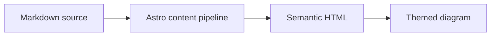

## GitHub Repository Cards
You can add dynamic cards that link to GitHub repositories, on page load, the repository information is pulled from the GitHub API. 

::github{repo="Fabrizz/MMM-OnSpotify"}

Create a GitHub repository card with the code `::github{repo="<owner>/<repo>"}`.

```markdown
::github{repo="saicaca/fuwari"}
```

## Mermaid Diagrams

Fenced `mermaid` blocks are rendered as diagrams and follow the active color scheme.



## Admonitions

Following types of admonitions are supported: `note` `tip` `important` `warning` `caution`

:::note
Highlights information that users should take into account, even when skimming.
:::

:::tip
Optional information to help a user be more successful.
:::

:::important
Crucial information necessary for users to succeed.
:::

:::warning
Critical content demanding immediate user attention due to potential risks.
:::

:::caution
Negative potential consequences of an action.
:::

### Basic Syntax

```markdown
:::note
Highlights information that users should take into account, even when skimming.
:::

:::tip
Optional information to help a user be more successful.
:::
```

### Custom Titles

The title of the admonition can be customized.

:::note[MY CUSTOM TITLE]
This is a note with a custom title.
:::

```markdown
:::note[MY CUSTOM TITLE]
This is a note with a custom title.
:::
```

### GitHub Syntax

> [!TIP]
> [The GitHub syntax](https://github.com/orgs/community/discussions/16925) is also supported.

```
> [!NOTE]
> The GitHub syntax is also supported.

> [!TIP]
> The GitHub syntax is also supported.
```

### Spoiler

You can add spoilers to your text. The text also supports **Markdown** syntax.

The content :spoiler[is hidden **ayyy**]!

```markdown
The content :spoiler[is hidden **ayyy**]!

```

## Image Widths and Captions

A standalone image accepts an optional `w-N%` width token in its alt text and a Markdown title rendered as a centered caption below the image:


```markdown

```

Valid widths range from `w-1%` to `w-100%`; invalid tokens stay in the alt text. The width and the caption are independent — a title alone also produces a caption:


