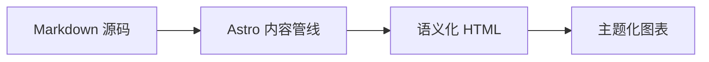

## GitHub 仓库卡片
你可以添加动态卡片来链接 GitHub 仓库，页面加载时会从 GitHub API 拉取仓库信息。

::github{repo="Fabrizz/MMM-OnSpotify"}

用代码 `::github{repo="<owner>/<repo>"}` 即可创建一个 GitHub 仓库卡片。

```markdown
::github{repo="saicaca/fuwari"}
```

## Mermaid 图表

带 `mermaid` 标记的代码块会被渲染成图表，并跟随当前配色方案。



## 提示框

支持以下类型的提示框：`note` `tip` `important` `warning` `caution`

:::note
强调用户即使只是快速扫读也应当留意的信息。
:::

:::tip
帮助用户更顺利地完成操作的补充信息。
:::

:::important
用户成功所必需的关键信息。
:::

:::warning
由于潜在风险而需要用户立即注意的关键内容。
:::

:::caution
某个操作可能带来的负面后果。
:::

### 基础语法

```markdown
:::note
Highlights information that users should take into account, even when skimming.
:::

:::tip
Optional information to help a user be more successful.
:::
```

### 自定义标题

提示框的标题可以自定义。

:::note[我的自定义标题]
这是一条带自定义标题的提示。
:::

```markdown
:::note[MY CUSTOM TITLE]
This is a note with a custom title.
:::
```

### GitHub 语法

> [!TIP]
> 同时支持 [GitHub 语法](https://github.com/orgs/community/discussions/16925)。

```
> [!NOTE]
> The GitHub syntax is also supported.

> [!TIP]
> The GitHub syntax is also supported.
```

### 剧透

你可以给文字加上剧透遮罩。遮罩里的文字同样支持 **Markdown** 语法。

内容是 :spoiler[被藏起来的 **ayyy**]！

```markdown
The content :spoiler[is hidden **ayyy**]!

```

## 图片宽度与题注

单独一行插入的图片，可以在替代文本里带上可选的 `w-N%` 宽度标记，并可用 Markdown 标题生成居中显示在图下方的题注：


```markdown

```

合法宽度范围是 `w-1%` 到 `w-100%`；非法标记会保留在替代文本里。宽度与题注互相独立 —— 只写标题同样会生成题注：


