Mermaid turns text descriptions in Markdown into diagrams. The examples below use Shirone's content workflow to demonstrate diagram types commonly used in technical articles and project notes.

## Flowchart

Flowcharts describe a process, including decisions and paths that return to an earlier step.

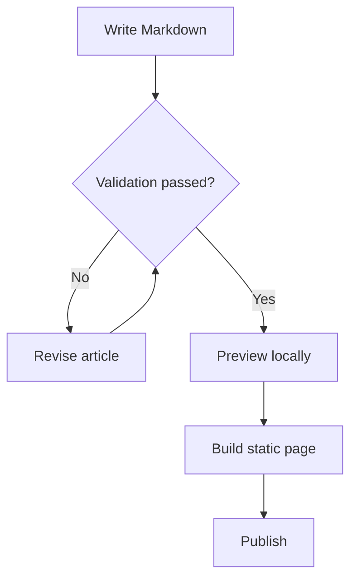

## Sequence Diagram

Sequence diagrams present collaboration between participants in chronological order. This example follows a Swup navigation from request to Mermaid rendering.

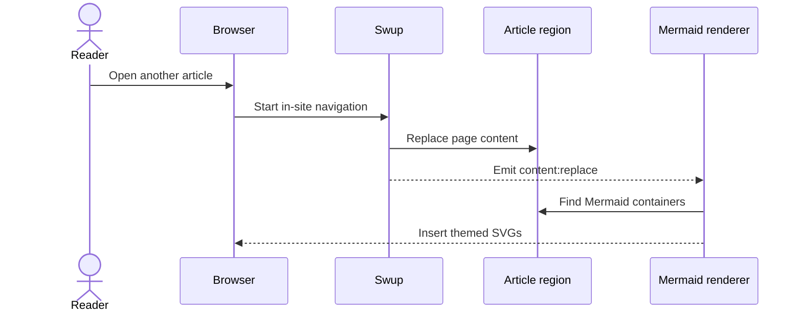

## Entity Relationship Diagram

Entity relationship diagrams model structured data and the connections between authors, posts, tags, and comments.

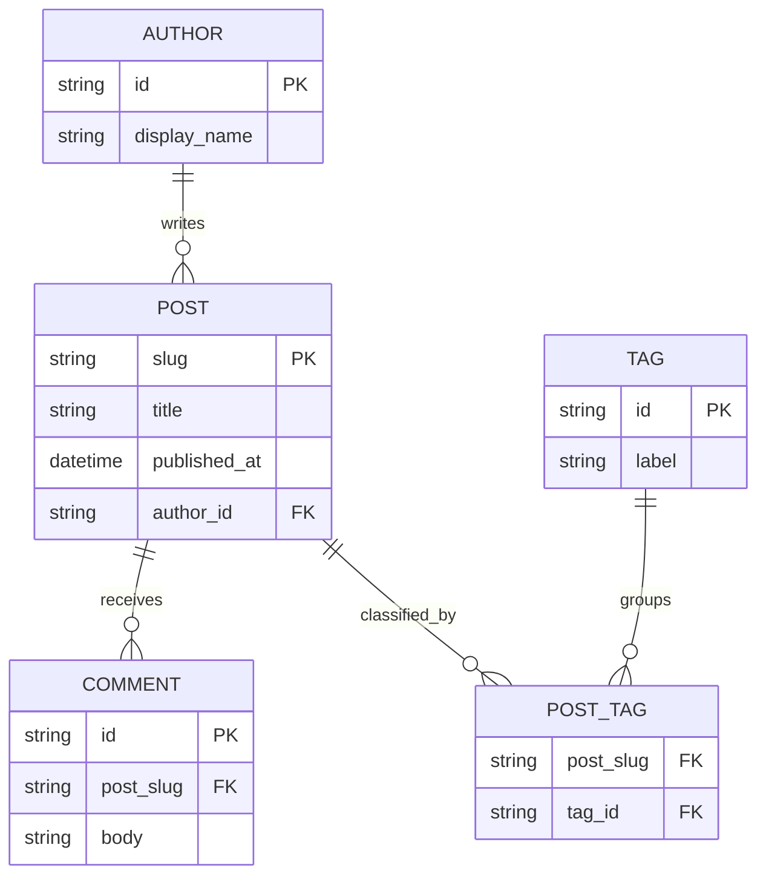

## Class Diagram

Class diagrams communicate responsibilities, public methods, and dependency directions in a software design.

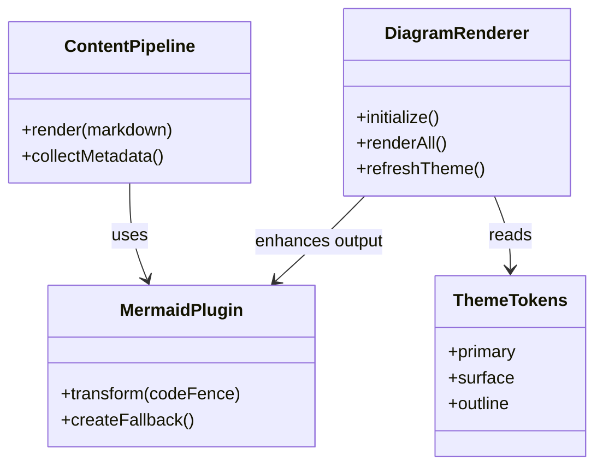

## State Diagram

State diagrams show the lifecycle of an object and the events that move it between states.

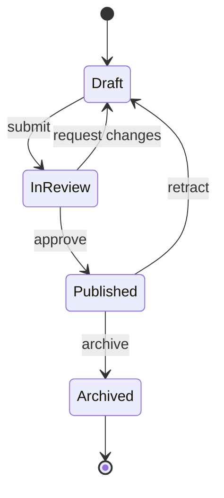

## XY Chart

XY charts combine bars and lines to compare values and trends over a shared axis.

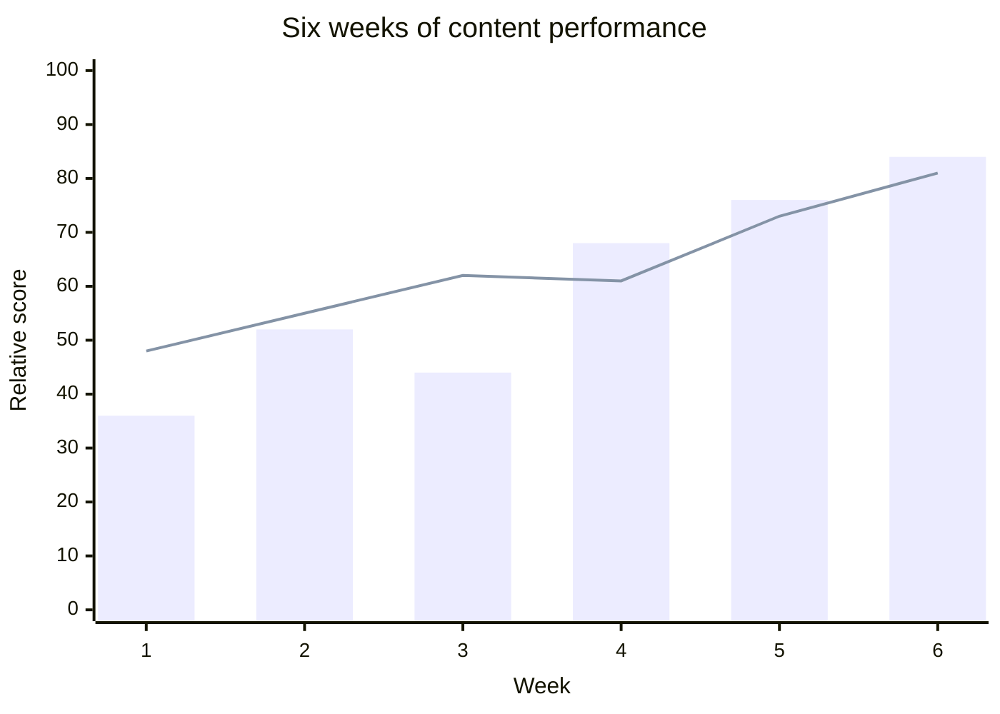

## Pie Chart

Pie charts provide a compact comparison of how categories contribute to a whole.

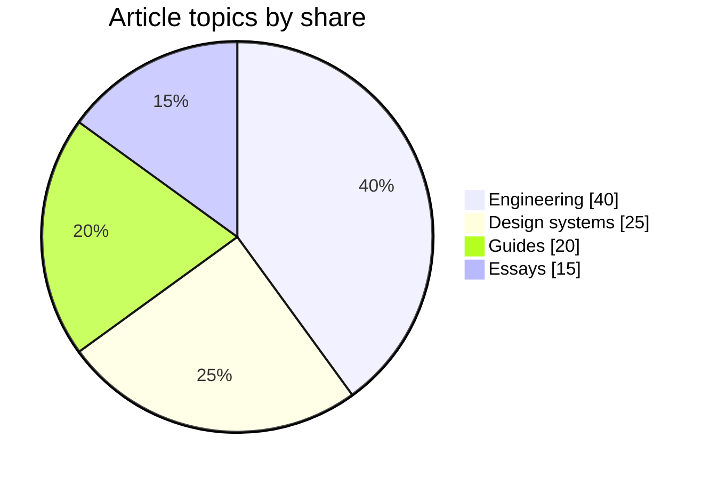

## Gantt Chart

Gantt charts arrange tasks, dependencies, and milestones along a calendar timeline.

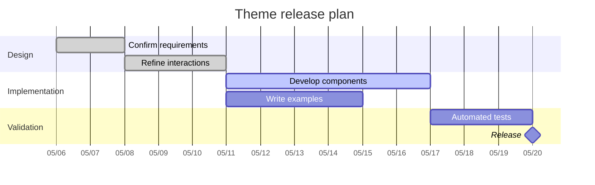

## Mind Map

Mind maps expand a central topic into related areas and supporting concepts.

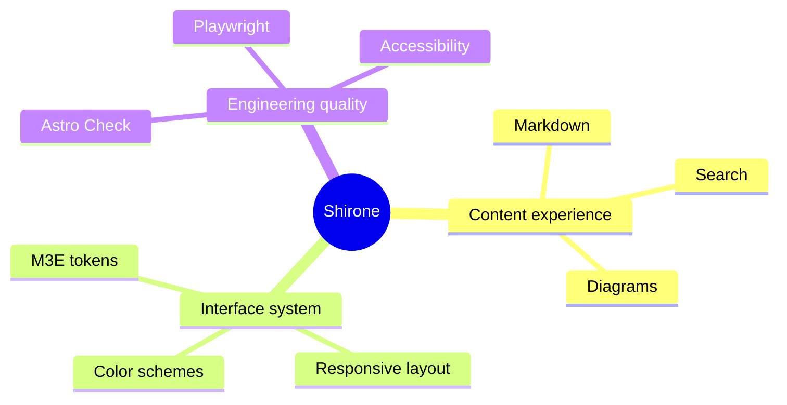

## Timeline

Timelines summarize significant events or phases without requiring exact calendar durations.

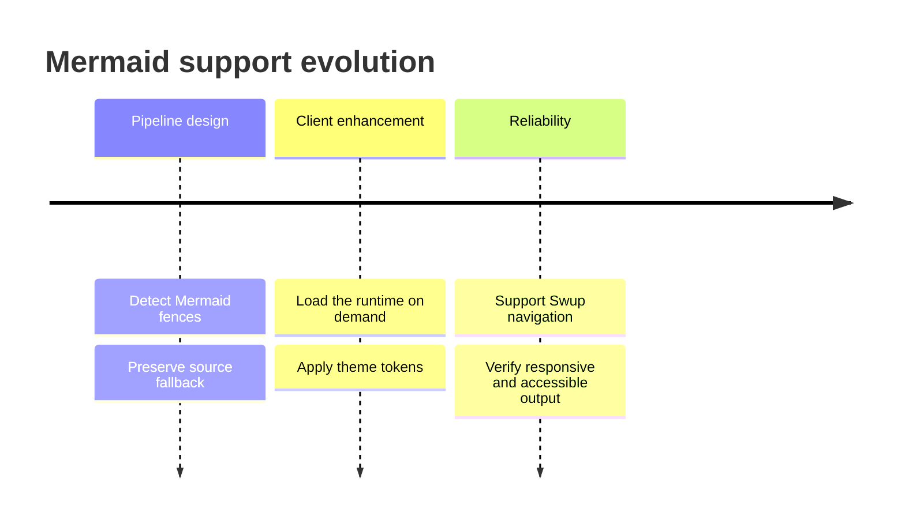

## User Journey

User journey diagrams combine actions, participants, and experience scores across the stages of a task.

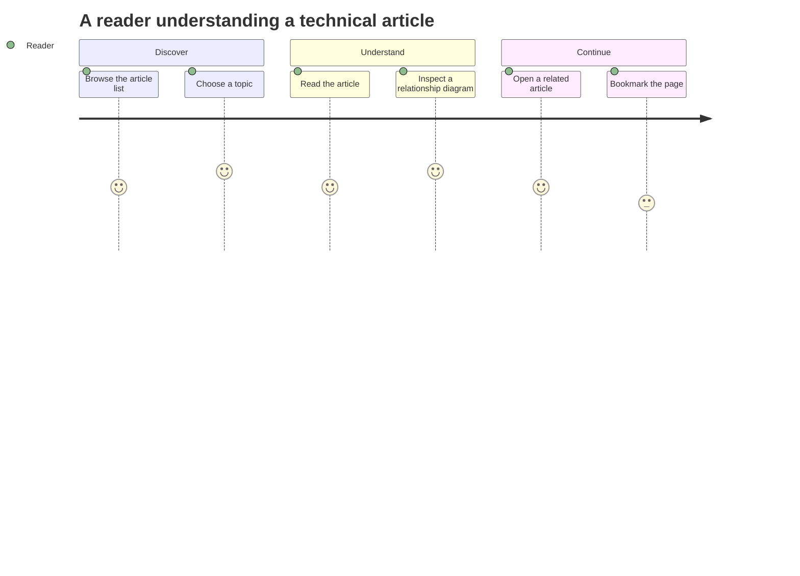

## Git Graph

Git graphs show how work progresses on a feature branch before it merges into the main line.

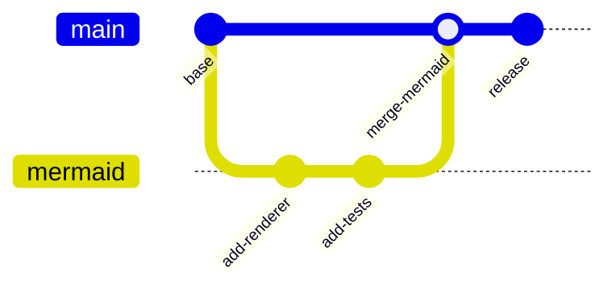

## Kanban Board

Kanban boards group tasks by workflow state to make current progress easy to scan.

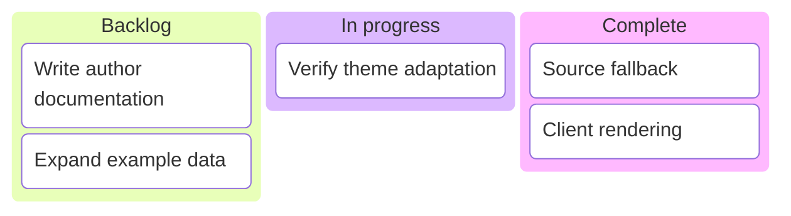

## Sankey Diagram

Sankey diagrams use link width to show how traffic or another quantity flows between nodes.

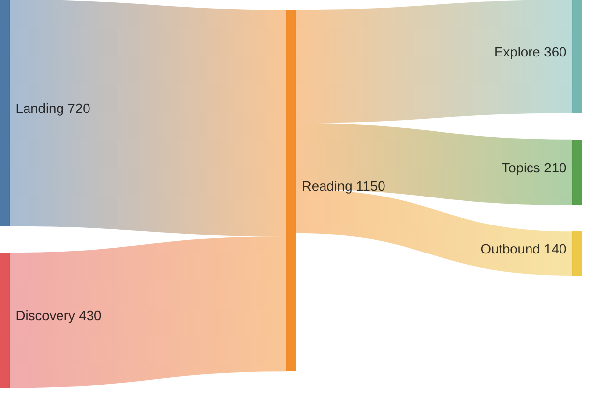

Each example uses a standard `mermaid` code fence. The server preserves readable source markup, and the browser enhances it into an SVG that follows the active theme. Diagrams render again when the theme changes or when Swup navigates to this article.