Mermaid 能把 Markdown 里的文字描述变成图表。下面的示例借用 Shirone 的内容工作流，演示技术文章与项目笔记里常用的各种图表类型。

## 流程图

流程图用来描述一个过程，包括判断分支，以及回到先前步骤的路径。

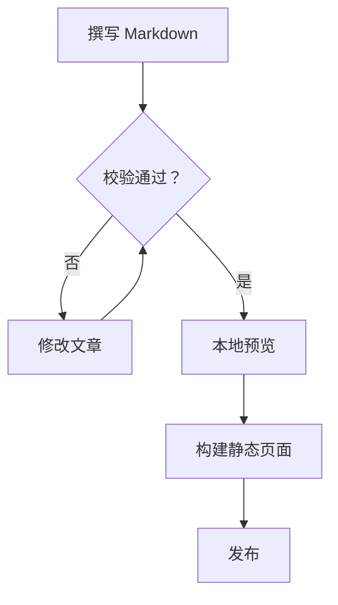

## 时序图

时序图按时间顺序呈现参与者之间的协作。这个例子顺着一次 Swup 导航，从发起请求一直跟到 Mermaid 完成渲染。

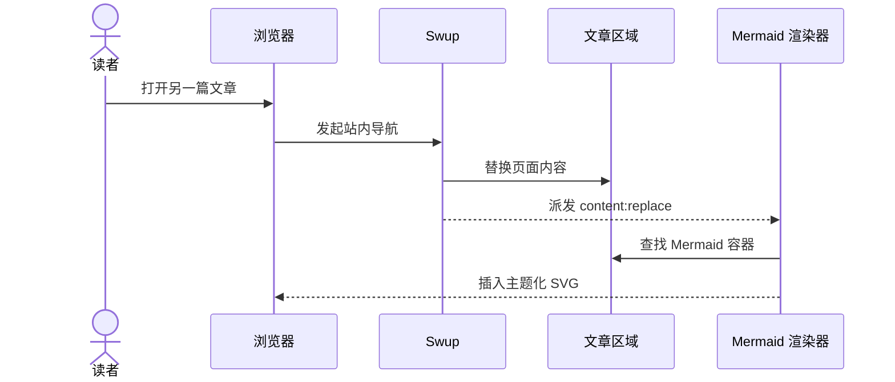

## 实体关系图

实体关系图用来建模结构化数据，以及作者、文章、标签和评论之间的连接关系。

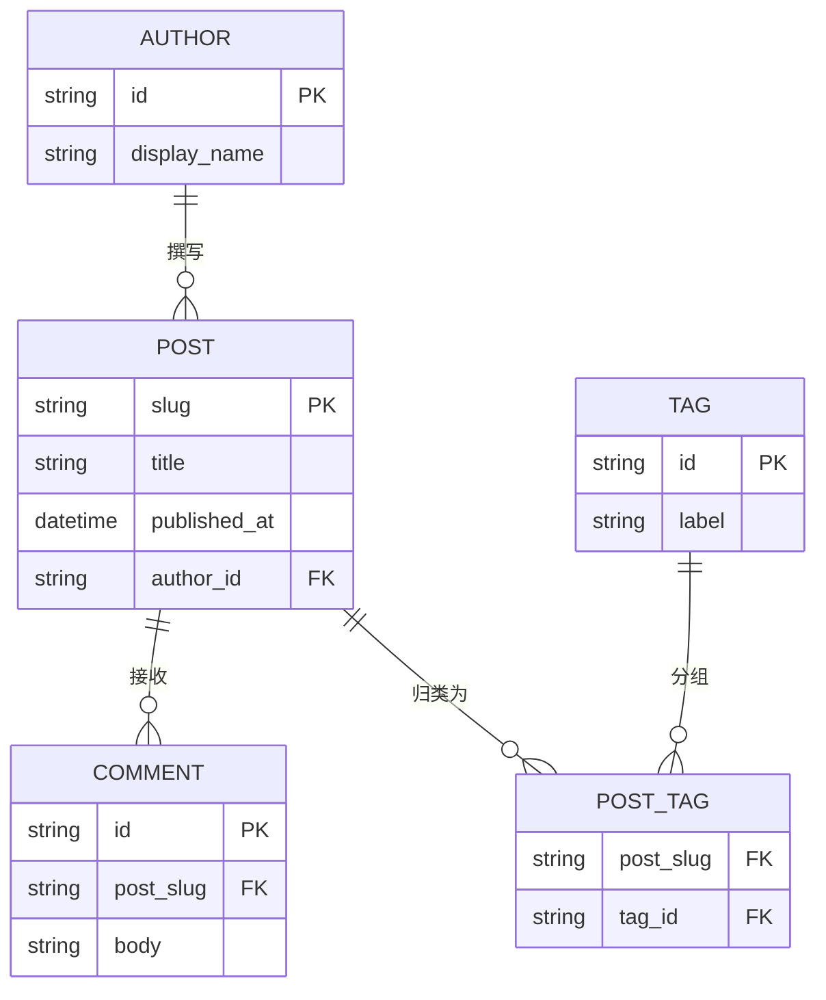

## 类图

类图用来表达软件设计里的职责划分、公开方法与依赖方向。

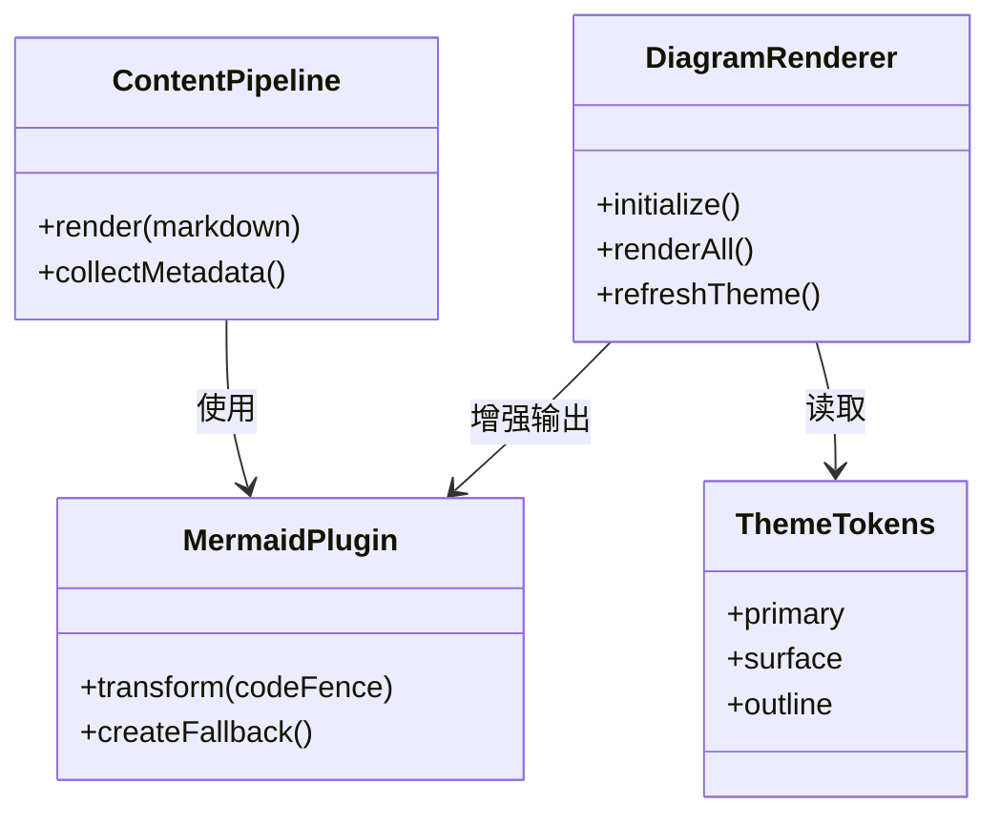

## 状态图

状态图展示一个对象的生命周期，以及把它在各个状态之间推动的事件。

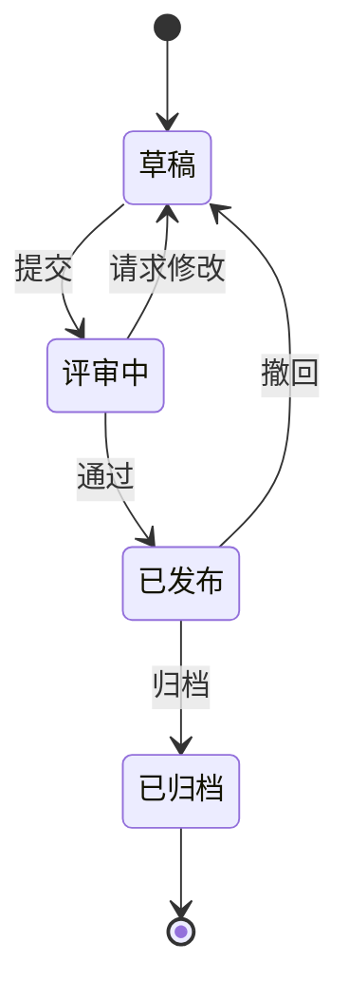

## XY 坐标图

XY 图把柱状与折线组合起来，在共享坐标轴上比较数值与趋势。

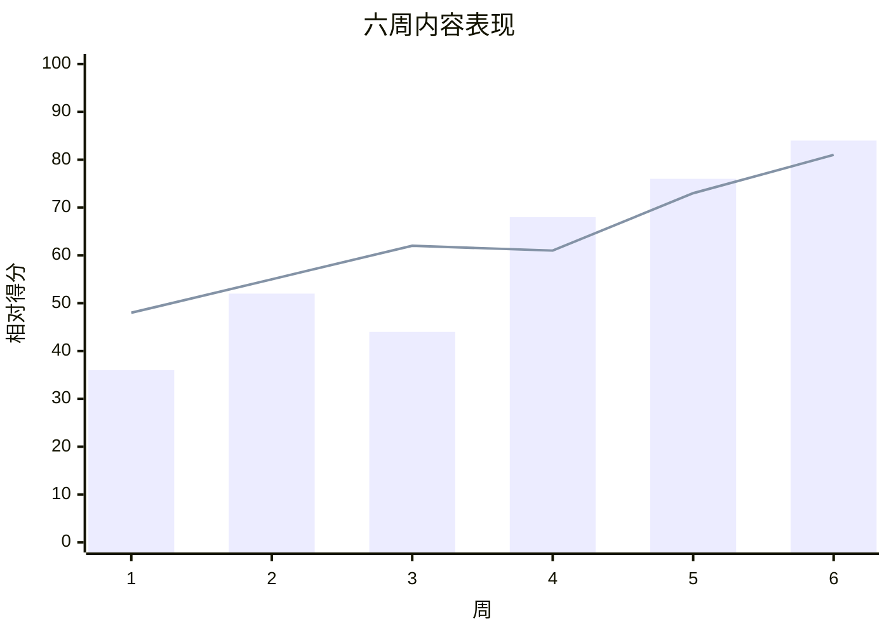

## 饼图

饼图用紧凑的方式比较各类别在整体中的占比。

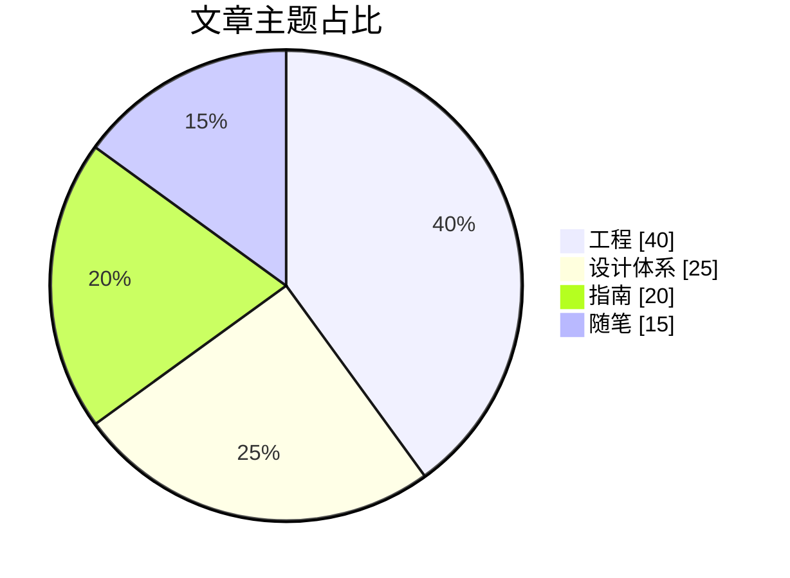

## 甘特图

甘特图把任务、依赖和里程碑沿日历时间轴排开。

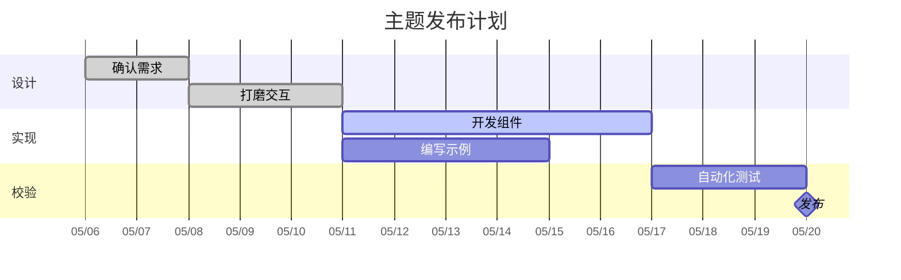

## 思维导图

思维导图把一个中心主题展开成若干相关领域与支撑概念。

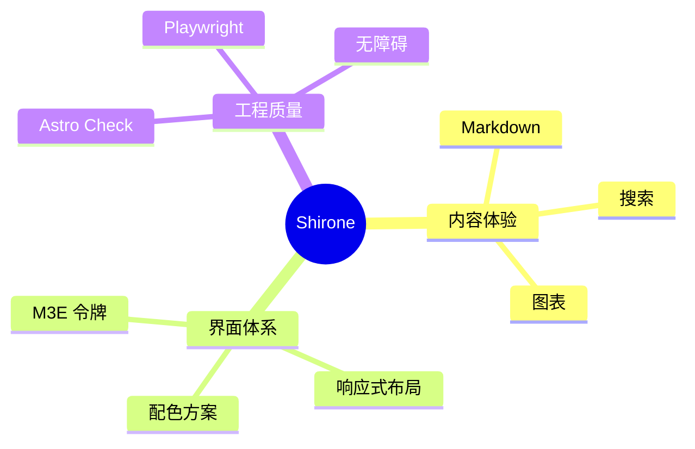

## 时间线

时间线用来概括重要事件或阶段，而不需要精确的日历时长。

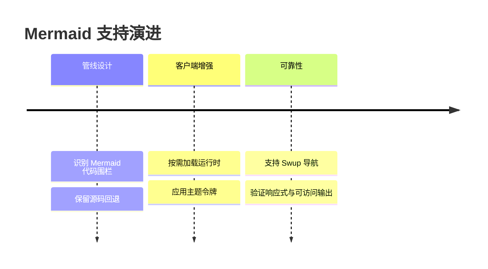

## 用户旅程图

用户旅程图把任务各阶段的动作、参与者与体验评分组合在一起。

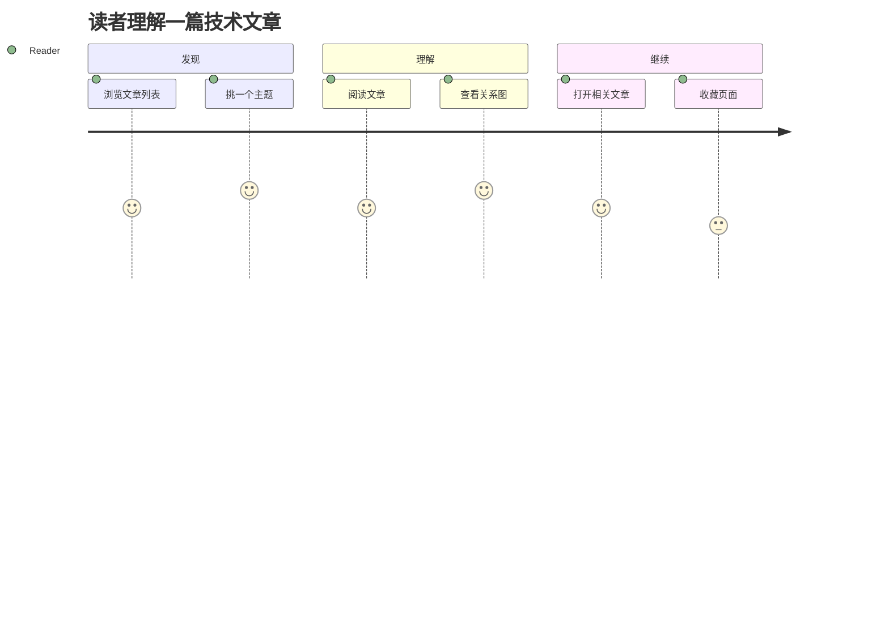

## Git 图

Git 图展示一个功能分支在合入主线之前，工作是如何推进的。

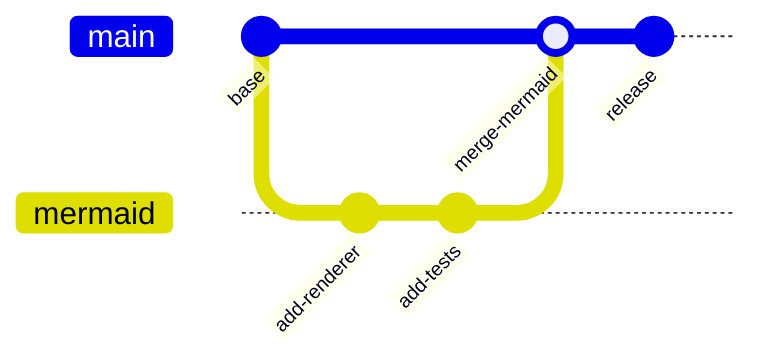

## 看板

看板按工作流状态把任务分组，让当前进度一目了然。

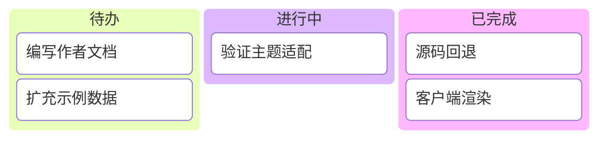

## 桑基图

桑基图用连线宽度表示流量或其他数量如何在节点之间流转。

```mermaid
sankey-beta
落地页,阅读,720
发现页,阅读,430
阅读,探索,360
阅读,专题,210
阅读,外链跳转,140
```

每个示例都使用标准的 `mermaid` 代码围栏。服务端会保留一份可读的源码标记，浏览器再把它增强为跟随当前主题的 SVG。主题切换或 Swup 导航到本篇文章时，图表都会重新渲染。
