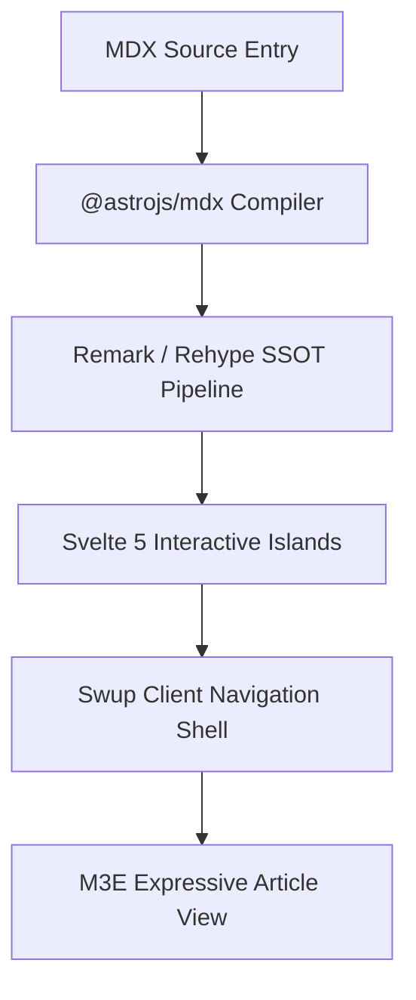

import Button from "@components/atoms/action/Button.svelte";
import Chips from "@components/atoms/action/Chips.svelte";
import Card from "@components/atoms/display/Card.svelte";
import AccentBar from "@components/atoms/display/AccentBar.svelte";
import Badge from "@components/atoms/display/Badge.svelte";
import Divider from "@components/atoms/display/Divider.svelte";
import Skeleton from "@components/atoms/display/Skeleton.svelte";
import LoadingIndicator from "@components/atoms/feedback/LoadingIndicator.svelte";
import ProgressIndicator from "@components/atoms/feedback/ProgressIndicator.svelte";
import TextField from "@components/atoms/input/TextField.svelte";
import Switch from "@components/atoms/selection/Switch.svelte";
import Checkbox from "@components/atoms/selection/Checkbox.svelte";
import SegmentedButton from "@components/atoms/selection/SegmentedButton.svelte";
import Slider from "@components/atoms/selection/Slider.svelte";

export const authorInfo = {
  framework: "Astro 7",
  ui: "Svelte 5",
  tokens: "M3E Design Tokens",
  architecture: "Islands Architecture"
};

export const showcaseItems = [
  { name: "Atomic Component Embedding", desc: "Directly import and render 60+ M3E atoms and molecules in article content" },
  { name: "Svelte 5 Islands", desc: "Selective hydration via client:visible ensures zero unnecessary JavaScript overhead" },
  { name: "JSX Expressions", desc: "Native JavaScript variables, data mappings, and conditional rendering" },
  { name: "Extension Pipeline", desc: "Unified SSOT compilation for Mermaid, KaTeX, Admonitions, and Expressive Code" }
];

export const filterChipOptions = [
  { value: "all", label: "All Components" },
  { value: "display", label: "Display Atoms" },
  { value: "feedback", label: "Feedback" },
  { value: "action", label: "Interactive" }
];

export const segmentedOptions = [
  { value: "linear", label: "Linear" },
  { value: "circular", label: "Circular" },
  { value: "morph", label: "Morphing" }
];

:::tip
**MDX (Markdown + JSX)** bridges the gap between static writing and application interfaces. In Shirone, authors can seamlessly mix dynamic logic, reactive Svelte 5 components, and Material 3 design tokens directly within post content.
:::

## 1. Markdown vs MDX Capability Matrix

| Feature | Standard Markdown (`.md`) | Shirone MDX (`.mdx`) | Execution Mode |
| :--- | :--- | :--- | :--- |
| **Typography & Structure** | Full Support | Full Support | Static SSR |
| **Code Highlighting** | Line Numbers, Frames, Collapsible | Line Numbers, Frames, Collapsible | Static SSR (Expressive Code) |
| **Diagrams & Mathematics** | Mermaid, KaTeX | Mermaid, KaTeX | Client Enhanced |
| **Callout Admonitions** | Note, Tip, Important, Warning, Caution | Note, Tip, Important, Warning, Caution | Static SSR |
| **M3E Display Atoms** | Not Available | Direct Integration (`<Card>`, `<Skeleton>`) | Pure SSR (Zero Client JS) |
| **Svelte 5 Reactive Islands** | Not Available | On-Demand Hydration (`<Button>`, `<Switch>`) | `client:visible` Lazy Hydrated |
| **Feedback & Loading Atoms** | Not Available | Animated Morph (`<LoadingIndicator>`) | `client:visible` Reactive |
| **Dynamic JSX Expressions** | Not Available | Native Evaluation (`{authorInfo.ui}`) | Compile-Time / Client |

---

## 2. Dynamic Expressions and Data Mapping

MDX allows declaring scoped constants using `export const` at the top of the file, which can be evaluated inline or mapped across templates:

- **Core Framework**: {authorInfo.framework}
- **UI Engine**: {authorInfo.ui}
- **Design Tokens**: {authorInfo.tokens}
- **Architecture Pattern**: {authorInfo.architecture}

Arrays and collections can be rendered dynamically into grid layouts:

  {showcaseItems.map((item, idx) => (
    

      

        
          {idx + 1}
        
        {item.name}
      

      
{item.desc}

    

  ))}

---

## 3. M3E Display and Layout Primitives (SSR-Only)

In accordance with Shirone's component architecture (`docs/atomic-structure.md`), stateless display components output clean, accessible semantic HTML with no client-side runtime payload.

### 3.1 Card Containers (`Card.svelte`)

  <Card variant="filled" class="!p-5">
    
Filled Card

    
Default container background with no elevation shadow. Ideal for grouped content blocks.

  </Card>

  <Card variant="elevated" class="!p-5">
    
Elevated Card

    
Level 1 container elevation with interactive state layering for heightened visual focus.

  </Card>

  <Card variant="outlined" class="!p-5">
    
Outlined Card

    
A crisp 1px outline boundary providing clean separation on neutral surfaces.

  </Card>

### 3.2 Accent Bars and Badges (`AccentBar` & `Badge`)

  <AccentBar size="large" />
  

    System Announcement
    
Combine AccentBar with Badge to build prominent visual callouts

  

  <Badge>M3E v0.192</Badge>

### 3.3 Skeleton Placeholders (`Skeleton.svelte`)

For previewing layout skeletons or prototyping async states:

  

    <Skeleton variant="circle" width="2.5rem" height="2.5rem" />
    

      <Skeleton variant="text" width="40%" height="0.875rem" />
      <Skeleton variant="text" width="25%" height="0.75rem" />
    

  

  <Skeleton variant="rect" width="100%" height="3rem" radius="0.5rem" />

---

## 4. Feedback and Loading Indicators

Shirone features full-fidelity Material 3 Expressive motion and feedback atoms:

### 4.1 Morphing Loading Indicator (`LoadingIndicator.svelte`)

Implemented with `androidx.graphics.shapes` polygon morphing, providing smooth spring-interpolated 7-shape animations:

  

    

      <LoadingIndicator client:visible />
    

    Indeterminate Shape Morph
  

  

    

      <LoadingIndicator client:visible contained />
    

    Contained Circular Variant
  

  

    

      <LoadingIndicator client:visible progress={0.68} />
    

    Determinate Progress (68%)
  

### 4.2 Linear and Indeterminate Progress (`ProgressIndicator.svelte`)

  

    

      Pipeline Compilation
      80%
    

    <ProgressIndicator client:visible progress={0.8} />
  

  

    
Continuous Dual-Line Animation

    <ProgressIndicator client:visible />
  

---

## 5. Interactive Svelte 5 Islands

Components declared with `client:visible` are lazy-hydrated via `IntersectionObserver` when entering the viewport:

### 5.1 Button Matrix (`Button.svelte`)

  <Button client:visible variant="filled">Filled Button</Button>
  <Button client:visible variant="elevated">Elevated</Button>
  <Button client:visible variant="tonal">Tonal Button</Button>
  <Button client:visible variant="outlined">Outlined</Button>
  <Button client:visible variant="text">Text Button</Button>

### 5.2 Filter Chips and Segmented Buttons (`Chips` & `SegmentedButton`)

  

    
M3E Filter Chips

    <Chips client:visible items={filterChipOptions} value="all" />
  

  <Divider />

  

    
Segmented Control

    <SegmentedButton client:visible options={segmentedOptions} value="linear" />
  

### 5.3 Switches, Checkboxes, and Sliders (`Switch`, `Checkbox`, `Slider`)

  

    Switch with Status Icons
    <Switch client:visible checked={true} icons label="Push notifications" />
  

  <Divider />

  

    Selection Checkboxes
    

      <Checkbox client:visible checked={true} label="Selected" />
      <Checkbox client:visible checked={false} label="Unselected" />
      <Checkbox client:visible checked={null} triState label="Indeterminate" />
    

  

  <Divider />

  

    Hue Spectrum Slider
    <Slider client:visible value={60} label="Hue adjustment" />
  

### 5.4 Input Controls (`TextField.svelte`)

  <TextField client:visible variant="filled" label="Filled Text Field" placeholder="Enter text..." />
  <TextField client:visible variant="outlined" label="Outlined Text Field" placeholder="Enter text..." />

---

## 6. Markdown Extension Compatibility

Shirone's SSOT unified plugin pipeline preserves full compatibility with all Markdown extensions:

### 6.1 GitHub Repository Cards

::github{repo="saicaca/fuwari"}

### 6.2 Mermaid Architecture Diagrams

### 6.3 Mathematical Expressions (LaTeX / KaTeX)

Inline equation: Mass-energy equivalence $E = mc^2$ and Gaussian integral $\int_{-\infty}^{\infty} e^{-x^2} dx = \sqrt{\pi}$.

Block equation:

$$
\mathcal{L}_{M3E} = \sum_{i=1}^{N} \left( \text{Token}_i \cdot \text{ContrastRatio} \right) + \lambda \|\text{MotionElegance}\|
$$

---

## 7. Summary

The native integration of MDX empowers technical writers to build rich, interactive documentation while preserving Shirone's ultra-fast static performance. All components adhere to the Material 3 Expressive token design system, ensuring consistency, accessibility, and visual harmony.
