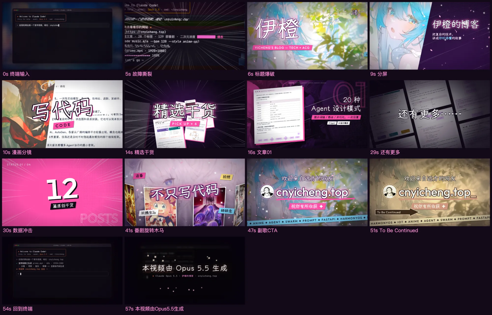

今天下午我在 Claude Code 里敲了一段提示词，让它给 cnyicheng.top 做个宣传视频。提示词很短，就是给我的网站做一个宣传视频，域名是 cnyicheng.top。后面补了两句交代，音乐和内容它自己构思，关键画面先发给我确认，成品放到 `/Library/CC_Opus5.5`。

它没再追问。先抓了一遍网站，文章标题、标签、番剧列表和页面截图都过了一遍，然后搭了一个 Remotion 工程，把分镜、转场、特效写成代码，又写脚本合成配乐，最后渲染成 mp4。

站内每篇文章都有体积限制，第二版的成片是 97MB，传不上来，下面只放两支片子的关键画面截图。

## 第一支：雨夜 lo-fi

第一版走的是雨夜 lo-fi 路线。背景是紫黑色的夜雨，主视觉是玻璃拟态卡片和粉色霓虹，字幕踩着打字机的节奏一条条出现，镜头全程缓慢推近。

配乐是 96 BPM 的 lo-fi 拍子，下面垫了一层雨声。画面从“深夜第 N 次搜索多 Agent 怎么协作”起手，转到网站标题、关键词云、精选文章、数据面板、追番墙，最后落到 CTA 和“诸事顺，利”。

整支片子 53 秒，先出了一版 720p 草稿。看完的第一感觉是它听懂了需求，节奏和信息点都稳，只是整体偏规矩，一段接一段，没有太多意外。

*图：第一版的关键画面，从雨夜开场、关键词云、文章精选到数据面板。*

## 第二支：动漫 OP

看完第一版我补了一段话，说现在的视频太规矩有序了，再创新一些，塞点艺术感的特效，有活力一点，二次元感拉满，像动漫 CG 一样，让人眼前一亮，觉得这个网站很高级，最后加一句“本视频由 Opus 5.5 生成”。

:::tip 第二版补的提示词
你现在做的视频太规矩有序了，再创新一些，塞入艺术些的特效，有活力些，二次元感拉满，像动漫 CG 一样，视频效果让人眼前一亮，让人感觉到这个网站很高级很厉害，你的模型效果也很好，最后加上一句：本视频由 Opus 5.5 生成。
:::

然后它换了个完全不同的画风。开场是终端窗口里敲那句提示词，回车之后镜头怼进屏幕，切进动漫 OP：漫画分镜、速度线、半调网点、荧光粉配青色，画面跟着鼓点震。结尾先是一个漫画式定格，箭头框里写着 To Be Continued，再切回终端打出“本视频由 Opus 5.5 生成”的署名。

配乐也换成了 120 BPM 的 future bass，走 IV–V–iii–vi 的王道进行。这一版直接出了 1920×1080 的成片，60 秒。

*图：第二版的关键画面，终端开场、漫画分镜、文章推荐、数据冲击和结尾。*

## 配乐

两支片子的配乐都不是现成素材。它写了两个 Node 脚本，用振荡器、包络和滤波器把波形一段段算出来，第一版是 lo-fi 雨夜的感觉，第二版是动漫 OP 的路子。

第一次听的时候我觉得挺神奇，画面和音乐是在同一次对话里一起生成的。刷了它做的几支视频之后，AI 味就出来了：鼓组和和声进行偏套路，情绪从开头一路推到底，该留白的地方不太舍得停。当背景音乐用完全够，单独拿出来听还是不够耐听。

## 代价

效果好的代价是烧钱。每改一次分镜，都要重新出静帧、对时间轴、再走一遍渲染，token 和时间都实打实花出去了。第二版为了 1080p 的成片，音轨给到 320k，H.264 文件 97MB，工程量并不小。

以现在的价格看，这个玩法更适合偶尔尝鲜，天天这么跑钱包受不了。

## 半年之后

Opus 5.5 这次的表现让我有点改观：一句提示词加一段风格描述，它就能把分镜、特效、配乐、剪辑串成一条流水线，最后交出来的东西已经不是“能看”的水平了。

音乐这块再过半年，大概率会落到便宜得多的模型上。到那时候，我大概会把它当成写博客的常规工具，而不是现在这种隔一阵子花笔钱尝个鲜。

两个 mp4 都放在 `/Library/CC_Opus5.5` 里，有空再让它改一版。
