刚学完 Python 语法，会写 `for`、会写函数、知道什么是字典，然后呢？

很多人卡在这一步：语法都懂，却不知道手里这门语言能干什么。这篇文章给你一个**半小时内就能亲手跑出结果**的小项目——用 Python 抓一本小说，存成 txt。

不需要框架，也不用一上来就啃 Scrapy。你只要会两件事：**发一个 HTTP 请求**，**从返回的 HTML 里把想要的文字挑出来**。

:::note 这篇文章的目标
读完你应该能做到：给定一个小说章节页，让代码从第一章自动抓到最后一章，最后输出一个完整的 txt 文件。
:::

## 0. 准备：装两个库

打开终端（Windows 用 PowerShell 或 CMD）：

```bash
pip install requests lxml
```

| 库 | 干什么用 |
| --- | --- |
| `requests` | 帮你发送 HTTP 请求，把网页"下载"下来 |
| `lxml` | 把下载到的 HTML 解析成一棵树，方便按结构取数据 |

:::tip 下载太慢？
可以换国内镜像：`pip install requests lxml -i https://pypi.tuna.tsinghua.edu.cn/simple`
:::

## 1. 先让代码跑起来：三行发一个请求

先别想太多，三行就能发出你人生中第一个爬虫请求：

```python
import requests  # 发送请求需要的库

url = "https://www.bqgyy.net/book/4708/1251881.html"  # 目标章节页的 URL
resp = requests.get(url)  # 用 GET 方式请求，resp 用来接收服务器返回的结果
print(resp.text)  # 把响应内容按字符串打印出来
```

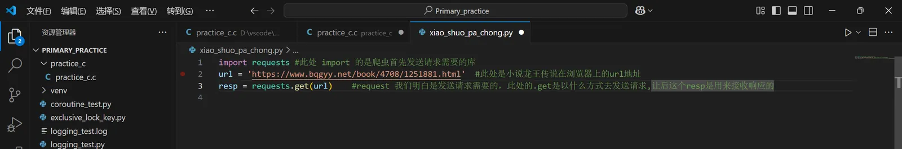

这里有个值得记住的点：**`requests.get` 里的 `get` 不是固定的**。它叫"请求方法"，取决于目标网站用的是什么。所以下一步，我们得先去确认。

## 2. 用浏览器 DevTools 找到"正确姿势"

浏览器开发者工具（DevTools）是爬虫学习阶段最好的老师：网站向服务器要了什么、用什么方式要的，它都记着。

### 2.1 打开检查面板

在目标页面上**右键 → 检查**（或按 `F12`）：

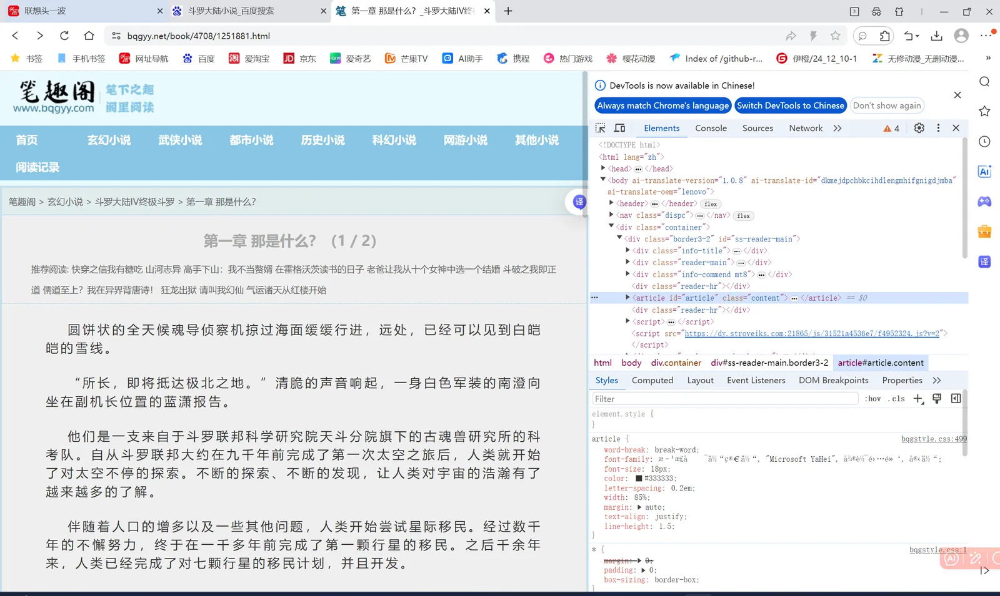

### 2.2 切到 Network 面板并刷新

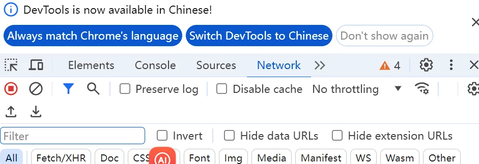

### 2.3 找到第一个请求

刷新页面后，列表里第一条通常就是这份 HTML 文档本身：

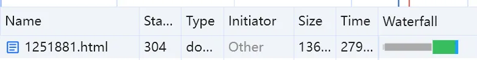

### 2.4 看它的请求方法

点进这条请求，找到 `Request Method`：


网站用的是 **GET**，所以代码里也用 `.get()`。如果人家用的是 POST，你就得改成 `.post()` 并按表单格式传参数——方法要跟网站一致，不是你想用哪个就用哪个。

## 3. 伪装成浏览器：User-Agent

### 3.1 为什么会被拒绝

你在浏览器里读小说，网站把你当"正常访客"；但代码发出去的请求带着一身"我是程序"的痕迹，很容易被识别出来，然后被拒之门外。

### 3.2 线索还是藏在 Network 里

回到刚才那条请求，点开 **Headers**，找到 `Request Headers`，一直拉到 User-Agent：

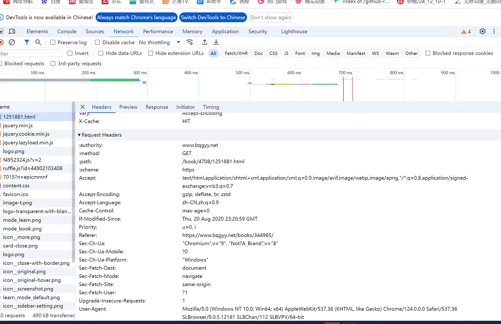


从这一行能读出两件事：

- 操作系统：`Windows NT 10.0; Win64; x64`（64 位 Windows）
- 浏览器：`Chrome/124.0.0.0`

### 3.3 把它写进代码

```python
feign = {
    "User-Agent": "Mozilla/5.0 (Windows NT 10.0; Win64; x64) AppleWebKit/537.36 "
                  "(KHTML, like Gecko) Chrome/124.0.0.0 Safari/537.36"
}

resp = requests.get(url, headers=feign)  # 通过 headers 把自己伪装成浏览器
```

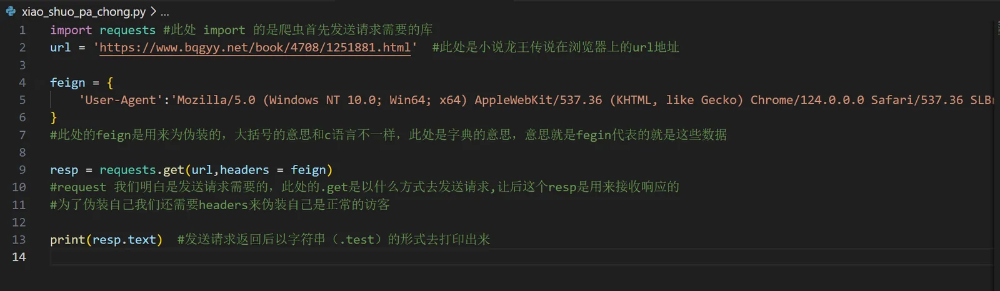

:::note 别被大括号吓到
Python 里的 `{}` 不是 C 语言那种代码块，而是**字典**。`feign` 只是个变量名（当成"伪装"来记就好），你写 `headers` 也一样。
:::

## 4. 满屏乱码？——设置编码

兴冲冲地运行，结果输出里除了正常汉字，还夹着一堆乱七八糟的东西：

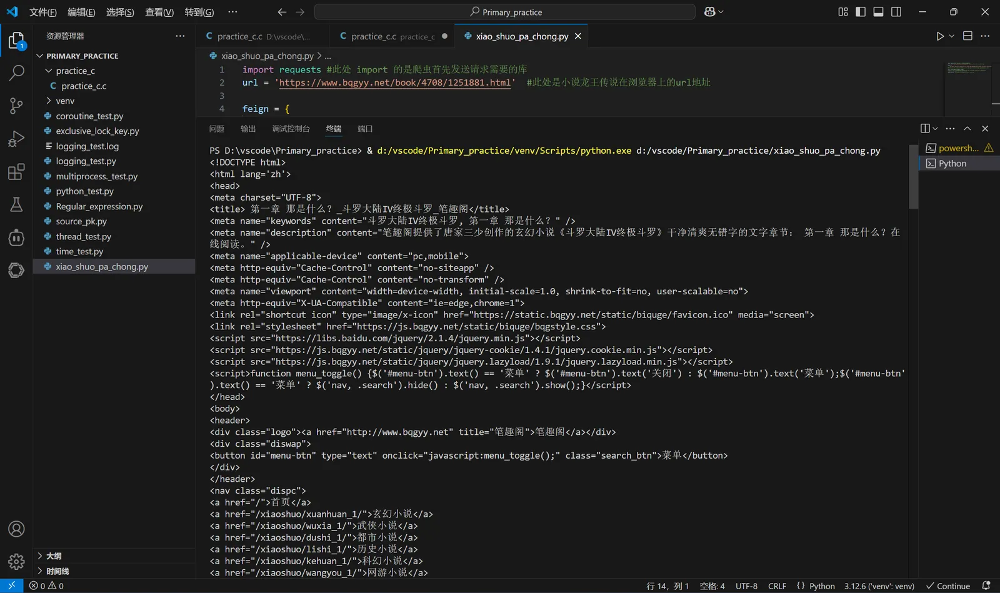

这十分有十二分不对劲——但原因很朴素：**编码不一致**。服务器返回的是一串字节，得用正确的规则解码才能得到正常文字。加一行：

```python
resp.encoding = "utf-8"  # 告诉 requests 按 utf-8 来解码
```

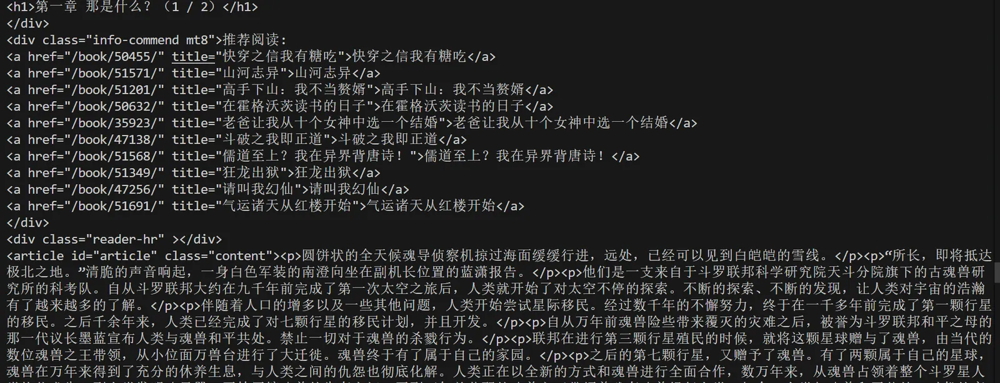

好多了。但现在拿到的还是**整页 HTML**——导航、广告、"推荐阅读"全混在里面。我们要的只是正文。

## 5. 用 lxml + XPath 把正文"挑"出来

### 5.1 引入 lxml

```python
from lxml import etree  # 把 HTML 交给它解析
```

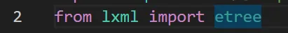

### 5.2 找到正文的容器

回到 DevTools 的 Elements 面板，你会发现正文每一段都被 `<p>` 标签包着：

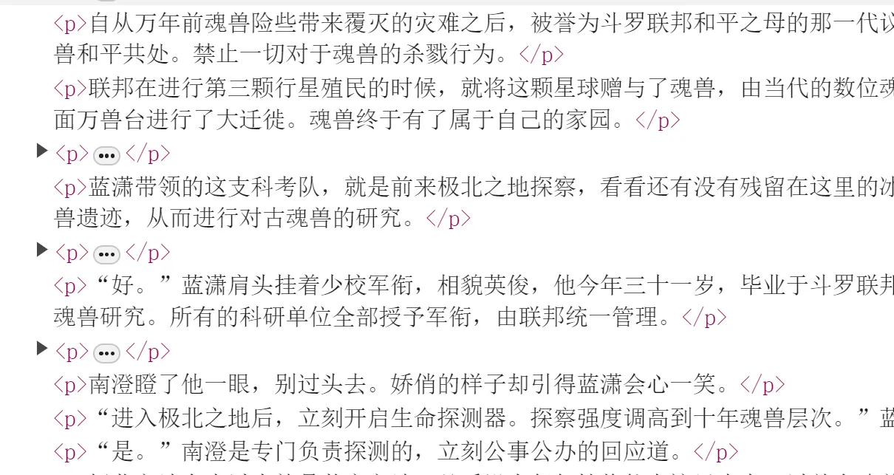

而这些 `<p>` 都躺在同一个容器里（比如 `<div class="content">`）：

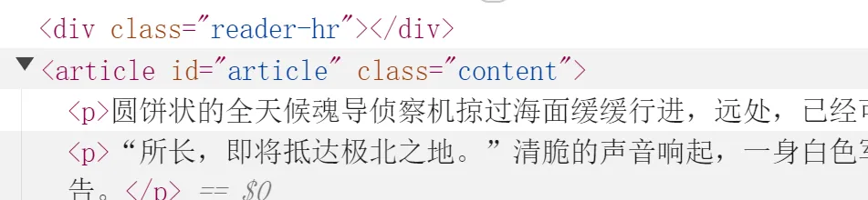

### 5.3 写 XPath 选中它们

XPath 是"在 HTML 树里找节点"的语法。不用背，装个 **XPath Helper** 插件，在页面上边试边看：

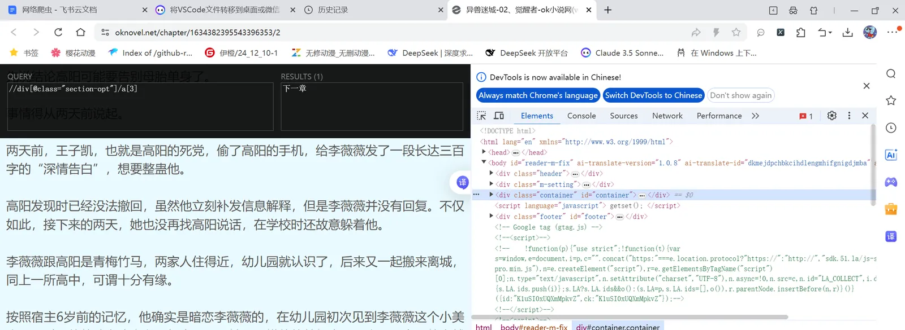

确认能选中之后，写进代码：

```python
e = etree.HTML(resp.text)  # 把响应文本解析成 HTML 树
info = "\n".join(e.xpath('//div[@class="content"]/text()'))  # 取出正文并拼接
```

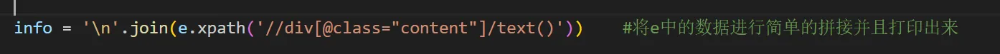

拆开看这三层意思：

1. `//div[@class="content"]` —— 在整个文档里找 `class="content"` 的 div
2. `/text()` —— 取它内部的所有文本节点
3. `"\n".join(...)` —— 用换行符把每一段拼成一整块文本

:::warning 为什么不用正则表达式？
正则当然也能抠出来，但 HTML 结构一旦变动就会失效，嵌套标签也会让表达式迅速失控。XPath 是按"结构"定位的，可读性和可维护性都更好。
:::

## 6. 写进文件

```python
with open("异兽迷城.txt", "a", encoding="utf-8") as f:
    f.write(info)
```

- `"a"` 是**追加**模式：每抓完一章就往文件尾部追加，不会覆盖前面的内容
- `encoding="utf-8"` 别漏，否则在 Windows 上容易报编码错误

## 7. 变成循环：抓一整本

一章的内容到手之后，"抓一整本"其实就是把上面的流程循环起来。思路拆成八步：

:::steps[抓取一整本的流程]
1. **给出目标 URL**

   从第一章的地址开始。

2. **伪装自己**

   准备好带 `User-Agent` 的 `headers`。

3. **发送请求**

   用 `requests.get(url, headers=feign)`。

4. **接收并解码**

   用变量接住响应，设置 `resp.encoding = "utf-8"`。

5. **提取正文**

   用 lxml 和 XPath 取出这一章的文本，并做简单拼接。

6. **找到"下一章"链接**

   在页面里用 XPath 定位"下一章"按钮，取出它的 `href`。

7. **循环**

   用 `while True` 重复以上步骤，并设置退出条件。

8. **写入文件**

   每循环一次，就把这一章追加进 txt。
:::

完整代码：

```python
import requests  # 发送请求
from lxml import etree  # 解析 HTML

url = "https://www.oknovel.net/chapter/1634382395543396353/2"  # 起始章节

while True:
    feign = {
        "User-Agent": "Mozilla/5.0 (Windows NT 10.0; Win64; x64) AppleWebKit/537.36 "
                      "(KHTML, like Gecko) Chrome/124.0.0.0 Safari/537.36"
    }

    resp = requests.get(url, headers=feign)  # 发请求
    resp.encoding = "utf-8"  # 按 utf-8 解码

    e = etree.HTML(resp.text)  # 解析成 HTML 树
    info = "\n".join(e.xpath('//div[@class="content"]/text()'))  # 取正文

    with open("异兽迷城.txt", "a", encoding="utf-8") as f:
        f.write(info + "\n")

    # 取"下一章"链接：section-opt 里的第 3 个 a 标签
    next_path = e.xpath('//div[@class="section-opt"]/a[3]/@href')[0]
    url = "https://www.oknovel.net" + next_path

    # 已到最后一章，收工
    if url == "https://www.oknovel.net/chapter/1634382395543396353/1424":
        break
```

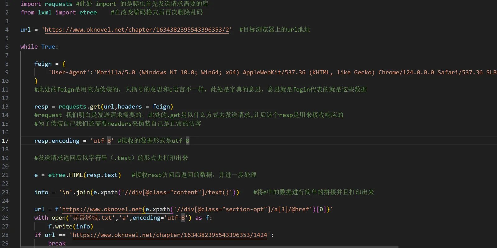

:::caution 这里的退出条件很"脆"
上面用"最后一章 URL 是否相等"来判断结束——因为写的时候就已经知道末章地址了。一旦章节变动，这个条件就会失效。更稳的写法是：**取不到"下一章"链接就退出**。下面给一个加强版。
:::

### 更稳一点的版本

```python
import time

import requests
from lxml import etree

BASE = "https://www.oknovel.net"
url = BASE + "/chapter/1634382395543396353/2"
seen = set()

with open("异兽迷城.txt", "a", encoding="utf-8") as f:
    while url and url not in seen:
        seen.add(url)

        resp = requests.get(
            url,
            headers={
                "User-Agent": "Mozilla/5.0 (Windows NT 10.0; Win64; x64) "
                              "AppleWebKit/537.36 (KHTML, like Gecko) "
                              "Chrome/124.0.0.0 Safari/537.36"
            },
            timeout=10,
        )
        resp.encoding = "utf-8"

        e = etree.HTML(resp.text)
        info = "\n".join(e.xpath('//div[@class="content"]/text()'))
        f.write(info + "\n")

        # 取不到"下一章"就结束
        next_path = e.xpath('//div[@class="section-opt"]/a[3]/@href')
        url = BASE + next_path[0] if next_path else None

        time.sleep(1)  # 歇一秒，别把人家服务器打疼了
```

改动点：

- 用 `seen` 记录抓过的地址，避免死循环
- `next_path` 取不到就直接结束，不必事先知道末章 URL
- 加 `timeout`，避免请求卡死
- 每章之间 `sleep(1)`，降低对服务器的影响

## 8. 新手最容易踩的几个坑

:::details 报错 ModuleNotFoundError: No module named 'requests'
库没装上，或者装到了别的 Python 环境里。确认运行代码的解释器和 `pip install` 用的是同一个。
:::

:::details 抓回来是乱码
先试 `resp.encoding = "utf-8"`；如果还乱，看看网页源码 `<meta charset="...">` 里写的是什么，跟着改。
:::

:::details 返回内容是空的，或者提示禁止访问
多半是反爬。先检查 `headers` 有没有带全（至少要有 `User-Agent`）；有些站点还会校验 `Referer`、`Cookie`。也可能是请求太快被限流了，放慢速度再试。
:::

:::details 正文里混进了广告和"推荐阅读"
说明 XPath 选的范围太大。回到 DevTools，用 XPath Helper 逐步收窄，只框住真正放正文的那个容器。
:::

:::details 每章粘在一起，没有换行
写入时补一个换行即可：`f.write(info + "\n")`。
:::

## 9. 关于合规，必须说几句

:::warning
这篇文章的目的是让你理解 HTTP 请求与 HTML 解析，而不是鼓励你去搬运别人的内容。

请务必注意：遵守目标网站的 `robots.txt` 与服务条款；控制请求频率，不要对服务器造成压力；抓取到的内容仅作个人学习使用，不要传播、转载或用于商业用途。小说是有著作权的作品。
:::

## 小结

回头看，整件事其实只有三个关键词：

| 步骤 | 工具 | 解决什么问题 |
| --- | --- | --- |
| 拿到页面 | `requests` | 让程序代替浏览器发请求 |
| 读对内容 | `resp.encoding` | 别让编码把你的中文变成乱码 |
| 取出数据 | `lxml` + XPath | 从一堆 HTML 里精准挑出正文 |

刚学一门语言的时候，最难得的不是"学会了多少语法"，而是**亲手做出一个能跑起来的东西**。哪怕它只是把一本小说存成 txt，那种"我写的东西真的在干活"的感觉，才是让人继续学下去的动力。

如果你用它抓到了有意思的数据，或者踩到了什么奇怪的坑，欢迎来[关于页](/about/)找我聊聊。
