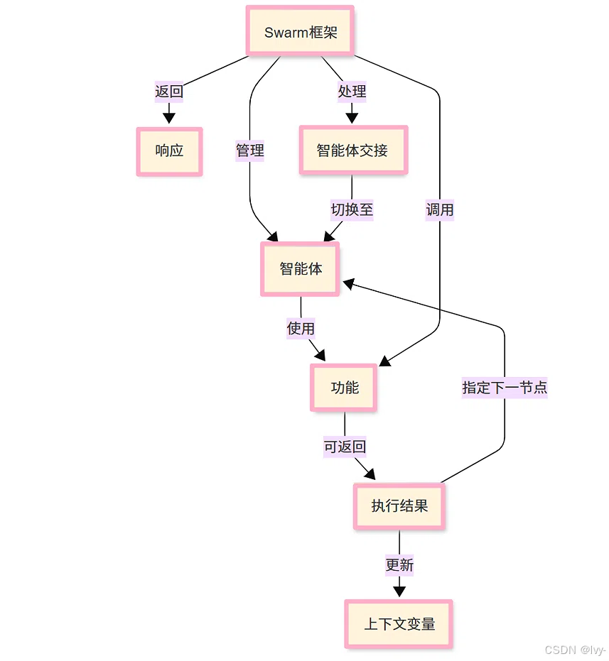

整理旧笔记时，我翻到了自己第一次接触到多 Agent 协作时保存的一张 Swarm 框架图。

那会儿我对 Agent 的理解还很模糊：会调几个 API、能给模型挂一两个工具，就已经觉得很厉害了。可看到 Swarm 的那张图时，我第一次意识到——多 Agent 协作并不一定意味着复杂的平台、状态图和层层封装，它也可以简单到只剩几个角色、一条消息链和一次“交接”。

后来 Agent 生态越来越热闹，LangGraph、CrewAI、AutoGen、各家云厂商的编排平台轮番出现，概念也越来越多：状态、持久化、人工审核、可观测性、评测。这些当然重要，但我还是会时不时想起最初看到的那个极简框架。

所以这篇文章，我想把 Swarm 当作一个入口，带大家先看懂多 Agent 协作的最小骨架。

:::note 本文适合刚接触多Agent协作的朋友们
如果你已经会写简单的模型调用，但对“多 Agent 协作”还停留在概念层面，这篇会帮你先建立一张清晰的控制流图。它不是生产级框架教程，而是一篇入门地图。
:::



*图：Swarm 框架图，来自我第一次接触多 Agent 协作时的资料。*

## 一、Swarm 是什么？

Swarm 是 OpenAI 开源的一个实验性、教育性质的多 Agent 框架。它最大的特点不是功能多，而是**足够小**。

小到什么程度？

它主要提供几个非常朴素的抽象：

- `Agent`：一个角色，包含系统指令和可用工具；
- `Handoff`：一次交接，把当前任务和控制权交给下一个 Agent；
- `Context / Messages`：一段在协作过程中被不断读写的共享上下文；
- `run()`：框架循环，负责把消息交给模型、执行模型要求调用的工具、处理交接，直到得出最终回复。

Swarm 不会替模型决定“该调用哪个工具”，它做的是另一件事：

> 把工具清单和消息历史交给模型，模型来决定下一步；Swarm 负责忠实执行。

这也是它容易被误解的地方。乍看之下，会以为 Swarm 是一个“智能调度器”；实际上，真正的决策发生在大模型里，Swarm 更像一个轻量级的执行器和传令官。

## 二、Swarm 和 Agent 是什么关系？

可以把它想成一个项目调度中心。

- **Swarm** 是调度台：接收任务、准备上下文、把工具说明交给模型、执行工具调用、处理 Agent 之间的交接。
- **Agent** 是拥有不同专长的员工：模型选择哪个 Agent，当前 Agent 选择调用哪个工具，或者把任务交给谁，都是模型基于上下文做出的决策。
- **工具** 是员工可用的外部能力：查天气、查数据库、发邮件、调接口。
- **上下文变量** 是共享白板：A 查到的信息写进去，B 和 C 都能读到。

如果用一句话概括：

> Swarm 是舞台和导演，Agent 是演员。没有 Agent，Swarm 只是空壳；没有 Swarm，Agent 很难共享记忆、工具和交接秩序。

## 三、用 A、B、C 三个 Agent 走一遍交接过程

假设用户发来一个任务：

> 帮我查一下明天的天气，根据天气推荐一套穿搭，最后为这套穿搭写一首短诗。

Swarm 里恰好有三个 Agent：

- Agent A：天气查询
- Agent B：穿搭推荐
- Agent C：写诗

执行过程可以拆成下面几步。

### 1. Swarm 接收任务

Swarm 拿到用户消息，先把任务交给当前 Agent A。

### 2. A 调用工具，并写入上下文

A 调用天气查询工具，拿到结果：

```text
明天晴，25℃
```

这个结果会进入共享上下文。

### 3. A 判断自己不适合继续，发起 Handoff

A 发现自己只会查天气，不会推荐穿搭，于是把下一节点指向 Agent B。

这就是 Swarm 里最重要的动作：**交接（Handoff）**。

### 4. B 读取上下文，继续处理

B 从共享上下文里读到天气信息，调用穿搭推荐工具，得到结果；然后把结果写回上下文，再把下一节点指向 Agent C。

### 5. C 完成最后一步，返回响应

C 读取天气和穿搭信息，调用写诗工具，完成最终内容。此时不再交接，流程回到 Swarm 的返回分支，最终响应被交还给用户。

整个过程可以画成一条接力链：

```text
用户
  ↓
Swarm
  ↓
Agent A（天气）
  ↓ Handoff
Agent B（穿搭）
  ↓ Handoff
Agent C（写诗）
  ↓
Swarm 返回响应
```

这里有几个关键点：

1. **它是串行的，不是并发的。** 控制权在同一时刻只在一个 Agent 手里，像接力赛，不是三个人同时跑。
2. **上下文是共享的。** A 的结果能变成 B 的输入，B 的结果又能变成 C 的输入。
3. **交接是显式的。** Agent 不直接“命令”另一个 Agent，而是把下一节点交给 Swarm，由框架完成切换。
4. **它可以是循环的。** 如果 A 觉得天气没查清楚，也可以把下一节点指回自己，形成重试循环。

## 四、Swarm 真正的核心逻辑

把 Swarm 的实现抽象出来，大概就是一个很朴素的循环：

```python
while True:
    # 1. 把当前 Agent 的指令、上下文和工具清单交给模型
    response = model(messages, tools=agent.tools)

    # 2. 记录模型回复
    messages.append(response)

    # 3. 如果模型要求调用工具，就执行工具，把结果写回上下文
    if response.tool_calls:
        for call in response.tool_calls:
            result = call_tool(call)
            messages.append(result)
        continue

    # 4. 如果模型决定交接给另一个 Agent，就切换当前 Agent
    if response.handoff:
        agent = response.handoff
        continue

    # 5. 没有工具调用、也没有交接，就返回最终结果
    return response
```

这段代码不是 Swarm 的逐行源码，但它把关键结构说清楚了：

- 工具是否调用，由模型决定；
- 调用哪个工具，由模型决定；
- 是否要交接给其他 Agent，也由模型决定；
- Swarm 自己不“思考”，它只负责把模型的决定翻译成动作，并维护消息和上下文的流动。

这也解释了为什么 Swarm 看起来不像 Spring AI、LangGraph 那样的“系统框架”。它更像一份带执行能力的教学参考实现：把多 Agent 协作最核心的 Tool Calling、Context 和 Handoff 暴露出来，不替你加太多抽象。

## 五、为什么我觉得它适合入门 Agent？

因为它让人先看到“骨架”，再谈“肌肉”。

很多人第一次接触 Agent 时，会直接掉进概念堆里：

- 什么是 State Graph？
- 什么是 Checkpointer？
- 什么是 Human-in-the-loop？
- 怎么接观测、评测、权限和审计？

这些问题当然要回答，但如果一开始就陷进工程细节，很容易变成“学会了框架 API，却不知道 Agent 到底怎么运转”。

Swarm 的价值在于，它足够简单，简单到你可以在脑子里跑完整个流程：

```text
模型 → 工具调用 → 结果写回上下文 → 判断下一步 → 交接或返回
```

一旦这条链路清楚了，再看 LangGraph、CrewAI 这些更成熟的框架，就会很容易理解它们分别在补什么：状态图补控制流，持久化补长任务，记忆组件补长期上下文，可观测性补排查，企业平台补治理和安全。

所以我更愿意把 Swarm 当作一块踏板：

> 先用手写最小循环理解 Agent 的本质，再看生产级框架如何把原型变成系统。

## 六、Swarm 不是企业级答案，但它留下了重要的一课

必须强调，Swarm 本身并不适合直接上生产。

它是轻量实验框架，缺少企业场景需要的东西：

- 跨请求的状态与持久化；
- 长任务恢复与失败重试；
- 权限、审计、安全边界；
- 人工审核节点；
- 完整的可观测性和评测体系；
- 大规模工具与 Agent 的动态治理。

所以真实企业系统通常不会拿 Swarm 直接扛业务，而会使用更成熟的编排框架或云平台。

但这并不代表 Swarm 没有价值。它留下的关键抽象——**Handoff**——已经被后来的很多 Agent 框架继承。企业级方案做的不是推翻它，而是在它的思路上补上状态、记忆、治理和工程能力。

换句话说：

> Swarm 提供的是灵魂，成熟框架提供的是钢铁之躯。

## 七、如果让我给一条入门路线

如果读者想从这篇文章出发继续学 Agent，我会建议这个顺序：

1. **先手写一次 Tool Calling 循环。** 不借助框架，自己维护 `messages`，让模型调用工具，再把结果喂回去。
2. **加入 Handoff。** 定义多个角色，让模型在需要时把任务交给下一个角色。
3. **加入共享上下文。** 让后一个 Agent 能读到前一个 Agent 的结果。
4. **补上状态和持久化。** 思考一次任务跨多轮、跨进程后该如何恢复。
5. **再看成熟框架。** 这时再看 LangGraph、CrewAI、AutoGen 或企业平台，你会更清楚它们为什么存在。
6. **最后再谈生产。** 权限、审计、评测、监控和成本控制，都是进入生产前必须补的课。

## 八、结语

第一次看到 Swarm 时，感觉这个写法没有办法和主流框架去比，但是就好像篮球教练和科比一样，篮球教练可以让你更快上手（什么奇妙的例子，算了我不举了）。

后来才明白，它的价值恰恰在于把多 Agent 协作剥到最薄：一个调度循环、几个角色、一条上下文、几次交接。它不试图解决所有问题，而是让初学者先把最核心的问题看清楚。

今天再回头看，我依然觉得它是很多人入门 Agent 最好的切口之一：

> 不要一上来就学怎么搭建复杂的 Agent 系统，先看懂一个 Agent 为什么能调用工具、为什么要把任务交给另一个 Agent、以及上下文是如何在它们之间流动的。

等这套最小骨架在脑子里跑通之后，再去接触生产级框架，路会清楚很多。
> 声明：本片文章参考博主lvy010的博客https://lvynote.blog.csdn.net/?type=blog内容，大家如果感兴趣可以关注一下，lvy牛逼！

---

### 参考资料

- [OpenAI Swarm](https://github.com/openai/swarm)
- [CSDN：Swarm 框架入门相关文章](https://blog.csdn.net/2301_80171004/article/details/149199018)
