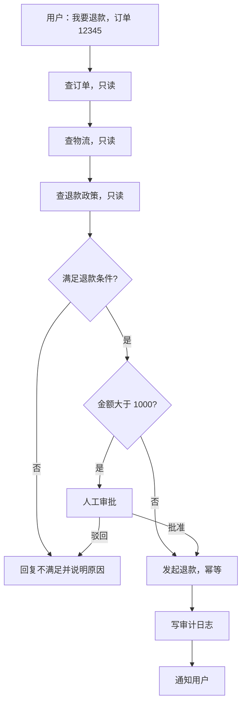

刚上手写 Agent 的时候，我把能想到的能力都写成工具，一次性交给模型：查订单、改地址、退款、发邮件、跑 SQL，全塞在同一个列表里。

工具过十个之后就开始出问题。让它查物流，它去查了订单；该走审批的退款，它直接调了。

有人问过我三个问题：工具为什么需要分层、分层的概念是什么、数据工具和动作工具有什么不同。这三个问题在同一条线上，我按顺序讲。

## 1. 工具一多会怎样

假设一个客服 Agent 挂了 50 个工具：查订单、查物流、查库存、退款、改地址、删订单、发邮件、查数据库、执行 SQL、转账、改配置、重启服务。

平铺在同一个列表里，会同时出现七个问题：

| 问题 | 表现 |
| :--- | :--- |
| 选择困难 | 面对 50 个工具，模型容易选错 |
| 权限混乱 | 说不清哪个工具谁能调 |
| 风险失控 | 读和写混在一起，危险操作容易被误触 |
| 审计困难 | 不知道谁在什么时候调了什么、为什么 |
| 成本失控 | 一次简单查询也可能走大模型 |
| 错误难定位 | 出了问题不知道是哪一类工具造成的 |
| 扩展困难 | 新增一个工具，影响面说不清 |

七个问题的根是同一个：工具列表是扁平的，工具背后的风险、权限和成本一点都不扁平。

## 2. 分层的本质

分层是按职责、风险、权限、调用频率和成本把工具分组，每一组有自己的调用规则、校验强度和边界。

它要解决的事情有六件：

| 目标 | 做法 |
| :--- | :--- |
| 隔离风险 | 读和写分开，低危和高危分开 |
| 简化选择 | 模型一次只面对一层工具 |
| 明确权限 | 不同层配不同授权 |
| 加强校验 | 越高危，校验越严 |
| 便于审计 | 每层单独记日志 |
| 方便扩展 | 新增工具归入对应层 |

## 3. 按风险分五层

这是最常用的一条分法，五层按风险从低到高排：

:::steps{title="工具分层的五个风险层"}
1. **只读工具**

   查订单、查物流、查库存、查政策。校验只要 schema 加权限，不需要审批。
2. **低危写工具**

   创建工单、发通知、更新备注。校验加频率限制，一般不需要审批。
3. **中危写工具**

   改地址、改预约、取消订单。校验加业务规则，审批视情况而定。
4. **高危写工具**

   退款、转账、删数据、改配置。校验加金额阈值和幂等，必须人工审批。
5. **系统级工具**

   执行 SQL、重启服务、改权限。校验最严，强制人工，重要操作还要双人复核。
:::

每层的门槛不一样，落到代码里就是按层配的一张规则表，见第 7 节。

## 4. 另外两种分法

风险不是唯一的分法。职责和成本也能分层，区别在于它们回答的问题不同：

::: collapse accordion
- :+ 按职责分

  数据层负责取信息，计算层负责算结果，动作层负责改状态，编排层负责触发流程，系统层负责操作基础设施。

  - 数据层：查订单、查物流、搜索知识库。
  - 计算层：计算器、汇率换算、日期推算。
  - 动作层：退款、发邮件、创建工单。
  - 编排层：启动工单流、转人工。
  - 系统层：执行 SQL、改配置、部署。

  按职责分的用处是给模型一个稳定的分类线索：名字里带 `query` 的只读，带 `create`、`update`、`send` 的会改状态。

- 按调用频率和成本分

  高频低成本的工具放在最前面，低频高成本的放在后面，需要人工的单独走一条路。

  - 高频低成本：缓存查询、本地计算。
  - 低频高成本：外部 API、大模型调用。
  - 需要人工：审批、复核。

  这一层主要管钱和延迟。缓存命中率、限流、超时、重试次数都按这一层来配。
:::

## 5. 数据工具和动作工具

这是工具分层里最重要的一组区分。

数据工具只读取信息，不改变系统状态。查订单、查物流、查库存、查政策、查用户信息、搜索知识库都属于这一类。

动作工具会改变系统状态，产生副作用 [+side-effect]。退款、下单、改地址、发邮件、删数据、转账、创建工单、重启服务都属于这一类。

[+side-effect]:
  副作用指的是这次调用改变了系统里的数据或其他人的状态，调用方拿到的返回值不是唯一的后果。

两边的差别不只是「读还是写」，工程要求也不一样：

| 维度 | 数据工具 | 动作工具 |
| :--- | :--- | :--- |
| 是否改变状态 | 否 | 是 |
| 风险 | 低 | 高 |
| 是否可逆 | 通常可逆，再查一次就行 | 可能不可逆 |
| 幂等要求 | 低 | 高 |
| 权限 | 读权限 | 写权限 |
| 是否需要审批 | 一般不需要 | 高危必须审批 |
| 失败的影响 | 信息不准 | 资金或数据损失 |
| 能不能重试 | 可以随意重试 | 必须幂等才能重试 |
| 能不能并行 | 通常可以 | 通常不可以 |
| 校验强度 | schema 加权限 | schema 加权限、业务规则、阈值、幂等 |

:::warning 两种错误的代价不一样
数据工具的参数写错了，最多是查不到，返回「查不到订单」，重试一次就能收场。

动作工具的参数写错了，可能给错误的订单退了 10000 元，钱已经出去了，后面靠人工补救。
:::

顺着这张表往前推，两边在设计上的待遇也不同。数据工具可以交给模型自由调用，能并行、能缓存、能重试，权限放宽一点问题不大。动作工具要严格 schema、幂等、阈值、审批、审计日志、可回滚，模型的自由度压到最低。

==读放开，写收紧；低危放开，高危收紧。==

## 6. 读写分离

有几类工具既读又写，放在一起最麻烦：

| 工具 | 读的部分 | 写的部分 |
| :--- | :--- | :--- |
| 创建工单 | 查是否已经有同类工单 | 创建新工单 |
| 改地址 | 查当前地址 | 更新地址 |
| 退款 | 查订单状态和金额 | 发起退款 |

处理办法是拆成两个工具，一个只读，一个只写。读的那个宽松，写的那个严格。

::: tabs#refund-tool

@tab 合成一个工具

```python
def refund(order_id: str, amount: float, reason: str):
    order = query_order(order_id)              # 读
    if order["status"] != "paid":
        raise ValueError("订单状态不允许退款")
    return create_refund(order_id, amount)     # 写
```

@tab:active 拆成两个工具

```python
def get_refund_eligibility(order_id: str) -> dict:
    """查询订单是否可以退款，不改变任何状态。"""
    ...

def create_refund(order_id: str, amount: float, request_id: str):
    """发起退款。request_id 是幂等键，同一个键重复调用只会退一次。"""
    ...
```

:::

拆开之后，权限、审计和审批都能分开配。`get_refund_eligibility` 谁都能调，`create_refund` 要写权限，金额超过阈值还要人工确认。合成一个工具的时候，这两套规则没法同时挂上去。

## 7. 落到代码

### 7.1 目录按层分

:::file-tree{title="tools"}
- tools
  - readonly
    - query_order.py
    - query_logistics.py
  - write-low
    - create_ticket.py
    - notify_user.py
  - write-high
    - create_refund.py
    - update_address.py
  - system
    - run_sql.py
:::

目录结构本身就是权限边界。代码评审、上线检查、日志检索都能按层看，新增工具时先想它属于哪个目录。

### 7.2 动作工具的参数写成卡片

参数的描述要写清楚单位、范围和幂等键怎么给：

:::: field-group

::: field order_id
@type string
@required

要退款的订单号。
:::

::: field amount
@type number
@required

退款金额，单位元，最多两位小数。
:::

::: field request_id
@type string
@required

幂等键。同一个 request_id 重复调用只会退一次。
:::

::: field reason
@type string
@optional

退款原因，写进审计日志。
:::

::::

模型的参数错误大多来自描述含糊，而不是能力不够。「金额」两个字和「单位元，最多两位小数」在调用时是两回事。

### 7.3 校验和审批挂在调用层

```python
LAYERS = {
    "readonly": {"approval": False, "retry": 3, "parallel": True},
    "write_low": {"approval": False, "retry": 1, "parallel": False},
    "write_high": {"approval": True, "retry": 0, "parallel": False},
    "system": {"approval": True, "dual_review": True, "retry": 0, "parallel": False},
}

def call_tool(layer, name, args, request_id):
    spec = LAYERS[layer]
    validate(args)                                  # schema 校验
    if spec["approval"] and not approved(layer, name, args):
        raise NeedApproval(layer, name, args)       # 挂起等人确认
    if name in IDEMPOTENT and seen(request_id):
        return cached_result(request_id)            # 幂等命中，返回上次结果
    return dispatch(name, args)
```

分层规则集中在一张表里，工具本身不用重复写权限判断。新增工具先选层，规则自动生效。

:::important 权限不写在工具描述里
工具描述是给模型看的，模型能看懂不等于它会遵守。谁可以调、金额上限多少、要不要审批，这些判断放在调用层。相关的讨论在[第四篇](/posts/agent-design-patterns-supplement/)里。
:::

## 8. 走一遍退款

用户说「我要退款，订单 12345」，整条路径是这样的：



每一步的分层待遇：

| 步骤 | 层 | 重试 | 审批 |
| :--- | :--- | :--- | :--- |
| 查订单、查物流、查政策 | 只读 | 允许，最多三次 | 不需要 |
| 发起退款 | 高危写 | 不重试，靠幂等键兜底 | 金额超阈值要人工确认 |
| 写审计日志 | 低危写 | 允许 | 不需要 |
| 通知用户 | 低危写 | 允许 | 不需要 |

前面三步都是只读，可以并行，查错了没有后果。从「发起退款」开始收紧：这次调用会真的把钱转出去，所以它没有重试次数，靠幂等键防重复，超过阈值就停下来等人。

## 9. 新手常踩的四个坑

1. **把读和写塞进同一个工具。** 名字叫 `manage_order`，里面既能查又能改，权限和审批没法配。拆成 `get_order` 和 `update_order` 两个。
2. **把业务规则写进工具描述。** 「退款金额不要超过 1000」写在描述里，模型未必照做。阈值判断放调用层。
3. **动作工具没有幂等键。** 网络超时之后重试，同一个订单可能退两次款。参数里带上 `request_id`，服务端按它去重。
4. **小项目也照搬五层。** 如果只是内部工具，没有资金和对外发送，读和写两层就够。分层是为了控制风险，层数超过实际风险就只剩开销。

## 10. 检查清单

- 每个工具属于哪一层，写在代码或文档里了吗？
- 读和写是不是分开的？
- 动作工具有幂等键吗？
- 阈值和审批规则挂在调用层，还是写在提示词里？
- 每层的日志能单独查吗？
- 新增一个工具，要改几处代码？

:::note 相关文章
这篇是新手向的工具部分，和 20 种 Agent 设计模式系列互补：

- [（一）控制流](/posts/agent-design-patterns-control-flow/)
- [（二）多 Agent 与记忆](/posts/agent-design-patterns-multi-agent-memory/)
- [（三）可靠性](/posts/agent-design-patterns-reliability/)
- [（四）软约束与硬校验](/posts/agent-design-patterns-supplement/)
:::

*[SQL]: Structured Query Language
